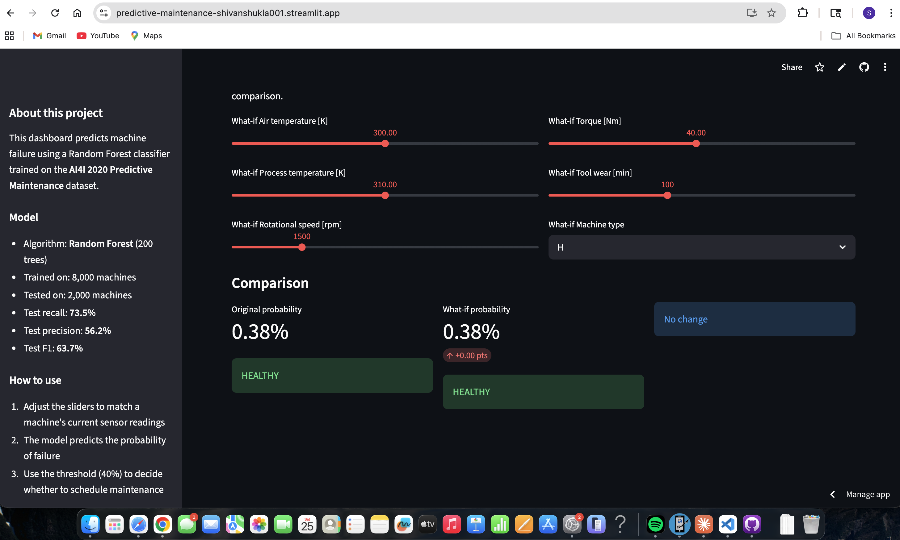

Claude finished the response
You said: i am new to coding and python , this is my first project and i want to complete it with your help and want to do most of the things on my own too by learning a…
Uploaded image
image.jpeg
i am new to coding and python , this is my first project and i want to complete it with your help and want to do most of the things on my own too by learning and setting up everything from scratch. i have around 10 days to deliver this

Claude responded: Welcome to your first project — this is a great one to start with.
Welcome to your first project — this is a great one to start with. Predictive maintenance with the AI4I 2020 dataset is beginner-friendly, has a clear story, and the Streamlit dashboard will make your work feel real and presentable at the end. Ten days is plenty if we pace it well.

Before I map out a day-by-day plan for you, I want to understand a few things so I can tailor the guidance to where you actually are right now. Rather than drowning you in generic steps, I'd like the plan to fit your setup and pace.

A few quick questions:

Your setup — What operating system are you on (Windows / macOS / Linux)? Do you already have Python installed, and do you have a code editor like VS Code? If not, that's completely fine — we'll install everything together.
Your starting point — When you say "new to coding," have you done any Python at all (even a tutorial or two), or are we truly starting from zero with things like variables, loops, and functions? Either is okay — I just want to know where to begin.
Dataset preference — Between the two options, I'd strongly suggest we go with the AI4I 2020 Predictive Maintenance dataset from Kaggle. It's tabular (rows and columns, like a spreadsheet), clean, and much easier to wrap your head around than the NASA turbofan data, which involves time-series sequences and is genuinely harder for a first project. Any objection to going with AI4I?
Daily time commitment — Roughly how many hours per day can you put into this? That helps me decide whether to stretch the fundamentals over more days or move faster.
Goal beyond finishing — Is this for a class, a job application, a portfolio piece, or personal learning? The "why" shapes how much polish we put on the final dashboard and writeup.
Once you answer these, I'll give you a concrete day-by-day plan and we'll start Day 1 together. The philosophy I'll use: I'll explain why before how, have you type code yourself (not copy-paste blindly), and when you get stuck, I'll nudge you toward the answer rather than just handing it over — because that's how the learning actually sticks.

Ready when you are.

You said: mac book air.
mac book air. i dont have python editor
You said: mac book air.
mac book air. i dont have python editor
just basic tutorial
AI4I 2020 4.2-3 hours 5. personal as well as for a job application
Claude responded: Perfect — I have what I need.
Perfect — I have what I need. Let me set up a todo list for Day 1 so you can track progress, then walk you through it step by step.


Loaded tools, updated todo list
Loaded tools, updated todo list
Here's the full picture, then we'll zoom into Day 1.

The 10-Day Plan
Day 1 — Today. Install Python, VS Code, and all the libraries. Run your first script. (This is the boring-but-essential day.)

Day 2. Python refresher — variables, lists, dictionaries, loops, functions. Just enough to read and write the code we'll use.

Day 3. Download the AI4I dataset. Open it in Pandas. Look at it. Understand what each column means.

Day 4. Exploratory Data Analysis (EDA) — plot the data, find patterns, see what a "failure" looks like vs normal operation.

Day 5. Preprocessing — split features/target, train/test split, handle categorical columns.

Day 6. Train your first model (Logistic Regression). Evaluate it with accuracy, precision, recall, confusion matrix.

Day 7. Train a better model (Random Forest). Compare results. Pick a winner. Save the model to a file.

Day 8. Build the Streamlit dashboard — a form where the user enters sensor values and gets a prediction.

Day 9. Add the "what-if" sliders + polish the UI + write a README for your GitHub repo.

Day 10. Deploy to Streamlit Cloud (free), write the story of the project for your portfolio, prepare the "how would you adapt this to real plant sensors" answer for interviews.

Now let's do Day 1.

Day 1: Setup
Step 1 — Check what you already have
MacBooks often come with a basic Python. Let's see.

Open the Terminal app (press Cmd + Space, type "Terminal", hit Enter). A black/white window will open. Type exactly this and press Enter:

python3 --version
Tell me what it prints. It'll either say something like Python 3.11.5 or give an error. Once I see what you have, we'll either use it or install a fresh copy from python.org.

While you're there, also run this and tell me the output:

which python3
Just send me back what both commands show. Take your time — don't worry if something looks weird. We'll fix it together.

You said: Library/Frameworks/Python.
Library/Frameworks/Python.framework/Versions/3.13/bin/python3

Claude responded: Excellent — you have Python 3.
Excellent — you have Python 3.13 installed via the official python.org installer. That's exactly what we want, no need to install anything Python-related. Let me update the plan and move you to the next step.


Updated todo list
Updated todo list
Quick aside on why that path matters, because understanding paths will save you hours of confusion later: the path Library/Frameworks/Python.framework/Versions/3.13/bin/python3 tells us Python was installed system-wide from the official installer. When we later "activate a virtual environment," that which python3 output will change to point to a folder inside your project. That's how you'll know you're using the project's isolated Python, not the system one. Don't worry about fully grasping it yet — just notice it later when it happens.

Step 2 — Install Visual Studio Code
VS Code is the editor you'll live in. It's free, made by Microsoft, and is the industry standard for this kind of work.

Do this:

Open Safari or Chrome and go to https://code.visualstudio.com
Click the big blue Download for macOS button. It'll download a .zip file.
Go to your Downloads folder (Finder → Downloads).
Double-click the zip — it'll extract a "Visual Studio Code" app.
Drag that app into your Applications folder. This is important — don't just run it from Downloads, or macOS will complain later.
Open VS Code from the Applications folder (or via Cmd + Space, type "Visual Studio Code"). The first time, macOS will ask "Are you sure you want to open this?" — click Open.
When VS Code opens, you'll see a welcome screen. Don't touch anything yet — just tell me:

Did it open successfully?
What does the welcome screen look like — do you see a sidebar on the left with icons?
Once you confirm it's running, we'll install the Python extension inside it (Step 3).

You said: yes it is running
yes it is running

Claude responded: Great, VS Code is alive.
Great, VS Code is alive. Let me move you forward.


Updated todo list
Updated todo list
Step 3 — Install the Python extension in VS Code
VS Code by itself doesn't "know" about Python. We add that knowledge through an extension. This gives you syntax highlighting, auto-complete, error detection, and the ability to run scripts with one click.

Do this inside VS Code:

On the left sidebar, you'll see a column of icons. Look for the one that looks like four squares with one square separated (it's called Extensions). Click it. Or use the shortcut Cmd + Shift + X.
A search bar will appear at the top that says "Search Extensions in Marketplace."
Type: Python
The top result will be one published by Microsoft (it'll have a blue "verified" checkmark and millions of downloads). Click on it.
Click the blue Install button.
That's it. It'll install in a few seconds. Installing the Microsoft Python extension also automatically installs a helper called Pylance — that's normal and good.

Two quick "nice to have" extensions you can also install the same way while you're here (optional but I recommend):

Jupyter (also by Microsoft) — lets you run Python in notebook-style cells, which is incredibly helpful for data exploration later.
Rainbow CSV — colors CSV file columns so they're readable when we look at the dataset.
Once you've installed at least the Python extension (Jupyter + Rainbow CSV optional but nice), let me know and we'll create your project folder. While you're at it — tell me your Mac username so I can give you the exact folder path to use in commands later. You can find it by opening Terminal and typing whoami and pressing Enter.

You said: installed.
installed. username is hemantshukla

Claude responded: Good, hemantshukla it is.
Good, hemantshukla it is. So your home folder path is /Users/hemantshukla — you'll see that pop up in commands.


Updated todo list
Updated todo list
Step 4 — Create your project folder
Back to the Terminal (not VS Code, just the plain Terminal app for now). Copy and paste these commands one line at a time, pressing Enter after each. I'll explain what each one does.

cd ~/Desktop
"cd" means "change directory." ~ is shorthand for your home folder (/Users/hemantshukla). So this puts you inside your Desktop folder.

mkdir predictive-maintenance
"mkdir" means "make directory." This creates a new folder called predictive-maintenance on your Desktop.

cd predictive-maintenance
Now step inside that new folder.

pwd
"pwd" means "print working directory" — it shows where you currently are. It should print something like /Users/hemantshukla/Desktop/predictive-maintenance.

Paste me back what pwd prints so I can confirm you're in the right place. Also — if you look on your Desktop now, you should see a new empty folder called predictive-maintenance. Do you see it?

You said: yes
yes

Claude responded: Perfect.
Perfect. You now have an empty folder ready for your project.


Updated todo list
Updated todo list
Step 5 — Create a virtual environment
This is a concept worth understanding before we run the command, because it trips up a lot of beginners.

What is a virtual environment? Imagine you're working on two different projects. Project A needs Pandas version 1.5, and Project B needs Pandas version 2.1. If you install Pandas "globally" on your Mac, only one version can exist at a time — they'd fight each other. A virtual environment is a little sandbox folder that holds Python plus a specific set of package versions, isolated to just one project. Every serious Python project uses one.

Think of it like this: your Mac has a general toolbox (the system Python), but for each project you build a custom mini-toolbox with only the exact tools that project needs.

The command. Make sure you're still inside the project folder (if you closed Terminal, run cd ~/Desktop/predictive-maintenance first). Then:

python3 -m venv .venv
Breakdown of what this does:

python3 — run Python
-m venv — use Python's built-in venv module (the virtual environment creator)
.venv — the name of the folder to create. The dot at the start makes it a "hidden" folder by convention, so it doesn't clutter your view.
It'll take 5–15 seconds. Nothing will print. That's normal.

Now activate it. Creating the environment isn't enough — you have to "step into" it:

source .venv/bin/activate
After you run this, look at your Terminal prompt. It should now start with (.venv) — like this:

(.venv) hemantshukla@... predictive-maintenance %
That (.venv) at the front is Terminal telling you "you are now inside the virtual environment." Any package you install from here on only goes into this project's sandbox, not your whole Mac.

Finally, verify Python is now coming from inside the project:

which python
This time it should print something like /Users/hemantshukla/Desktop/predictive-maintenance/.venv/bin/python — notice it's pointing inside your project folder now, not the system Frameworks path from before. That's the sign you're correctly isolated.

Paste me the output of which python after activating, and confirm you see (.venv) at the start of your prompt.

You said: confirmed
confirmed

Claude responded: Excellent — you're officially inside your project's sandbox now.
Excellent — you're officially inside your project's sandbox now. From this point on, whenever you work on this project, always activate the environment first with source .venv/bin/activate. If you forget, packages will install to the wrong place and things get messy. A good mental habit: "open Terminal → cd into project → activate → then start working."


Updated todo list
Updated todo list
Step 6 — Install the packages you'll need
Python by itself is a bare language — it doesn't "know" how to read spreadsheets, train ML models, or build web dashboards. We add those abilities by installing packages (also called libraries). For this project we'll install five:

pandas — reads and manipulates tabular data (like an Excel sheet in code).
scikit-learn — the workhorse machine-learning library. Has Logistic Regression, Random Forest, train/test splitting, evaluation metrics, all of it.
matplotlib — makes plots and charts.
seaborn — sits on top of matplotlib and makes prettier plots with less code.
streamlit — turns your Python script into an interactive web dashboard in a single file.
jupyter — notebook-style interface for experimenting with data cell-by-cell.
The tool that installs packages is called pip. Since your (.venv) is active, anything pip installs lands inside your project sandbox.

Make sure your prompt still starts with (.venv). Then run this single command:

pip install pandas scikit-learn matplotlib seaborn streamlit jupyter
This will print a LOT of text. You'll see lines like Collecting pandas..., Downloading numpy..., Installing.... That's pip fetching each package and all its dependencies from the internet. It usually takes 1–3 minutes on a normal connection. Don't interrupt it.

At the end you should see a line that says something like:

Successfully installed matplotlib-3.x.x numpy-2.x.x pandas-2.x.x ... streamlit-1.x.x
Two things to tell me when it finishes:

Did it end with Successfully installed ...? Or did you see any red ERROR lines?
Run pip list afterwards and paste me roughly the output (or just tell me you see pandas, scikit-learn, streamlit, matplotlib, seaborn, and jupyter all listed).
If you see any errors — especially anything mentioning "wheel," "building," or numpy on an M-chip Mac — paste the last 20 lines or so and we'll debug. Python 3.13 is very new, and one or two packages occasionally lag behind. If that happens we have a clean workaround.

You said: everything works fine.
everything works fine. tell me wheteher well be working on the terminal or well use vs code also

Claude responded: Great question, and it's the right time to ask it.
Great question, and it's the right time to ask it. Here's the honest answer: both, but VS Code is where you'll actually live, and Terminal is a supporting tool.

Let me break down how professionals actually use them together so you understand the rhythm:

VS Code is for:

Writing and editing your Python code (the .py files)
Looking at the dataset (CSV files open nicely in it)
Running your scripts (VS Code has a built-in terminal — more on that in a second)
Viewing plots and notebook outputs when we use Jupyter
Basically 90% of your time
Terminal (the standalone app) is for:

Quick one-off commands, like checking Python versions or navigating folders
Running git commands later if we push to GitHub
But here's the key trick: VS Code has a built-in terminal inside it. So instead of juggling two windows, you'll usually just use the one inside VS Code. It behaves exactly like the Terminal app — same commands, same everything — it's just embedded in your editor window. That's what most developers use day-to-day.

Let's switch to that setup now since you'll use it for every remaining day of the project:

Open your project in VS Code
In VS Code, go to the top menu: File → Open Folder...
Navigate to Desktop → click once on the predictive-maintenance folder to select it → click Open.
VS Code might ask "Do you trust the authors of the files in this folder?" — click Yes, I trust the authors.
You'll now see your project folder name in the top-left sidebar. You'll also see a .venv folder listed there — that's the virtual environment we made.

Open the built-in terminal inside VS Code
Press Ctrl + ` (that's Control + the backtick key, which is the key just above Tab on the left of the 1 key). A terminal pane will pop up at the bottom of VS Code.

Two important things to check:

Is it inside your project folder already? Type pwd — it should say /Users/hemantshukla/Desktop/predictive-maintenance. Yes? Good. (VS Code auto-navigates to your open folder.)
Is the virtual environment activated? Look at the start of the prompt line. Does it say (.venv)? If yes, great. If not, activate it with:
   source .venv/bin/activate
From now on, that's the setup: VS Code open on the project folder, with its built-in terminal at the bottom, virtual environment active. Any time you sit down to work, that's the state you want to get back to.


Updated todo list
Updated todo list
Once you've done both — opened the folder in VS Code, and confirmed the built-in terminal shows (.venv) in the prompt — let me know. Then we'll write your first script (hello.py), import pandas to confirm everything's wired up, and that wraps Day 1.

You said: i cant open the terminal in vs code
i cant open the terminal in vs code

Claude responded: No worries, this is a common stumble — the backtick key can be hard to find on Mac keyboards, and international layouts sometimes don't have it at all.
No worries, this is a common stumble — the backtick key can be hard to find on Mac keyboards, and international layouts sometimes don't have it at all. Let me give you three ways to open the terminal. Any one of them works.

Method 1 — Menu (easiest, always works): At the very top of your screen, when VS Code is the active app, you'll see the menu bar: File  Edit  Selection  View  Go  Run  Terminal  Window  Help. Click on Terminal → New Terminal. A pane will pop up at the bottom of VS Code.

Method 2 — Command Palette (good to learn, you'll use it a lot): Press Cmd + Shift + P. A search bar appears at the top-middle of VS Code. Type Terminal: Create New Terminal and press Enter.

Method 3 — The backtick shortcut, if you want it: The backtick () is the key **directly above the Tab key**, to the left of the 1key. On a US English Mac keyboard it shares a key with the tilde~. The shortcut is Ctrl + `` (Control — not Command — plus backtick). If your keyboard layout is non-US (e.g., UK, Indian, or other), the backtick might be somewhere else or missing, which is why Methods 1 and 2 exist.

Try Method 1 first since it's the most reliable. Once the terminal pane opens at the bottom:

Check the prompt — does it show (.venv) at the start? If yes, great. If not, run source .venv/bin/activate to activate.
Run pwd and tell me what it prints.
Let me know how it goes.

You said: Users/hemantshukla/Desktop/predictive-maintenance
Users/hemantshukla/Desktop/predictive-maintenance

Claude responded: You're in the right folder — /Users/hemantshukla/Desktop/predictive-maintenance.
You're in the right folder — /Users/hemantshukla/Desktop/predictive-maintenance.

One more check before we write code: look at your terminal prompt in VS Code. Does the line where you type show (.venv) at the beginning? It would look something like:

(.venv) hemantshukla@... predictive-maintenance %
If yes — perfect, we're ready to write your first script.

If no — just run this to activate the environment in this new terminal:

source .venv/bin/activate
…and you should see (.venv) appear at the front of the prompt.

Tell me which case you're in, and we'll write hello.py next — the final step of Day 1.

You said: yes
yes

Claude responded: Excellent — virtual environment active, we're ready to write your very first Python file.
Excellent — virtual environment active, we're ready to write your very first Python file.


Updated todo list
Updated todo list
Step 7 — Write and run hello.py
This step has three goals at once: (1) confirm VS Code can run Python files, (2) confirm your virtual environment is truly wired up, and (3) confirm that all the packages you installed actually work. If this step succeeds, Day 1 is done.

Create the file:

In VS Code, look at the left sidebar. You should see the name PREDICTIVE-MAINTENANCE in uppercase, with your folder's contents listed below it (probably .venv is the only thing visible).
Hover over that PREDICTIVE-MAINTENANCE heading. A small row of icons appears on the right side — the first one is a new file icon (looks like a page with a +).
Click it. A text box appears asking for a filename.
Type hello.py and press Enter.
The file opens in the main editor area, blank.

Type this code in (I strongly recommend typing it, not copy-pasting — muscle memory matters when you're learning):

python
# My first Python file for the predictive maintenance project

import pandas as pd
import sklearn
import streamlit
import matplotlib
import seaborn

print("Hello, predictive maintenance!")
print("Python can see all my packages.")
print(f"Pandas version: {pd.__version__}")
print(f"Scikit-learn version: {sklearn.__version__}")
Let me explain each part so you're not blindly copying:

Lines starting with # are comments — Python ignores them. They're just notes for humans.
import pandas as pd means "load the pandas library, and from now on I'll call it pd for short." pd is the universal nickname in the Python community — every tutorial and codebase uses it.
print(...) displays text in the terminal.
The f"..." syntax is called an f-string — it lets you drop variables inside text by wrapping them in {}. We use it here to print the version numbers.
pd.__version__ asks pandas "what version of yourself are you?" (those double underscores are a Python convention for built-in attributes.)
Save the file: Cmd + S.

Run it. Two ways:

The VS Code "play" button — in the top-right of the editor there's a triangle "Run" button. Click it. Output appears in the terminal at the bottom.
Type in the terminal: python hello.py and press Enter.
Either works. Try Method 1 first (the play button).

What you should see:

Hello, predictive maintenance!
Python can see all my packages.
Pandas version: 2.x.x
Scikit-learn version: 1.x.x
Paste me the output. If there's any error (red text saying ModuleNotFoundError or similar), paste that too and we'll fix it. The most common gotcha here is VS Code running the wrong Python — and if that happens, there's a one-click fix I'll walk you through.

You said: hemantshukla@Shivanshs-MacBook-Air predictive-maintenance % /Users/hemantshukla/Desktop/predict
hemantshukla@Shivanshs-MacBook-Air predictive-maintenance % /Users/hemantshukla/Desktop/predict
ive-maintenance/.venv/bin/python /Users/hemantshukla/Desktop/predictive-maintenance/hello.py
Matplotlib is building the font cache; this may take a moment.
Hello, predictive maintenance!
Python can see all my packages.
Pandas version: 3.0.2
Scikit-learn version: 1.8.0

Claude responded: 🎉 Day 1 is officially done.
🎉 Day 1 is officially done. That output is exactly what we wanted to see.


Updated todo list
Updated todo list
Three important things I want you to notice about what just happened, because they're quiet wins:

The path /Users/hemantshukla/Desktop/predictive-maintenance/.venv/bin/python at the top — that's VS Code automatically picking up your virtual environment's Python, not the system one. This is exactly what should happen. Your setup is "correctly plumbed."
"Matplotlib is building the font cache" — a one-time message you'll only see the first run. It'll be silent from here on. This tells me the package isn't just installed, it actually loaded and started working.
Pandas 3.0.2 and Scikit-learn 1.8.0 — you're on very current versions. These are April 2026 releases. You're not learning some outdated setup.
So what you just did in ~an hour: installed a full Python data science environment, learned what a virtual environment is, learned the VS Code + Terminal workflow, wrote and ran your first Python script, and confirmed every library you'll need. That's more than a lot of people accomplish in week one of a bootcamp.

What's next (Day 2 preview)
Tomorrow we shift from setup to actually writing Python. The plan:

Quick Python refresher — variables, lists, dictionaries, loops, functions, just enough to be fluent in what we'll be reading and writing
Introduce Jupyter Notebooks inside VS Code — this is the data scientist's favorite tool, because you run code cell-by-cell instead of the whole file at once, which is perfect for exploring data
Write your first few Pandas commands — creating a small table from scratch just to get comfortable with the vocabulary, before we touch the real dataset on Day 3
For today — you're done. But if you're curious:
Totally optional "keep the momentum" suggestion if you have energy left: close VS Code entirely, reopen it, and try to get back to a working state on your own — open the folder, open terminal, verify (.venv) is there, run python hello.py. Doing it twice from scratch is how you lock the workflow into memory.

Otherwise: close your laptop, feel good about this, and come back tomorrow for Day 2. When you're ready, just say "ready for Day 2" and we'll pick it up.

You said: create a routine after opening vs code what should i exactly do each time to get to a working space
create a routine after opening vs code what should i exactly do each time to get to a working space

Claude responded: Great instinct — building a muscle-memory routine is exactly what separates people who "fight their setup every day" from people who "just sit down and work.
Great instinct — building a muscle-memory routine is exactly what separates people who "fight their setup every day" from people who "just sit down and work."

Here's your exact daily routine. Memorize this order. Five steps, takes about 15 seconds once it's habit.

Your Daily Start-Up Routine
1. Open VS Code Cmd + Space → type "Visual Studio Code" → Enter. (Or click its icon from the Dock if you pinned it there — right-click the Dock icon while VS Code is running and pick "Options → Keep in Dock" to make this easier tomorrow.)

2. Make sure the right folder is open VS Code usually reopens whatever you had last. Look at the top-left sidebar — it should say PREDICTIVE-MAINTENANCE in uppercase. If it says something else, or the sidebar is empty, go to File → Open Recent → predictive-maintenance.

3. Open the built-in terminal Menu: Terminal → New Terminal. A panel appears at the bottom.

4. Activate the virtual environment In that terminal, type:

source .venv/bin/activate
Hit Enter. Your prompt should now start with (.venv).

5. Sanity-check you're good to go Look at the prompt. It should show both of these:

Starts with (.venv) ← environment is active
Ends with predictive-maintenance % ← you're in the right folder
That's it. You're ready to code.

The "If something feels off" checklist
If you ever feel lost or something isn't working, run these three quick checks in order:

pwd
Should print /Users/hemantshukla/Desktop/predictive-maintenance. If not, run cd ~/Desktop/predictive-maintenance.

which python
Should print a path inside .venv/bin/python. If it shows the system Frameworks path instead, your venv isn't active — run source .venv/bin/activate.

pip list
Should show pandas, scikit-learn, streamlit, etc. If it looks almost empty, you're on system Python, not your venv — activate it.

These three commands are your debugging toolkit for "why isn't my setup working right." 95% of beginner environment problems are solved by running one of these and noticing something isn't where it should be.

The shut-down side (optional but good habit)
When you're done for the day:

Save any open files: Cmd + S
(Optional) deactivate in the terminal to leave the venv cleanly
Quit VS Code: Cmd + Q
That's the whole loop. Open → activate → work → save → quit. Do it the same way every time for a week and you'll never think about it again.

Want me to save this as a little reference card (WORKFLOW.md) you can keep inside your project folder, so you can glance at it on Day 2–10?

You said: yes please
yes please

Claude responded: View your WORKFLOW.

Created a file
Created a file
View your WORKFLOW.md

Open the file, then save/drag it into your predictive-maintenance folder on your Desktop so it lives alongside your code. Once it's there, you'll see it in VS Code's sidebar and can click it any time you need a refresher.

A small bonus I added beyond what we discussed: a useful-commands cheat sheet and a VS Code shortcuts table at the bottom. Don't try to memorize any of it — just know it's there when you need it. You'll naturally absorb the ones you use often over the next ten days.

When you're ready for Day 2, say the word.


Workflow
Document · MD 

Show in Folder

You said: glance at Day 2–10
glance at  Day 2–10

Claude responded: Here's the full arc at a glance.
Here's the full arc at a glance. Don't worry about understanding everything — these are just headlines so you know what's coming. Each day is ~2–3 hours.

Day 2 — Python Fluency + Jupyter
Learn enough Python to be dangerous: variables, lists, dictionaries, loops, functions, conditionals. Then set up Jupyter Notebooks inside VS Code — the "write code one cell at a time" interface that data scientists actually use. End of day you'll have: comfort reading/writing basic Python, and a working notebook you can experiment in.

Day 3 — Meet the Data
Download the AI4I 2020 dataset from Kaggle, put it in a data/ folder, load it with pd.read_csv(). Learn Pandas basics: .head(), .info(), .describe(), .shape, selecting columns. Read about what the dataset represents — what each sensor column means in a real manufacturing context. End of day you'll have: the dataset loaded and a clear understanding of what you're predicting (machine failure) and what features you have (air temperature, process temperature, rotational speed, torque, tool wear).

Day 4 — Exploratory Data Analysis (EDA)
The detective day. Plot distributions of each feature. Look at how failures correlate with sensor values. Identify class imbalance (failures are rare — this matters a lot). Use Seaborn for heatmaps and pair plots. Write observations in markdown cells as you go — this becomes interview gold later. End of day you'll have: 5–10 plots, a mental model of "what does a failing machine look like in the data," and notes about data quirks.

Day 5 — Preprocessing & Splits
Separate features (X) from target (y). Handle the categorical "Type" column (L/M/H) with one-hot encoding. Split into train/test sets with train_test_split. Scale numeric features with StandardScaler. Understand why we do each of these — I'll explain at every step. End of day you'll have: clean X_train, X_test, y_train, y_test ready for a model.

Day 6 — First Model: Logistic Regression
Train your first ML model. Predict on the test set. Evaluate with accuracy, precision, recall, F1, confusion matrix. Understand why accuracy alone is misleading for imbalanced data (spoiler: you can be "99% accurate" by predicting "no failure" every single time, which is useless). End of day you'll have: a working baseline model + a clear understanding of ML evaluation metrics.

Day 7 — Better Model: Random Forest
Train a Random Forest classifier. Compare it against the Logistic Regression. Look at feature importances — which sensor signals matter most for predicting failure? Save the winning model to disk with joblib.dump() so the dashboard can use it tomorrow. End of day you'll have: model.pkl saved, and a written comparison of your two models.

Day 8 — Streamlit Dashboard v1
Create app.py. Build a sidebar where the user enters sensor values (temperature, torque, etc.). Load your saved model. Show the predicted failure probability. Learn how Streamlit's reactive model works (it re-runs the whole script on any input change — weird at first, elegant once it clicks). End of day you'll have: a working web app running on localhost:8501 where you type numbers and get a prediction.

Day 9 — "What-If" Analysis + Polish
Add sliders instead of text inputs. Add a chart showing how failure probability changes as you sweep one sensor across its range (this IS the "what-if" analysis). Add a clean header, explanation text, maybe a gauge visualization. Write your README.md explaining the project. End of day you'll have: a portfolio-worthy dashboard + GitHub-ready README.

Day 10 — Deploy + Storytelling
Push the whole project to GitHub (we'll set up git + GitHub from scratch). Deploy the Streamlit app to Streamlit Cloud (free, takes 5 minutes) so you have a public URL recruiters can click. Then spend the remaining time crafting your "interview story": how you adapted it, what you learned, and most importantly your answer to "How would you adapt this to real plant sensors?" — which is the exact question your source prompt flagged as the discussion point. End of day you'll have: a live URL + a GitHub repo + 2–3 rehearsed talking points for when a recruiter asks about it.

Buffer built in: if Day 5 or Day 8 takes two sessions instead of one, we just shift everything by a day. Ten days is a realistic, not tight, timeline. The only hard rule: don't skip the EDA day (Day 4). In real ML work, people who skip data exploration ship broken models. Recruiters ask about it.

Say "ready for Day 2" when you want to start.

You said: day 3-10 looks very hard i cant understand anything how will i do the project
day 3-10 looks very hard i cant understand anything how will i do the project

Claude responded: Hey — stop.
Hey — stop. Take a breath. What you're feeling right now is the single most predictable reaction any beginner has to seeing the full plan, and it means absolutely nothing about your ability to finish this. Let me explain.

Days 3–10 look hard because I wrote them the way a senior engineer would describe the project to another senior engineer. That was deliberate — I wanted you to see the real arc so you know where we're going. But you're not supposed to understand any of those words yet. "One-hot encoding," "Random Forest," "F1 score," "Streamlit reactive model" — these are all just names. You don't know them today. You will know them by the day we use them, because I'll teach each one from scratch, the exact same way we did Day 1.

Here's the better way to think about it. Remember how yesterday "virtual environment" sounded intimidating, and today you can explain it in a sentence? That exact thing is going to happen with every term in Days 3–10. None of them are harder than source .venv/bin/activate. I promise.

Think about Day 1 from a different angle. If I had told you on Day 0: "Tomorrow you're going to create an isolated Python interpreter context, install a data-science package stack with pip, configure VS Code's Python path, and validate library imports via an f-string expression" — you would have closed the laptop. But what we actually did? Type a few commands. Copy a tiny script. Press run. See the output. You did it.

Every day is going to feel that way. The technical vocabulary is scary; the actual work is a series of small, obvious steps. For example, Day 6 — "train your first ML model" — sounds like rocket science. What you'll actually type is roughly:

python
model = LogisticRegression()
model.fit(X_train, y_train)
predictions = model.predict(X_test)
Three lines. I'll explain every word. You'll write it yourself. And on the next line you'll check how it did.

Three things I'm committing to, so you can relax:

One — we never move past a concept until you're comfortable with it. If Day 4 takes two sessions instead of one, we just take two sessions. The ten-day plan is a guide, not a contract.

Two — I'll never drop a new term without a plain-English explanation first, usually with an analogy. No "you should already know this" energy, ever.

Three — if at any point you feel lost, just say "I don't get this" and I'll stop and re-explain. You don't need to justify it or feel embarrassed. Confusion is information — it tells me I skipped a step.

The reason this project is a good choice for you isn't that it's easy. It's that it's linear — each day builds directly on the last one, there are no leaps, and the finished product is something you can actually show a recruiter. People finish this kind of project in 10 days all the time, including people who didn't know what a virtual environment was 24 hours ago. You're one of them now.

When you're ready, we start Day 2 — which is just "get more comfortable with Python the language" plus "meet Jupyter notebooks." No machine learning yet. No data yet. Just gentle, familiar territory.

Ready when you are. And if you want to take a day off first, that's also a completely valid choice. Let me know.

You said: lets begin day 2
lets begin day 2

Claude responded: Welcome back.
Welcome back. Deep breath — today's day is genuinely easier than yesterday. No installs, no terminal gymnastics. Just you, code, and immediate feedback.


Updated todo list
Updated todo list
Day 2: Python Fluency + Jupyter Notebooks
Step 1 — Start your session using your routine
Before we do anything, practice the daily ritual from yesterday's WORKFLOW card. Don't scroll up, don't peek. Try to do it from memory:

Open VS Code
Make sure the predictive-maintenance folder is open in the sidebar
Open the built-in terminal
Activate the venv
Verify (.venv) is in the prompt
Tell me "done" when you're sitting in a working state. No need to paste anything unless something goes wrong — if you see (.venv) in the prompt, you're good.

Don't move on without doing this. It matters. Every time you repeat the routine, it locks in deeper, and you'll stop having to think about it. By Day 4 it'll feel like starting a car.

You said: done
done

Claude responded: Nice — you just did that from memory, which is a real milestone.
Nice — you just did that from memory, which is a real milestone. Moving forward.


Updated todo list
Updated todo list
Step 2 — Meet Jupyter Notebooks
First, the why. Until now you've been writing Python in .py files — you save the file, then run the whole thing at once, and see all the output. That's fine for running a finished program. But when you're exploring data — asking "what does this column look like?" "how many failures are there?" "let me try plotting this" — waiting to run the whole file every time is painful.

A Jupyter notebook is a different kind of file, ending in .ipynb. Instead of one big script, it's a series of cells you can run one at a time. Each cell's output appears directly below it. Charts render inline. You can re-run just the cell you changed. Think of it as Python's lab notebook — or a calculator where each line of math is a cell you can tweak and re-run.

This is how data scientists actually work. We'll use notebooks for Days 3–7 (data exploration and model training), and a .py file for Day 8 onwards (the Streamlit dashboard).

Create your notebooks folder and first notebook
Good projects are organized. Let's make a dedicated folder for our notebooks.

In VS Code's sidebar (left side, showing your project):

Hover over the PREDICTIVE-MAINTENANCE heading so the icons appear on the right
Click the New Folder icon (looks like a folder with a +)
Type notebooks and press Enter
You should now see a notebooks folder in the sidebar.

Click on the notebooks folder to select it (not double-click, just single click)
Hover again so the icons appear
Click the New File icon (page with +)
Type day2_python_basics.ipynb and press Enter
(The .ipynb extension is what tells VS Code "this is a Jupyter notebook, not a regular text file.")

When the file opens, you'll see something very different from hello.py. There's no big blank text area. Instead, you'll see:

A toolbar at the top with buttons like + Code, + Markdown, a Run All button, etc.
A single empty cell in the middle of the screen
Possibly a prompt in the top-right asking you to Select Kernel
About that "Select Kernel" prompt
A kernel is the Python engine that actually runs your notebook cells. The notebook itself is just the document; the kernel is the brain behind it. We want to pick the kernel that lives inside our .venv (so it has all our packages).

Click the Select Kernel button in the top-right. A dropdown appears. You'll see options like:

Python Environments...
Existing Jupyter Server...
Click Python Environments... — another dropdown appears showing every Python install on your Mac. Pick the one that says .venv (Python 3.13.x) — it'll be marked as recommended or show the star. That's the environment with pandas, scikit-learn, etc.

If VS Code asks you to install ipykernel (a small helper package), click Install. It'll install automatically in a few seconds.

Once that's done, your empty cell should be ready. You'll know it's working when:

The top-right of the notebook shows something like .venv (Python 3.13.x)
The empty cell has a blue line down its left side when you click it (indicating it's selected)
Tell me when you've:

Created the notebooks/ folder
Created day2_python_basics.ipynb inside it
Selected the .venv kernel (and installed ipykernel if prompted)
If anything pops up that you don't recognize, screenshot-describe it and I'll walk you through.

You said: done
done

Claude responded: Perfect.
Perfect. You now have your first Jupyter notebook ready. Let's make it actually do something.


Updated todo list
Updated todo list
Step 3 — Understand how cells work
Two things to know up front:

There are two types of cells:

Code cells — contain Python, get executed. This is the default.
Markdown cells — contain formatted text (headings, notes, explanations). Useful for documenting what you're doing between code. You'll switch a cell to markdown using the small dropdown at the top-left of the cell or the toolbar.
To run a cell: press Shift + Enter. This runs the current cell AND moves to the next one (creating a new one if there isn't one below). Alternatively, Ctrl + Enter runs the cell but stays on it.

When a cell runs, you'll see [1], [2], [3] numbers appear to the left — those are the execution order. The output appears right below the cell.

Your first cell
Click into the empty cell. Type exactly this (type it, don't paste):

python
print("Day 2 is go!")
2 + 2
Now press Shift + Enter.

You should see two things appear below the cell:

Day 2 is go!
…and then, separately:

4
Notice something curious: we have TWO lines of code, but only one has a print(). The first uses print explicitly. The second — just 2 + 2 — doesn't. Yet it still showed 4.

That's a Jupyter superpower: the last expression in a cell is automatically displayed, even without print. This is different from a regular .py file, where nothing shows unless you print. In notebooks, you'll often just type a variable name on the last line of a cell to "peek at it" without cluttering your code with print() everywhere.

Quick test of this idea — add a new cell below. (Two ways: either press Shift + Enter again on the first cell which auto-creates one, or hover between cells and click the + Code button that appears.) In the new cell, type just:

python
10 * 5
Press Shift + Enter. You should see 50 below it.

Tell me you see 50, and we'll start the actual Python lesson — variables and types. If anything goes weird (the cell shows a red error, nothing happens, or you get a dialog asking about kernels), copy the message and we'll fix it.

You said: done all ok
done all ok

Claude responded: Beautiful.
Beautiful. You now know the core loop: write code in a cell, Shift+Enter, see output below. That's the whole game.


Updated todo list
Updated todo list
Step 4 — Variables and basic types
What is a variable? It's a named label you stick onto a value so you can refer to it later. Think of a variable as a box with a sticker on it — the sticker is the name you chose, and inside the box is the value. When you need the value later, you just ask for it by the sticker name.

In Python you create a variable with =:

python
machine_temperature = 45
That means: "make a box called machine_temperature and put the number 45 inside it." From here on, typing machine_temperature anywhere means "the value 45."

Basic types (Python calls these "data types"):

int — whole numbers: 5, -12, 1000
float — decimal numbers: 3.14, -0.5, 98.6
str — text ("string"), always in quotes: "hello", 'M'
bool — true/false, exactly two values: True or False (capital T and F — Python is picky)
Your turn — add a new cell and type this
Start a fresh cell in your notebook (hover between cells → + Code, or just hit Shift+Enter on your current last cell to create one). Type this whole block into a single cell:

python
# Variables for a pretend machine reading
machine_id = "CNC-042"          # a string (text in quotes)
temperature = 67.3              # a float (decimal number)
rotation_speed = 1450           # an int (whole number)
is_running = True               # a bool (True or False)

print(machine_id)
print(temperature)
print(rotation_speed)
print(is_running)
Run it with Shift + Enter.

You should see four lines printed:

CNC-042
67.3
1450
True
Why this matters for your project
That's not a random example — those four variables are a miniature version of what a single row of the AI4I dataset will look like. Each machine reading has an ID (string), sensor values (floats), a speed (int), and eventually a failure flag (bool). Everything we do later is "Pandas doing this same thing but for thousands of rows at once."

One more thing — check the type
Python has a built-in function called type() that tells you what kind of value something is. Add a new cell and type:

python
type(machine_id)
Run it. You should see:

str
Then change it to type(temperature) and run again — you'll see float. Try type(rotation_speed) → int. And type(is_running) → bool. These four types (str, int, float, bool) will be 95% of what you see in your dataset.

Run those four cells (one at a time, changing the variable each time) and tell me you got str, float, int, bool respectively. Then we'll move to lists, which is where Python starts feeling genuinely powerful.

You said: i wrote:
i wrote: 

type(machine_id)
type(rotation_speed)
type(is_running)
and got only bool. why?

Claude responded: Great catch — and you just discovered the most common "huh?
Great catch — and you just discovered the most common "huh?" moment every new Jupyter user has. Let me explain what happened, because it circles back to something I mentioned earlier.

Remember from the first cell where I said: "the last expression in a cell is automatically displayed"? That's biting you here. Your cell has three expressions:

python
type(machine_id)      # evaluates to str, but not shown
type(rotation_speed)  # evaluates to int, but not shown
type(is_running)      # evaluates to bool — LAST ONE, SO IT'S SHOWN
Python ran all three lines — it did compute str, int, and bool. It just only displayed the result of the last one, because only the last expression gets auto-printed. The first two results got computed, noted, and thrown away.

Two ways to fix it
Option 1 — wrap each in print() (use this when you want multiple outputs from one cell):

python
print(type(machine_id))
print(type(rotation_speed))
print(type(is_running))
Run that and you'll see all three:

<class 'str'>
<class 'int'>
<class 'bool'>
(Don't worry about the <class '...'> wrapper — that's just Python's more formal way of writing the type. Same info as str, int, bool.)

Option 2 — put each on its own cell. This is actually what you normally do in a notebook when exploring. One thought per cell, one output per cell. Cleaner.

The rule of thumb going forward
If a cell has one thing to show → just put the expression on the last line, no print() needed.
If a cell has multiple things to show → wrap each in print().
Try it with Option 1 now — write that three-line print() version in a fresh cell and run it. Confirm you see all three types. Then we'll move to lists.

You said: done
done

Claude responded: Nice — you've got variables and types under your belt.
Nice — you've got variables and types under your belt. Moving to lists, which are the most-used data structure in all of Python.


Updated todo list
Updated todo list
Step 5 — Lists
What is a list? A variable that holds multiple values in a specific order. Think of the variables you made earlier as single-compartment lockers. A list is a row of lockers — one name, many compartments.

You write a list using square brackets [ ], with the values separated by commas.

python
temperatures = [65.2, 67.8, 71.4, 69.1, 73.5]
That's a single variable called temperatures that holds five readings. This is an enormous part of why Python is good for data — almost every real dataset is just a collection of lists under the hood.

Your turn — make a new cell and type this:
python
# Five temperature readings from a machine
temperatures = [65.2, 67.8, 71.4, 69.1, 73.5]

# The list itself
print(temperatures)

# How many items does it have?
print(len(temperatures))
Run it. You should see:

[65.2, 67.8, 71.4, 69.1, 73.5]
5
len() is another built-in function — it gives the length (count of items) of a list. You'll use this constantly.

Accessing individual items — indexing
To grab one specific item from a list, use square brackets with a position number. And here's the Python quirk every beginner trips over:

Python starts counting at 0, not 1.

So in our list [65.2, 67.8, 71.4, 69.1, 73.5]:

Position (index)	Value
0	65.2
1	67.8
2	71.4
3	69.1
4	73.5
The first item is at index 0. The last item (since there are 5 items) is at index 4, not 5.

Add a new cell and type:

python
print(temperatures[0])   # first item
print(temperatures[2])   # third item
print(temperatures[-1])  # last item (negative indexing!)
Run it. You should see:

65.2
71.4
73.5
Yes — negative indexes count from the end. [-1] is the last item, [-2] is the second-to-last, etc. This is a Python superpower you'll use often — e.g., "give me the most recent reading."

Modifying lists
Lists are "mutable" — you can change them after creating them. Three most-used operations:

Append (add to end):

python
temperatures.append(75.0)
print(temperatures)
Change an item by index:

python
temperatures[0] = 66.0
print(temperatures)
Slice (grab a range):

python
print(temperatures[0:3])   # first three items
print(temperatures[-2:])   # last two items
Put it all together
Add a new cell and type this whole block:

python
temperatures = [65.2, 67.8, 71.4, 69.1, 73.5]

print("Original:", temperatures)

temperatures.append(75.0)          # add a new reading
print("After append:", temperatures)

temperatures[0] = 66.0             # correct the first reading
print("After edit:", temperatures)

print("First three:", temperatures[0:3])
print("Last reading:", temperatures[-1])
print("How many readings:", len(temperatures))
Run it. You should see six lines of output. Tell me what the LAST line prints (just so I know you ran it and to make sure something didn't go sideways). Then we'll move on to dictionaries.

You said: why does print("First three:", temperatures[0:3]) gives three readings not for as 0,1,2,3
why does print("First three:", temperatures[0:3]) gives three readings not for as 0,1,2,3

Claude responded: Excellent question — and a really sharp one to ask, because almost every beginner expects what you expected.
Excellent question — and a really sharp one to ask, because almost every beginner expects what you expected. The answer is one of Python's most important rules to internalize, so let me unpack it carefully.

The rule: in slicing, the end is excluded
When you write temperatures[0:3], Python reads it as:

"Start at index 0, and stop just before index 3."

So you get indexes 0, 1, and 2 — three items. Index 3 is the cutoff, but it itself is not included. The start number is inclusive, the end number is exclusive.

This trips up everyone at first. Even experienced programmers occasionally write [0:3] thinking they'll get four items.

Why on earth would Python work this way?
It feels weird, but there's a clean reason: it makes the math nice.

The number of items you get is always end - start.

So [0:3] → 3 - 0 = 3 items. [2:7] → 7 - 2 = 5 items. [10:50] → 40 items. You never have to do "off-by-one" mental gymnastics. Once you accept the rule, it's actually easier than the alternative.

There's also a "fence post" mental model some people prefer: imagine the indexes aren't sitting on the items, they're sitting between them, like fence posts:

       65.2   67.8   71.4   69.1   73.5
       ↑      ↑      ↑      ↑      ↑      ↑
       0      1      2      3      4      5
So [0:3] is "everything between fence posts 0 and 3" → the three items in that span (65.2, 67.8, 71.4).

Quick check that you've got it — try these in a new cell
python
temperatures = [65.2, 67.8, 71.4, 69.1, 73.5]

print(temperatures[0:3])   # how many items?
print(temperatures[1:4])   # how many items?  which ones?
print(temperatures[2:5])   # how many items?  which ones?
print(temperatures[:2])    # leaving start blank means "from the beginning"
print(temperatures[3:])    # leaving end blank means "to the very end"
Before you run it, predict what each line will print — write it down on paper or in your head. Then run it and see if you were right. Tell me how many you guessed correctly. Getting this wrong now is normal; getting it wrong on Day 6 when you're slicing your training data is painful.

You said: done
done

Claude responded: Good.
Good. Slicing is one of those things that doesn't fully click until you've used it three or four times in real situations — by Day 5 you'll be doing it without a thought.


Updated todo list
Updated todo list
Step 6 — Dictionaries
What is a dictionary? It's like a list, but instead of accessing items by their position (0, 1, 2…), you access them by a name you choose yourself. Think of an actual paper dictionary: you don't say "give me word number 4,251" — you say "give me the word machine" and you get its definition. That's exactly what a Python dictionary does.

A dictionary stores key-value pairs. The key is the name; the value is the data. You write it with curly braces { }:

python
machine_reading = {
    "id": "CNC-042",
    "temperature": 67.3,
    "rotation_speed": 1450,
    "is_running": True
}
Compare this to the four separate variables you made earlier:

python
machine_id = "CNC-042"
temperature = 67.3
rotation_speed = 1450
is_running = True
Same information, but now bundled into one neat package. This is exactly how each row of your dataset will be represented later — each machine measurement will be one "dict-like" thing with named columns.

Your turn — make a new cell:
python
machine_reading = {
    "id": "CNC-042",
    "temperature": 67.3,
    "rotation_speed": 1450,
    "is_running": True
}

# View the whole dict
print(machine_reading)

# Access individual values by KEY (not by position)
print(machine_reading["id"])
print(machine_reading["temperature"])
Run it. You should see the whole dict printed, then CNC-042, then 67.3.

Modifying a dictionary
You can change values, add new keys, or delete keys:

python
# Change an existing value
machine_reading["temperature"] = 68.1
print(machine_reading)

# Add a brand new key-value pair
machine_reading["torque"] = 42.8
print(machine_reading)

# See all the keys / all the values
print(machine_reading.keys())
print(machine_reading.values())
Run that in a new cell. You should see the temperature update, then a new "torque": 42.8 appear, then a list-like object showing all keys, then one showing all values.

Lists vs dictionaries — when to use which?
This trips beginners up, so a clear rule of thumb:

Use a list when you have many things of the same kind, in order. Example: 100 temperature readings.
Use a dictionary when you have one thing with several named attributes. Example: a single machine reading with id, temperature, speed, status.
In real data work, you combine them — a list of dictionaries (a list of rows). And that's almost exactly what a Pandas DataFrame is under the hood.

Tell me when you've run those two cells and seen what you expected. Then we move to conditionals (the if statement) — which is what powers the "what-if" analysis in your final dashboard, so it's directly project-relevant.

You said: done
done

Claude responded: Nice work.
Nice work. Dictionaries down — and you'll see them everywhere in data work. Moving on.


Updated todo list
Updated todo list
Step 7 — Conditionals (if / elif / else)
What is a conditional? Code that asks a yes/no question and runs different blocks depending on the answer. It's how programs make decisions.

English example: If the temperature is above 80, alert the operator. Otherwise, do nothing.

Python example:

python
temperature = 85

if temperature > 80:
    print("ALERT: Machine overheating!")
else:
    print("Temperature is normal.")
This is a near-direct translation. Run that in a new cell. You should see ALERT: Machine overheating! because 85 is greater than 80. Now change temperature = 85 to temperature = 70 and re-run. You'll see Temperature is normal.

Three things to notice — these are Python's ground rules
1. The colon : at the end of the if line. Every if, elif, and else line ends with a colon. Forget it and you get an error. No exceptions.

2. The indentation. The lines inside the if and else are indented with 4 spaces (or a tab). In most languages, indentation is just for readability. In Python, indentation is how the language knows which lines belong inside the if block. If you don't indent, Python will complain. If you indent by different amounts in the same block, Python will complain. VS Code auto-indents for you after a colon, which is lovely. But be aware: indentation is code, not decoration.

3. Comparison operators. These are the "questions" you can ask:

Operator	Meaning	Example
==	equal to	x == 10
!=	not equal to	x != 0
<	less than	x < 100
>	greater than	x > 80
<=	less than or equal	x <= 50
>=	greater than or equal	x >= 20
Critical: = assigns a value. == compares two values. These are completely different. temperature = 85 means "put 85 into the box." temperature == 85 means "is the box's value equal to 85?" (a yes/no question). Mixing these up is the #1 beginner bug.

elif — chains of conditions
What if you want to check multiple thresholds? Use elif (short for "else if"):

python
temperature = 75

if temperature > 90:
    print("CRITICAL: Immediate shutdown")
elif temperature > 80:
    print("WARNING: Cooling required")
elif temperature > 70:
    print("Caution: Monitor closely")
else:
    print("Normal operation")
Python checks each condition top-to-bottom, stops at the first one that's True, runs that block, and skips the rest. Run that cell — you should get Caution: Monitor closely (since 75 is > 70 but not > 80).

Change temperature to 95, re-run → you'll get CRITICAL. Change to 50, re-run → you'll get Normal.

Combining conditions with and, or, not
Real decisions often depend on multiple things at once. Python lets you combine questions with these three words:

python
temperature = 85
rotation_speed = 1600

# BOTH must be true
if temperature > 80 and rotation_speed > 1500:
    print("Overheating AND overspeeding — shut down")

# EITHER one being true is enough
if temperature > 80 or rotation_speed > 2000:
    print("Something's off — investigate")

# Invert a condition
is_running = True
if not is_running:
    print("Machine is off")
else:
    print("Machine is running")
Run that cell. Predict what each of the three print statements will do before you see the output. You should see two of them print and one skip. Tell me which one skipped and why — that's my check that the logic clicked.

You said: done
done

Claude responded: Small correction on my part — looking back at what I wrote, my question was slightly misleading.
Small correction on my part — looking back at what I wrote, my question was slightly misleading. Let me walk through what actually happens so you can check your output:

With temperature = 85, rotation_speed = 1600, is_running = True:

First if: temperature > 80 AND rotation_speed > 1500 → both true → prints "Overheating AND overspeeding — shut down" ✓
Second if: temperature > 80 OR rotation_speed > 2000 → first condition true (that's all or needs) → prints "Something's off — investigate" ✓
Third if: not is_running → is_running is True, so not True = False → jumps to else → prints "Machine is running" ✓
So all three blocks print, three lines total. I wrote "two print and one skip" earlier, which was wrong — I apologize for the confusion. What I should have asked is simply: "did you see three lines and do they all make sense?"

If your output matches those three lines, you're solid. If it doesn't, tell me what you saw.

Moving to the next concept when you're ready — for loops, which is how we tell Python to do the same thing to every item in a list (this is everywhere in data work).


Updated todo list
Updated todo list
Say "go" when you want to do for loops, or "yes all three printed" and we skip the correction check entirely and jump straight in.

You said: start loops
start loops

Claude responded: Step 8 — For loops
Step 8 — For loops
What is a loop? A way to repeat the same action for every item in a collection, without writing the action out ten times. This is where programming starts saving you real time.

English example: For each temperature reading in my list, print it.

Python:

python
temperatures = [65.2, 67.8, 71.4, 69.1, 73.5]

for temp in temperatures:
    print(temp)
Run that in a new cell. You'll see:

65.2
67.8
71.4
69.1
73.5
How to read that code
for temp in temperatures: — "Go through temperatures. Each time, grab one item and call it temp."
The indented line — "This is what I do with temp each time around."
temp is just a name you made up. It's a temporary variable that holds the current item each iteration. You could call it t, reading, x, banana — Python doesn't care. Convention is to pick something meaningful. And the colon + indentation rule from if applies exactly the same way here.

A loop + condition — now we're cooking
You can combine everything you've learned so far. Here's how you'd find readings above a threshold:

python
temperatures = [65.2, 67.8, 71.4, 69.1, 73.5, 82.1, 78.4, 91.5]

for temp in temperatures:
    if temp > 80:
        print(f"High reading: {temp}")
Run it. You should see:

High reading: 82.1
High reading: 91.5
Notice: the if is nested inside the for — it runs once per item. And the if has two levels of indentation (one for being inside the loop, one more for being inside the if). Python uses these indentation levels to know what belongs where.

This pattern — "loop through a list, check a condition, do something" — is the bread-and-butter of data processing. A huge chunk of what Pandas does later is this, just much faster and without you having to write the loop yourself.

The range() trick — looping a specific number of times
Sometimes you just want to repeat something N times, or count. range() creates a sequence of numbers:

python
# Print numbers 0 through 4
for i in range(5):
    print(i)
Output: 0 1 2 3 4 (each on a new line). Remember — Python starts at 0, and the end is excluded, so range(5) gives you five numbers: 0, 1, 2, 3, 4. Same "end is exclusive" rule as slicing.

i is a conventional name for "index" — feel free to use anything else.

A useful combo — enumerate()
What if you want both the index AND the value in a loop? enumerate gives you both:

python
temperatures = [65.2, 67.8, 71.4, 69.1, 73.5]

for i, temp in enumerate(temperatures):
    print(f"Reading #{i}: {temp}°C")
Output:

Reading #0: 65.2°C
Reading #1: 67.8°C
Reading #2: 71.4°C
Reading #3: 69.1°C
Reading #4: 73.5°C
Your turn — run all four examples
Put each in its own cell and run them. I want you to:

Run the basic for temp in temperatures example
Run the loop-with-if example
Run the range(5) example
Run the enumerate example
When you're done, tell me which one felt the least intuitive. That's the one we'll poke at more before moving on. (If they all felt clear, say that — we'll go to functions, the last concept of Day 2.)

You said: explain enumerate
explain enumerate

Claude responded: Good — let's slow down on enumerate because it looks magical until you see what it's actually doing.
Good — let's slow down on enumerate because it looks magical until you see what it's actually doing. Once it clicks, it'll feel obvious.

The problem enumerate solves
Say you're looping through a list. Often you want to know two things at each step:

What is the current item? (the value)
What position is it at? (the index — 0, 1, 2…)
A plain for loop only gives you #1:

python
for temp in temperatures:
    print(temp)   # I know the temperature, but NOT which position it's at
A for i in range(len(temperatures)) gives you only #2:

python
for i in range(len(temperatures)):
    print(i)   # I know the position, but NOT the temperature at that position
To get both, beginners often do the clumsy thing:

python
for i in range(len(temperatures)):
    print(i, temperatures[i])
That works, but it's ugly. You're manually grabbing the item by index each time. enumerate is Python's cleaner way of doing the same thing.

What enumerate actually gives you
enumerate(temperatures) wraps your list and spits out pairs: (0, 65.2), (1, 67.8), (2, 71.4), ... — one pair per loop iteration. Each pair is (position, value).

That's why the for line looks different — it has TWO variables, separated by a comma:

python
for i, temp in enumerate(temperatures):
    #   ↑  ↑
    #   |  the value at that position
    #   the position
    print(f"Reading #{i}: {temp}°C")
Each time around the loop, Python unpacks one pair: i becomes the position and temp becomes the value. You get both for free.

A simple analogy
Imagine you're walking down a buffet line.

Plain for is "just tell me each dish as I pass it" — you see the food but don't know which spot it's in.
range(len(...)) is "just count how many dishes you've passed" — you know the number but not what's there.
enumerate is "tell me the dish AND which station number it's at, at the same time" — both pieces of info handed to you every step.
The syntax quirk worth noticing
The comma in for i, temp in ... is Python doing something called tuple unpacking. enumerate hands you one thing (a pair), and the comma tells Python "please split that pair into two variables for me." Same idea as if you wrote:

python
pair = (0, 65.2)
i, temp = pair   # splits into i=0, temp=65.2
You'll see this comma-unpacking pattern a lot in Python. When we use Pandas later and you see for index, row in df.iterrows(): — same pattern, identical logic.

When do you actually reach for enumerate?
Any time you find yourself in a loop thinking "I wish I knew which number iteration this is." A few real examples you'll hit in the coming days:

Printing a numbered list of things
Skipping the first item (use enumerate, then if i == 0: continue)
Tagging a result by its position in the original data
Comparing consecutive items (if i > 0: compare temperatures[i] to temperatures[i-1])
Quick sanity test
Run this one in a fresh cell:

python
fruits = ["apple", "banana", "cherry"]

for position, fruit in enumerate(fruits):
    print(f"Position {position} holds a {fruit}")
You should see:

Position 0 holds an apple
Position 1 holds a banana
Position 2 holds a cherry
Does that make enumerate feel less mysterious? If yes, we'll continue with loops → functions. If still fuzzy, tell me exactly which part — the comma, the pairs, or something else — and I'll re-frame.

You said: yes we can continue but just clarify print and printf
yes we can continue but just clarify print and printf

Claude responded: Great question — this is a common source of confusion because they look similar but they're completely different things.
Great question — this is a common source of confusion because they look similar but they're completely different things.

There is no printf in Python
printf exists in other languages like C, Java, and JavaScript. In Python, the function is just print, always. If you ever type printf(...) in Python, you'll get a NameError.

The thing that's probably confusing you is this syntax I've been using:

python
print(f"Reading: {temp}")
That f is not part of the function name. It's part of the string. Let me break the line down piece by piece:

python
print(     f"Reading: {temp}"     )
  ↑        ↑                  ↑
function   f-string           closing paren
name
The function being called is just print. What we're passing to it is an f-string — which is the weird-looking thing f"...".

What's an f-string?
An f-string (short for "formatted string") is a regular string with a small superpower: you can embed variables directly inside { } and Python will substitute their values in.

Without f-string:

python
temp = 67.3
print("Reading:", temp)
Output: Reading: 67.3

That works, but it's awkward when you want to weave variables into a sentence with other text, punctuation, or units.

With f-string:

python
temp = 67.3
print(f"The temperature is {temp}°C today")
Output: The temperature is 67.3°C today

The f at the very start of the string tells Python "this string has slots — read everything in { } as a variable and swap in its value." Without the f, Python would print it literally:

python
print("The temperature is {temp}°C today")  # no f
Output: The temperature is {temp}°C today ← the braces show up as text

So to summarize
print — the function that displays output. Always just print, never printf.
f"..." — a string with f stuck to the front, enabling {variable} substitution. You can pass it to print, assign it to a variable, return it from a function — it's just a string.
You can write a plain print without f-strings perfectly well:

python
print("Hello")              # plain string
print("x is", x)            # uses commas to add a variable
print("x is " + str(x))     # concatenates strings (messier)
print(f"x is {x}")          # f-string (cleanest for most cases)
All four work. F-strings are the modern, readable way — that's why I default to them.

Tiny thing to try
Run this in a cell:

python
name = "CNC-042"
temp = 68.2

print("Plain:", name, temp)
print(f"F-string: {name} at {temp}°C")
print(f"Math in f-string: {temp + 10}°C")   # you can even do math inside {}
Last line is a bonus: you can put any Python expression inside {}, not just variable names.

Ready to move on to functions (the last concept of Day 2) when you are.

You said: yes
yes

Claude responded: Step 9 — Functions
Step 9 — Functions
What is a function? A reusable chunk of code that you wrap in a name. You "call" it by name whenever you need its behavior, instead of rewriting the logic every time.

You've been using functions all along:

print(...) is a function
len(...) is a function
type(...) is a function
enumerate(...) is a function
range(...) is a function
Those are all built into Python. Now you'll write your own.


Updated todo list
Updated todo list
The simplest possible function
python
def greet():
    print("Hello, machine operator!")

greet()
Run it in a new cell. You'll see Hello, machine operator!.

Breakdown:

def — a keyword meaning "I'm defining a function." (Short for "define.")
greet — the name you chose. Pick something descriptive.
() — the parentheses hold "inputs" (called parameters). Empty here because this function takes no input.
: — same colon rule as if and for. Required.
Indented lines — the function's body. What it does when called.
greet() on its own line — this is calling (running) the function. Without this line, you'd only be defining it and nothing would happen.
Important distinction: defining a function ≠ running it. def greet(): ... just creates the function. greet() actually executes it. Beginners often write a function and wonder why nothing printed — it's because they forgot to call it.

Functions with inputs (parameters)
Most functions take inputs so they can do different things based on what you pass in:

python
def greet(name):
    print(f"Hello, {name}!")

greet("Hemant")
greet("Shivansh")
Run it. You'll see:

Hello, Hemant!
Hello, Shivansh!
name is a parameter — a placeholder. When you call greet("Hemant"), Python plugs "Hemant" into wherever name appears in the function body.

Functions that give you something back (return)
So far our functions just printed. Usually you want a function to compute a value and hand it back so you can use it elsewhere. That's what return does.

python
def add(a, b):
    return a + b

result = add(5, 3)
print(result)            # 8

print(add(10, 20))       # 30
print(add(100, -50))     # 50
Run it. Three outputs: 8, 30, 50.

print vs return — a critical distinction:

print displays something on screen. The function gives back nothing useful.
return hands a value back to whoever called the function. Nothing appears on screen unless you print the result.
You'll use return constantly. Our ML model's predict() function later returns values we do things with.

A mini, project-relevant function
Let's write something closer to what you'll build later:

python
def check_machine_status(temperature, speed):
    if temperature > 90 or speed > 2000:
        return "CRITICAL"
    elif temperature > 80 or speed > 1800:
        return "WARNING"
    else:
        return "OK"

# Test with a few scenarios
print(check_machine_status(75, 1400))   # OK
print(check_machine_status(85, 1500))   # WARNING
print(check_machine_status(95, 1600))   # CRITICAL
print(check_machine_status(60, 2100))   # CRITICAL (speed alone triggers it)
Run it. You should see OK, WARNING, CRITICAL, CRITICAL.

Read that code slowly. It combines everything you learned today:

Function definition with two parameters
if/elif/else
Comparison operators (>)
Logical operator (or)
return to hand back a value
Four separate calls with different inputs
Why functions matter (especially for your project)
Three big reasons:

1. Don't repeat yourself. Imagine checking 500 machine readings without a function — you'd write the if/elif/else chain 500 times. With a function: one def, then check_machine_status(...) in a loop.

2. Readable code. check_machine_status(temp, speed) tells you what's happening. A wall of if statements doesn't.

3. Testable pieces. You can run one function with sample inputs to confirm it works, without running your whole program. Critical for debugging.

Tell me when your four check_machine_status calls printed the expected four statuses. Then we'll do one small exercise that ties every Day 2 concept together — and we're done.

You said: OK WARNING CRITICAL CRITICAL just clarify return for me
OK WARNING CRITICAL CRITICAL     just clarify return for me

Claude responded: Good — you got all four.
Good — you got all four. Let's nail down return, because this is the concept that unlocks using functions as real tools instead of just print-makers.

The core idea
When a function returns something, it hands a value back to whoever called it. That value can then be used like any other value — stored in a variable, passed to another function, used in math, printed, whatever.

When a function only prints, it just splashes something onto the screen. The caller gets nothing they can use later.

Side-by-side comparison
Put this in a new cell:

python
def add_with_print(a, b):
    print(a + b)           # displays the result, hands back NOTHING

def add_with_return(a, b):
    return a + b           # hands back the result, displays NOTHING
Now compare what you can do with each:

python
# With print version:
x = add_with_print(5, 3)   # prints 8 on screen, and x becomes... nothing useful
print(x)                    # prints: None

# With return version:
y = add_with_return(5, 3)  # nothing on screen yet, but y now holds 8
print(y)                    # prints: 8
print(y * 10)              # prints: 80   <-- can use y in further math!
Run both blocks. Key observation: when add_with_print(5, 3) ran, you saw 8 on screen — but x ended up being None (Python's word for "nothing"). The value got displayed, then vanished. You can't do math with x because there's nothing in it.

With add_with_return, nothing showed up on screen when you first called it. But y now genuinely holds the number 8, so you can use it — print it, multiply it, pass it into another function, store it in a list.

Think of it like ordering food
print is the waiter shouting your order's total across the room. Everyone heard "that'll be $28." But you can't take "$28" home and put it in a spreadsheet. It was said, then gone.
return is the waiter handing you a receipt. Quieter — nothing announced. But now you have a physical $28 you can tape to your budget, show to your accountant, add to last week's total. It's a thing you can hold.
Why this matters for your project
In 4 days, you'll write something like:

python
prediction = model.predict(new_reading)

if prediction == 1:
    print("Machine will fail")
else:
    print("Machine will run fine")
model.predict(...) is a function that returns a value (the prediction). You store it in a variable and then use it in an if-statement. If predict() only printed instead of returning, you'd have no way to make a decision based on its answer. This is why return exists.

Two more things to know about return
1. return ends the function immediately. Anything after it doesn't run:

python
def demo():
    print("Before return")
    return "hello"
    print("After return — NEVER runs")

result = demo()
print(result)
Output:

Before return
hello
The "After return" line never prints because return exits the function.

2. No return = implicit None. If you write a function without return, Python silently returns None:

python
def no_return():
    pass  # pass just means "do nothing"

x = no_return()
print(x)   # None
Your add_with_print from earlier did this — that's why x was None.

Fix the rule of thumb in your head
When writing a function, ask: "Do I want the caller to be able to use the result?"

Yes → return the value.
No, just show it → print.
Both → return it (always). The caller can decide to print it if they want.
Tell me if that nails it, or if any part is still murky. Then the very last thing for Day 2: one small exercise that combines every concept from today, and we'll wrap.

You said: but why none
but why none

Claude responded: Great question — this is worth a moment to really understand, because it reveals a subtle thing about Python.
Great question — this is worth a moment to really understand, because it reveals a subtle thing about Python.

The short version
print and return are completely unrelated operations. print puts text on the screen. return hands a value back to the caller. Doing one does NOT automatically do the other.

So when you write:

python
def add_with_print(a, b):
    print(a + b)           # only prints to screen
    # no return statement here!
The function runs, splashes 8 on the screen, and then... ends. It never said "return something." And when a function doesn't explicitly say return, Python automatically returns None as a silent default.

So:

python
x = add_with_print(5, 3)
Plays out like this in Python's head:

Call the function with inputs 5 and 3
Function runs print(8) → screen shows 8
Function body ends with no return → Python auto-returns None
That None is what gets assigned to x
The 8 you saw on screen was a side effect of the function — like the function briefly shouting something. But the actual value handed back (what x catches) is just None, because nothing was returned.

The mental shift you need to make
Think of calling a function as receiving a gift from it. Whatever the function returns is the gift. That's what you hold after the call finishes.

print(...) is like a function politely yelling news at you but handing you nothing
return ... is like a function handing you a physical package
x = add_with_print(5, 3) is you standing there with your hands out expecting a package. The function yelled "8!" — which you heard — but then it handed you None. So your hands (x) contain nothing (None).

Quick proof you can run
Put this in a cell:

python
def says_hi():
    print("Hi")
    # no return

def hands_hi():
    return "Hi"
    # no print

a = says_hi()    # prints "Hi" on screen, but a = None
b = hands_hi()   # nothing on screen, but b = "Hi"

print("a is:", a)
print("b is:", b)
Output:

Hi
a is: None
b is: Hi
See the asymmetry clearly? says_hi spoke out loud but handed back nothing. hands_hi said nothing but gave you a real value you can use.

Does that finally make the None make sense? If so, we'll do the tiny combined exercise (literally 10 lines of code) and Day 2 is done.

You said: ok
ok

Claude responded: Perfect.
Perfect. Last piece of Day 2 — a mini exercise that stitches everything together.


Updated todo list
Updated todo list
Step 10 — The Day 2 Mini Exercise
Here's the scenario. You have a list of machine readings (each is a dictionary), and you want to check each one and print an alert for any machine with a problem.

The goal: loop through the list, and for each machine, call your check_machine_status function (you already wrote it) with that machine's temperature and speed. If the status is "WARNING" or "CRITICAL", print an alert.

Copy this starter into a new cell, BUT don't add your own code yet — just read it first:

python
# Your function from earlier (re-paste it here so this cell stands alone)
def check_machine_status(temperature, speed):
    if temperature > 90 or speed > 2000:
        return "CRITICAL"
    elif temperature > 80 or speed > 1800:
        return "WARNING"
    else:
        return "OK"

# A list of machine readings — each one is a dictionary
machines = [
    {"id": "CNC-042", "temperature": 75, "speed": 1400},
    {"id": "CNC-043", "temperature": 92, "speed": 1500},
    {"id": "CNC-044", "temperature": 85, "speed": 1850},
    {"id": "CNC-045", "temperature": 60, "speed": 2100},
    {"id": "CNC-046", "temperature": 70, "speed": 1600},
]

# YOUR JOB: loop through `machines`. For each machine, get its status
# using the function. If the status is NOT "OK", print an alert line like:
# "ALERT [CNC-043]: CRITICAL (temp=92, speed=1500)"
Read the comment at the bottom carefully. That's your task.

Before you write anything, try to plan it out loud (or on paper) in English first:

I need to loop through machines — that's a for machine in machines: loop
For each one, I need to grab its temperature, speed, and id — those come from the dict
I call check_machine_status with the temperature and speed → gives me back a status
I check with if — if the status is not "OK"...
...then I print an f-string alert
Try it yourself first. If you get stuck, paste what you wrote (even if it doesn't work) and we'll debug together. Don't worry about getting it right the first time — getting stuck and fixing it is the real learning.

The expected output, when your code works, is:

ALERT [CNC-043]: CRITICAL (temp=92, speed=1500)
ALERT [CNC-044]: WARNING (temp=85, speed=1850)
ALERT [CNC-045]: CRITICAL (temp=60, speed=2100)
(CNC-042 and CNC-046 should NOT print anything because they're "OK".)

Take a shot. Paste what you wrote even if it errors. Every mistake here is a Day 2 concept locking in.

You said: iwrote:
iwrote: 

for machine in machines:
    return(machine{"id"}, machine("temperature"), machine("speed"))
if(check_machine_status(temperature, speed)) not "OK" :
print(f"ALERT {id}: CRITICAL ("temp"={temperature},"speed"={speed} ) ")
and the result was:    Cell In[13], line 24     return(machine{"id"}, machine("temperature"), machine("speed"))            ^ SyntaxError: invalid syntax. Perhaps you forgot a comma?

Claude responded: Really good attempt — you're reaching for the right concepts but a few wires got crossed.
Really good attempt — you're reaching for the right concepts but a few wires got crossed. Let me walk through each issue. Don't feel bad about this; every single error here is something that trips up all Python beginners.

Issue #1 — return is only for inside functions
This is the one causing your SyntaxError. return only works inside a def. You're in a regular script cell here, not inside a function, so Python sees return and panics.

Out here in the open (not inside a def), when you want to "get a value out of the dict," you just use a variable assignment:

python
machine_id = machine["id"]        # assign, don't return
Issue #2 — Dictionary access uses [ ], not { } or ( )
You wrote machine{"id"} and machine("temperature"). Neither works.

machine{"id"} — curly braces are for creating dicts, not reading them
machine("temperature") — parentheses would mean "call machine as a function"
✅ machine["id"] — square brackets are how you read a value out of a dict
Remember Step 6 yesterday? We had machine_reading["temperature"]. Same rule.

Issue #3 — The if and print are outside the loop
Look at your indentation. Your if and print lines start at the left margin, meaning Python treats them as separate, post-loop code. But you want them to run once per machine, inside the loop. They need to be indented so Python knows they belong inside the for.

Issue #4 — "not equal" is !=, not not
You wrote if(...) not "OK". That's English grammar, but not Python. Python's "not equal" operator is !=:

python
if status != "OK":
Or, if you prefer the word form:

python
if not (status == "OK"):
Both work. != is cleaner and more common.

Issue #5 — Broken quotes inside the f-string
You wrote:

python
f"ALERT {id}: CRITICAL ("temp"={temperature},"speed"={speed} ) "
The quotes around "temp" and "speed" inside your f-string are closing your outer string early. Inside an f-string, don't put quote marks around your labels — just type them as plain text:

python
f"ALERT {machine_id}: {status} (temp={temperature}, speed={speed})"
Also, {status} should be the actual status, not hardcoded CRITICAL — because CNC-044 is WARNING, not CRITICAL.

Issue #6 — Variable names need to exist
You referenced id, temperature, and speed in the last line, but they aren't defined at that scope. You need to actually pull them out of the dict first.

Now — try the fix yourself, step by step
Here's the structure filled in with blanks. See if you can fill in the blanks before looking at the answer.

python
for machine in machines:
    # Step 1: pull the three values out of this machine's dict
    machine_id = machine[_____]
    temperature = machine[_____]
    speed = machine[_____]
    
    # Step 2: ask the function for the status
    status = check_machine_status(_____, _____)
    
    # Step 3: if status is not "OK", print the alert
    if status != _____:
        print(f"ALERT [{machine_id}]: {status} (temp={temperature}, speed={speed})")
Try filling in the six blanks yourself, paste me the result, and we'll check it together. If that feels like too much, say "show me" and I'll reveal the full answer with explanations.

You said: works fine now
works fine now

Claude responded: 🎉 Huge.
🎉 Huge. Read back what you just did: you wrote a piece of Python that uses a list, iterates through it with a for loop, pulls values out of each dictionary, calls a custom function, checks the returned value with a conditional and a comparison operator, and prints a formatted alert using an f-string. That's literally every single concept from Day 2 stitched together into one working program.


Updated todo list
Updated todo list
Day 2 — Done ✅
Look at what you've picked up in one session:

Jupyter notebooks and the cell-run workflow
Variables and the four core types (str, int, float, bool)
Lists: indexing, negative indexing, slicing (and the "end is exclusive" rule)
Dictionaries: key-value pairs, when to use them vs lists
Conditionals: if/elif/else, comparison operators (==, !=, <, >), logical operators (and, or, not)
For loops: simple iteration, range(), enumerate()
Functions: def, parameters, and the critical difference between print and return
F-strings for formatted output
Indentation as a structural rule, not decoration
That's a real Python foundation. Every line of code we write from here uses some combination of these. Nothing new to learn on Day 3 other than one new library — Pandas — and it will feel familiar because Pandas is essentially "dicts and lists, but for thousands of rows."

Before you close the laptop
Two minutes of housekeeping that pays off later:

Save the notebook — Cmd + S on the notebook tab. Jupyter files autosave but confirming never hurts.
Glance at your day2_python_basics.ipynb — it's now a notebook full of your own code. This is your reference. Anytime a Day 3–10 concept feels shaky ("wait, how did dictionaries work again?"), just reopen this file and the examples are there in your own writing.
Day 3 preview
Tomorrow is a shift in feel. We stop writing toy examples and start working with a real dataset. Specifically:

Download the AI4I 2020 dataset from Kaggle (requires a free account — takes 2 minutes)
Put it in a data/ folder in your project
Load it into Pandas with one line: df = pd.read_csv(...)
Look at it. Understand what the columns mean. Peek at the first few rows. Count how many rows there are.
No machine learning yet. No plots yet. Just — meet the data. That's a full session on its own.

Rest well. When you come back, just say "ready for Day 3" and we'll pick up. You crushed today.

You said: well start day3 in a minute but first give another exercise to specifiacally help with list of dictionariy, loop, function and fstring printing.
well start day3 in a minute but first give another exercise to specifiacally help with list of dictionariy, loop, function and fstring printing. then we will go to day 3

Claude responded: Good instinct — repetition with a fresh scenario is exactly how these patterns lock in.
Good instinct — repetition with a fresh scenario is exactly how these patterns lock in. Here's one more before Day 3.

Exercise: Student Grade Report
The scenario. You're building a grade book. You have a list of students, each a dictionary with their name and scores in three subjects. Your job: compute each student's average, assign them a letter grade, and print a formatted report line for every student.

Paste this starter into a fresh cell:

python
# Your data — a list of dictionaries (one per student)
students = [
    {"name": "Priya",   "math": 88, "english": 92, "science": 85},
    {"name": "Arjun",   "math": 54, "english": 61, "science": 48},
    {"name": "Meera",   "math": 72, "english": 78, "science": 74},
    {"name": "Rohan",   "math": 95, "english": 88, "science": 97},
    {"name": "Simran",  "math": 41, "english": 55, "science": 38},
]

# YOU write this function
def get_grade(average):
    # If average is 90 or more, return "A"
    # If 75 to 89, return "B"
    # If 60 to 74, return "C"
    # If 40 to 59, return "D"
    # Otherwise (below 40), return "F"
    pass   # delete this line once you add your code

# YOU write this loop
# For each student:
#   1. Compute their average across math, english, science  (hint: add them up and divide by 3)
#   2. Call get_grade(average) to get the letter
#   3. Print a line like:
#      "Priya — avg: 88.33 — grade: B"
What you should see when it works:
Priya — avg: 88.33 — grade: B
Arjun — avg: 54.33 — grade: D
Meera — avg: 74.67 — grade: C
Rohan — avg: 93.33 — grade: A
Simran — avg: 44.67 — grade: D
Two small nudges
On the function. You're doing a chain of conditions just like check_machine_status — if, elif, elif, elif, else. Remember to use return (not print) inside the function so the caller can catch the letter.

On formatting the decimal. If you just print the average, you'll get something ugly like 88.33333333333333. To clean it up, use this inside the f-string:

python
{average:.2f}
The :.2f means "format this number with 2 digits after the decimal point." So:

python
print(f"{average:.2f}")   # prints "88.33" instead of "88.3333333333"
Tiny new piece of syntax, but super common — you'll use it a lot in the Streamlit dashboard later.

Write it yourself, paste me your code (working or not), and if it's right we go straight to Day 3. If it breaks, we debug together.

def get_grade(average):
    if average >= 90:
        return("A")
    elif average > 75 and average < 89:
        return("B")
    elif average > 60 and average < 74:
        return("C")
    elif average > 40 and average < 59:
        return("D")
    else
        return("F")
    # If average is 90 or more, return "A"
    # If 75 to 89, return "B"
    # If 60 to 74, return "C"
    # If 40 to 59, return "D"
    # Otherwise (below 40), return "F"

for student in students:
    Name = students["name"]
    M = students["math"]
    E = students["english"]
    S = students["science"]

    avg = ((M+E+S)/3)
    
    get_grade(avg)

    print(f"{Name} - avg : {avg} grade : {get_grade})
Show more
Claude responded: Strong attempt — the overall structure is right, and you're clearly reaching for all the concepts.
Strong attempt — the overall structure is right, and you're clearly reaching for all the concepts. There are five small bugs to fix though. Each one is a classic that's worth understanding. Let me walk through them in order.

Bug 1 — else is missing its colon
Like if, elif, for, def, while — else also needs a colon. This would crash with a SyntaxError:

python
else:            # ← colon needed
    return "F"
Bug 2 — Your grade ranges have gaps
Look carefully at the boundaries. What happens to a student with exactly 89?

>= 90 → no
> 75 and < 89 → no (not below 89)
> 60 and < 74 → no
> 40 and < 59 → no
else → F
So 89 = F. Wrong. Same issue for 75, 89, 60, 74, 40, 59 — all slip to F.

The cleanest fix uses a property of elif chains: once you're on an elif branch, Python already proved the earlier conditions were false. So you only need one comparison per step, not two:

python
if average >= 90:
    return "A"
elif average >= 75:     # Python already knows average < 90
    return "B"
elif average >= 60:
    return "C"
elif average >= 40:
    return "D"
else:
    return "F"
Cleaner, no gaps.

Bug 3 — students vs student
Your loop variable is student (singular) — that's the one dict being looked at this iteration. But inside the loop you wrote students["name"] — that's the whole list, not the current item:

python
for student in students:        # loop variable is "student"
    Name = students["name"]     # ← but you accessed "students" (the list!)
This would error with TypeError: list indices must be integers or slices, not str. Fix:

python
for student in students:
    name = student["name"]      # singular — the current student
    M = student["math"]
    E = student["english"]
    S = student["science"]
Bug 4 — You called get_grade(avg) but threw the result away
python
get_grade(avg)              # computes grade, result vanishes into thin air
print(f"... {get_grade}")   # prints the FUNCTION itself, not the letter
Classic return pitfall — the function handed you back a value and you didn't catch it. Fix:

python
grade = get_grade(avg)      # catch the returned letter
print(f"{name} - avg : {avg} - grade : {grade}")
Or call it inline, inside the f-string:

python
print(f"{name} - avg : {avg} - grade : {get_grade(avg)}")
Both are fine.

Bug 5 — Missing closing quote on the f-string
python
print(f"{Name} - avg : {avg} grade : {get_grade})
                                              ↑
                                     closing " is missing
Should be:

python
print(f"{name} - avg : {avg} - grade : {grade}")
Tiny style notes (not bugs)
return("A") works, but return "A" is more Pythonic. return isn't a function — the parens are decorative. Drop them.
By Python convention, variable names are lowercase: name, not Name. Uppercase is reserved for class names. Doesn't affect behavior but looks more natural.
Go fix and try again
Work through your code fixing each bug. Take them in order — fix Bug 1 first, re-run, then Bug 2, and so on. That way if something breaks you know which fix caused it.

When it runs, you should see something like:

Priya - avg : 88.33333333333333 - grade : B
Arjun - avg : 54.333333333333336 - grade : D
...
If the decimal tail bothers you, use the {avg:.2f} trick I mentioned earlier to clean it up to two decimal places.

Paste me your output after the fixes.

def get_grade(average):
    if average >= 90:
    return "A"
elif average >= 75:     # Python already knows average < 90
    return "B"
elif average >= 60:
    return "C"
elif average >= 40:
    return "D"
else:
    return "F"
    
    # If average is 90 or more, return "A"
    # If 75 to 89, return "B"
    # If 60 to 74, return "C"
    # If 40 to 59, return "D"
    # Otherwise (below 40), return "F"

for student in students:
    Name = student["name"]
    M = student["math"]
    E = student["english"]
    S = student["science"]

    avg = ((M+E+S)/3)
    
    grade = get_grade(avg)

    print(f"{Name} - avg : {avg:.2f} grade :{grade}")
# For each student:
#   1. Compute their average across math, english, science  (hint: add them up and divide by 3)
#   2. Call get_grade(average) to get the letter
#   3. Print a line like:
#      "Priya — avg: 88.33 — grade: B"
Show more
Claude responded: Almost there — everything except the indentation inside get_grade is correct.
Almost there — everything except the indentation inside get_grade is correct. But indentation is how Python knows which lines belong where, so this one bug breaks the whole function. Let me show you exactly what's wrong.

The indentation issue
Here's your function with indentation levels counted:

def get_grade(average):           ← 0 spaces (top level)
    if average >= 90:             ← 4 spaces (inside function) ✓
    return "A"                    ← 4 spaces (SHOULD be 8 — inside if)
elif average >= 75:               ← 0 spaces (SHOULD be 4 — inside function)
    return "B"                    ← 4 spaces (SHOULD be 8)
elif average >= 60:               ← 0 spaces (SHOULD be 4)
    return "C"                    ← 4 spaces (SHOULD be 8)
...
The if line is correctly inside the function, but everything after it fell out. When Python sees elif at 0 spaces (the far left), it thinks you're writing elif at the top level of the cell — outside any function, outside any if. That's illegal, so you'll get a SyntaxError: invalid syntax.

The two indentation rules
Everything inside a def must be indented (usually 4 spaces).
Everything inside an if, elif, or else must be indented further (another 4 spaces, so 8 total when inside a function).
So the corrected function looks like this — I'll show it with dots where spaces go, just so the pattern is crystal clear:

def get_grade(average):
····if average >= 90:
········return "A"
····elif average >= 75:
········return "B"
····elif average >= 60:
········return "C"
····elif average >= 40:
········return "D"
····else:
········return "F"
Every if/elif/else line is indented 4 spaces (inside the function). Every return is indented 8 spaces (inside the if/elif/else, which is inside the function).

Here it is properly formatted for copy
python
def get_grade(average):
    if average >= 90:
        return "A"
    elif average >= 75:
        return "B"
    elif average >= 60:
        return "C"
    elif average >= 40:
        return "D"
    else:
        return "F"
Quick tip for fixing this in VS Code
If you click on one of the elif lines and press Tab, VS Code indents it by 4 spaces. You can also select multiple lines and press Tab to indent them all at once. Or Shift + Tab to un-indent.

Fix the function, re-run the whole cell, and paste the output. The loop part of your code is already correct — you caught all four other bugs cleanly.

(One stylistic nudge for later, not a bug: Name → name. Python convention is lowercase for variables. No impact on behavior, but you'll write more Python-idiomatic code.)

You said: riya - avg : 88.
riya - avg : 88.33 grade :B Arjun - avg : 54.33 grade :D Meera - avg : 74.67 grade :C Rohan - avg : 93.33 grade :A Simran - avg : 44.67 grade :D

Claude responded: 🎉 All five grades are correct.
🎉 All five grades are correct. Priya = B, Arjun = D, Meera = C, Rohan = A, Simran = D. That's exactly the expected output. You wrote, debugged, and completed a multi-concept program entirely on your own.

The reason I made you work through all those bugs wasn't to torture you — it's because you'll hit exactly these same errors in Days 3–10, and now you recognize them on sight. "Missing colon," "wrong indentation," "forgot to catch a returned value," "used the plural list name instead of the loop variable" — all five are debugging reflexes now.

Day 2 is officially behind you. On to Day 3.

Day 3: Meet Your Data
Today's goal is simpler than it sounds: get the AI4I 2020 dataset onto your laptop, load it in Python, and look at it until you understand what each column means. No models, no plots — just data reconnaissance.


Updated todo list
Updated todo list
Step 1 — Make a data/ folder
A clean project structure saves you a headache later. Code goes in notebooks/, data goes in data/, models (later) go in a models/ folder. This is the universal convention in data science.

In VS Code's sidebar:

Hover over the PREDICTIVE-MAINTENANCE heading
Click the New Folder icon
Type data and press Enter
You should now see data alongside notebooks in the sidebar. It'll be empty for the next minute or two. That's fine.

Step 2 — Get a Kaggle account (if you don't have one)
Kaggle is essentially the "GitHub for datasets and ML competitions" — the place most public ML datasets live. You'll use it throughout your career if you stick with data work. Free account, 2-minute signup.

Open a browser, go to https://www.kaggle.com
Click Register (top right)
Sign up with Google, email, or whatever you prefer
Verify your email if it asks
Answer the onboarding questions or skip them
If you already have a Kaggle account, just log in.

Tell me "done" when you're logged into Kaggle, and I'll give you the exact link to the dataset plus how to download it.

You said: done
done

Claude responded: Great.
Great. Let's get the dataset.


Updated todo list
Updated todo list
Step 3 — Download the AI4I 2020 dataset
Go to this URL: https://www.kaggle.com/datasets/stephanmatzka/predictive-maintenance-dataset-ai4i-2020
You'll see the dataset page with a description, some stats ("10,000 rows × 14 columns"), and a file listing.
Look for a Download button near the top-right (it might appear as a small download icon or a dropdown). Click it.
Kaggle will download a zip file to your Downloads folder, probably called something like predictive-maintenance-dataset-ai4i-2020.zip.
Go to Finder → Downloads. Double-click the zip. macOS will extract it into a folder of the same name.
Inside that extracted folder, you should see a CSV file — likely named ai4i2020.csv (or similar, might be called predictive_maintenance.csv).
Step 4 — Move it into your project
Now drag (or cut/paste) that CSV into your project's data/ folder. Two ways:

Option A — drag from Finder into VS Code:

In Finder, grab the CSV file
Drag it onto the data folder in VS Code's sidebar
Drop it there
Option B — via Terminal (practice your shell commands):

In VS Code's terminal (still with (.venv) active — activate if not), run:

mv ~/Downloads/predictive-maintenance-dataset-ai4i-2020/ai4i2020.csv ~/Desktop/predictive-maintenance/data/
(Adjust the path/filename to match whatever your actual download is named. mv = move.)

Step 5 — Verify it landed
In VS Code's sidebar, expand the data/ folder — you should see the CSV file inside. Single-click it to preview. VS Code will open it as a big table of numbers and text. It'll look overwhelming at first — that's normal. We don't read CSVs by eye, we ask Python to read them for us.

Tell me:

What's the exact filename of your CSV (e.g., ai4i2020.csv)?
Does it show up in the data/ folder in VS Code's sidebar?
Once I know the filename, I'll give you the exact Pandas command to load it.

You said: yes 2.
yes 2. yes
Claude responded: I'm going to assume your CSV is named ai4i2020.
I'm going to assume your CSV is named ai4i2020.csv (the most common name for this dataset). If yours is named differently — like predictive_maintenance.csv — we'll just swap the filename in the code. If it errors, we'll fix it together.


Updated todo list
Updated todo list
Step 6 — Create the Day 3 notebook
Exactly the same process you used yesterday:

In VS Code's sidebar, click on the notebooks folder
Click the New File icon that appears on hover
Name it day3_data_intro.ipynb and press Enter
When it opens, make sure the kernel in the top-right shows .venv (Python 3.13.x) — if it prompts you, pick that one again
Step 7 — Load the CSV with Pandas
In your first cell, type this (don't paste — typing helps you remember):

python
import pandas as pd

df = pd.read_csv("../data/ai4i2020.csv")

df.head()
Before you run it, let me explain every piece because this is your first real Pandas code and I want nothing to be magic.

Line 1 — import pandas as pd

You're telling Python: "load the Pandas library, and from now on when I say pd, I mean Pandas." Every data scientist writes import pandas as pd. It's the universal shorthand.

Line 2 — df = pd.read_csv("../data/ai4i2020.csv")

pd.read_csv(...) — Pandas's function for reading a CSV file. Returns a DataFrame — which is Pandas' word for "a table" (rows and columns, like a spreadsheet).
"../data/ai4i2020.csv" — the file path. This is a relative path that needs explaining:
../ means "go up one folder from where this notebook lives." Your notebook is in notebooks/, so .. takes you up to the project root.
Then /data/ai4i2020.csv takes you back down into the data folder to find the CSV.
So the full journey is: notebooks/ → .. → project root → data → ai4i2020.csv ✓
df = ... — we save the DataFrame into a variable called df. df (short for "dataframe") is the universal convention. Every tutorial you ever read will use df.
Line 3 — df.head()

Shows the first 5 rows of the DataFrame. .head() is a Pandas method (a function attached to the DataFrame). You can pass a number too — df.head(10) shows 10 rows.

Run it with Shift + Enter
Two things should happen:

No output from line 2 (just a silent load)
A pretty formatted table appears below the cell — 5 rows, 14 columns
If it works: paste me what columns you see in the table (just the column names, not the data). Or if it's easier, screenshot the output visually.

If it errors: the most likely issue is a filename mismatch. The error will say something like FileNotFoundError: ...ai4i2020.csv. Paste the exact error and we'll correct the path.

You said: Cell In[1], line 2 df = pd.
Cell In[1], line 2     df = pd.read_csv(../data/ai4i2020.csv)                      ^ SyntaxError: invalid syntax

Claude responded: Easy fix — the file path needs to be wrapped in quotes because it's a string (text).
Easy fix — the file path needs to be wrapped in quotes because it's a string (text). Without quotes, Python tries to interpret ../data/ai4i2020.csv as code, sees the .. and / symbols, and panics.

The fix
python
df = pd.read_csv("../data/ai4i2020.csv")
Notice the double quotes around the path. Anything you pass as a filename/path is text, and text in Python always needs quotes.

The general rule to remember
Anytime you're giving Python a piece of text — a filename, a word, a label, a URL — it has to be in quotes (either "..." or '...', Python accepts both). Numbers don't need quotes (42 is a number; "42" would be the text "42"). File paths are just text that looks like it means something structural.

Fix that line, re-run the cell, and you should see a nice table pop out below it. Tell me when it works (or if you get a different error this time).

You said: FileNotFoundError Traceback (most recent call last) Cell In[2], line 2 1 import pandas as pd ----> 2 df = pd.
FileNotFoundError                         Traceback (most recent call last) Cell In[2], line 2       1 import pandas as pd ----> 2 df = pd.read_csv("../data/ai4i2020.csv")       3 df.head()  File ~/Desktop/predictive-maintenance/.venv/lib/python3.13/site-packages/pandas/io/parsers/readers.py:873, in read_csv(filepath_or_buffer, sep, delimiter, header, names, index_col, usecols, dtype, engine, converters, true_values, false_values, skipinitialspace, skiprows, skipfooter, nrows, na_values, keep_default_na, na_filter, skip_blank_lines, parse_dates, date_format, dayfirst, cache_dates, iterator, chunksize, compression, thousands, decimal, lineterminator, quotechar, quoting, doublequote, escapechar, comment, encoding, encoding_errors, dialect, on_bad_lines, low_memory, memory_map, float_precision, storage_options, dtype_backend)     861 kwds_defaults = _refine_defaults_read(     862     dialect,     863     delimiter,    (...)    869     dtype_backend=dtype_backend,     870 )     871 kwds.update(kwds_defaults) --> 873 return _read(filepath_or_buffer, kwds)  File ~/Desktop/predictive-maintenance/.venv/lib/python3.13/site-packages/pandas/io/parsers/readers.py:300, in _read(filepath_or_buffer, kwds)     297 _validate_names(kwds.get("names", None))     299 # Create the parser. --> 300 parser = TextFileReader(filepath_or_buffer, **kwds)     302 if chunksize or iterator:     303     return parser  File ~/Desktop/predictive-maintenance/.venv/lib/python3.13/site-packages/pandas/io/parsers/readers.py:1645, in TextFileReader.__init__(self, f, engine, **kwds)    1642     self.options["has_index_names"] = kwds["has_index_names"]
...
    933     else:     934         # Binary mode     935         handle = open(handle, ioargs.mode)  FileNotFoundError: [Errno 2] No such file or directory: '../data/ai4i2020.csv'
Output is truncated. View as a scrollable element or open in a text editor. Adjust cell output settings...

Show more
Claude responded: No problem — this is the second most common error you'll see with file loading, and it's easy to diagnose.
No problem — this is the second most common error you'll see with file loading, and it's easy to diagnose. FileNotFoundError means Python looked at the path you gave and couldn't find a file there. One of three things is off:

The filename is different from what we assumed (maybe predictive_maintenance.csv or has a different casing)
The file isn't actually inside data/ (maybe still inside a subfolder from the zip extraction)
The notebook's "current location" is different from what we think
Let's check all three with one diagnostic cell. Put this in a new cell and run it:

python
import os

# What directory does the notebook think it's in?
print("Notebook is running from:")
print(os.getcwd())
print()

# What's actually inside the data folder?
print("Contents of ../data/:")
print(os.listdir("../data"))
What this does:

os.getcwd() — "get current working directory" — tells you where Python thinks it is right now
os.listdir("../data") — lists every file in the data/ folder
You should see two things:

A path ending in .../predictive-maintenance/notebooks
A list like ['ai4i2020.csv'] — or whatever the real filename is
Paste me that output. Once I see the exact filename, I'll give you the corrected pd.read_csv(...) line.

You said: Notebook is running from: /Users/hemantshukla/Desktop/predictive-maintenance/notebooks Contents of .
Notebook is running from: /Users/hemantshukla/Desktop/predictive-maintenance/notebooks  Contents of ../data/:

Claude responded: Aha — there's the answer.
Aha — there's the answer. Look at your output carefully:

Contents of ../data/:
…and nothing after it. That means the data folder exists but is empty. The CSV didn't actually land in there. Earlier when I asked "does it show up in the data/ folder in VS Code's sidebar?" — I think the file may have been shown in Downloads/somewhere else, not actually inside data/.

Let's find it and move it properly. Do these checks in order:

1) Expand data/ in VS Code sidebar and look carefully
In VS Code's left sidebar, find the data folder under PREDICTIVE-MAINTENANCE. Click the small arrow ▶ next to it to expand. Is there anything inside? If so, what's the exact filename?

2) Find where the CSV actually is
Open Finder → Downloads. Look for either:

A folder called something like predictive-maintenance-dataset-ai4i-2020 (the extracted zip folder), which should contain ai4i2020.csv inside
Or a loose .csv file somewhere
Tell me: do you see the CSV file in Downloads, and what's the full name of the folder and/or file?

3) Run this diagnostic cell
This will scan Downloads for any CSV files and tell you exactly where the AI4I data lives. Run in a new cell:

python
import os

# List everything in your Downloads folder
downloads = os.path.expanduser("~/Downloads")
print("Contents of Downloads:")
for item in os.listdir(downloads):
    print(" ", item)
Paste me that output. It'll show every file and folder in your Downloads. Once I can see the exact filename/location of the CSV, I'll give you a one-line command to move it to the right place.

You said: the csv file shows in the data folder in the vs code sidebar additionaly i checked in the data folder in the desktop and the csv file is ther
the csv file shows in the data folder in the vs code sidebar additionaly i checked in the data folder in the desktop and the csv file is ther

Claude responded: Interesting — there's a mismatch between what VS Code shows and what Python sees.
Interesting — there's a mismatch between what VS Code shows and what Python sees. Something is off with the folder structure. Let's find exactly what.

Run this diagnostic cell — two checks:

python
import os

# Check 1: What's in the project root (one level up from notebooks)?
print("Contents of the project root (..):")
for item in os.listdir(".."):
    print(" ", item)

print()

# Check 2: Try the absolute path directly — no relative path confusion
abs_path = "/Users/hemantshukla/Desktop/predictive-maintenance/data"
print(f"Contents of {abs_path}:")
for item in os.listdir(abs_path):
    print(" ", item)
This will reveal one of these scenarios:

The data folder you see in VS Code is actually a subfolder of notebooks/ (would show in Check 2 being empty, but maybe you'd see it under notebooks). You'd have dragged it in the wrong spot.
There are two data folders — one with a space, different capitalization, or a typo
The CSV is inside a subfolder of data/ — like data/ai4i2020/ai4i2020.csv
Paste me the output from both checks. Once I can see exactly where your CSV truly lives, I'll give you the correct read_csv line.

You said: Contents of the project root (.
Contents of the project root (..):   hello.py   WORKFLOW.md   .venv   notebooks  Contents of /Users/hemantshukla/Desktop/predictive-maintenance/data:

Claude responded: Found the mystery.
Found the mystery. Look closely at your first check:

Contents of the project root (..):
  hello.py
  WORKFLOW.md
  .venv
  notebooks
There is no data folder in your project root. Python can only see those four things inside predictive-maintenance/. That tells me your data folder — the one with the CSV — is almost certainly sitting on your Desktop directly, not inside the predictive-maintenance folder.

You even hinted at this: you said "I checked in the data folder in the desktop and the csv file is there." I think that data folder is on the Desktop itself, one level outside your project.

Let's confirm. Run this:

python
import os

print("Contents of Desktop:")
for item in os.listdir(os.path.expanduser("~/Desktop")):
    print(" ", item)
I predict you'll see something like:

  data                             ← the folder with your CSV (wrong place)
  predictive-maintenance           ← your project folder (where data SHOULD be)
  ... (other desktop stuff)
If that's what you see, the fix is simple — move the data folder inside predictive-maintenance. Two ways:

Easiest — Finder:

Open Finder → go to Desktop
Drag the data folder into predictive-maintenance
Or from terminal:

mv ~/Desktop/data ~/Desktop/predictive-maintenance/
After moving, re-run the first diagnostic:

python
print(os.listdir(".."))
You should now see data appear in the list alongside hello.py, WORKFLOW.md, .venv, and notebooks. Once it's in the right place, your original pd.read_csv("../data/ai4i2020.csv") line will work.

Paste the Desktop contents first so we confirm the theory.

You said: the code is now working
the code is now working

Claude responded: Excellent — the load works.
Excellent — the load works. Now the fun part: meeting the data.


Updated todo list
Updated todo list
You've hit your limit · resets 10:30pm (Asia/Calcutta)

You said: the code is now working
the code is now working

Claude responded: Great — let's now get to know this dataset properly.
Great — let's now get to know this dataset properly. Four essential commands, one per cell, each revealing a different angle of the data.

Cell 1 — How big is it?
python
df.shape
Run it. You should see something like (10000, 14) — meaning 10,000 rows (readings) and 14 columns (features).

.shape is an attribute, not a function — notice no parentheses. Attributes describe something about the data (like its size); functions do something. Small distinction, but it matters.

Cell 2 — What are the column names?
python
df.columns
Run it. You'll see the list of all 14 column names. Probably:

UDI, Product ID, Type, Air temperature [K], Process temperature [K],
Rotational speed [rpm], Torque [Nm], Tool wear [min], Machine failure,
TWF, HDF, PWF, OSF, RNF
Cell 3 — What are the data types, and are there any missing values?
python
df.info()
Run it. You'll see each column listed with three pieces of info: its name, how many non-null values it has, and its data type (int64, float64, object). Two things to check:

Non-null count — if any column shows fewer than 10,000, that column has missing values you'd need to handle. For this clean dataset, all should show 10,000.
Dtype — numeric columns will be int64 or float64. Text columns (like Type) will be object.
Cell 4 — Statistical summary of numeric columns
python
df.describe()
Run it. You'll get a table showing count, mean, std (standard deviation), min, 25th/50th/75th percentiles, and max for every numeric column. This gives you a quick sense of the range and distribution. Useful: if min = 0 and max = 0 for a column, it's useless; if std = 0, everything is identical.

What each column actually means
Once you've run all four cells, here's the story behind those 14 columns so you can interpret what you're seeing:

UDI — unique identifier (just a row number, 1 to 10,000). Not useful as a feature.
Product ID — a code combining a letter (L/M/H) and a number. Also not a predictive feature.
Type — the product quality tier: L (low), M (medium), H (high). ~60% low, ~30% medium, ~10% high.
Air temperature [K] — the ambient temperature around the machine, in Kelvin (~300K = ~27°C).
Process temperature [K] — the temperature of the manufacturing process itself, always a bit higher than air temp.
Rotational speed [rpm] — how fast the spindle/tool is spinning.
Torque [Nm] — twisting force applied, in Newton-metres.
Tool wear [min] — how many minutes the tool has been in use (accumulates over time — old tools wear out).
Machine failure — 🎯 this is your target variable. 1 = failure occurred, 0 = no failure. This is what your model will predict.
TWF — Tool Wear Failure (1/0)
HDF — Heat Dissipation Failure (1/0)
PWF — Power Failure (1/0)
OSF — Overstrain Failure (1/0)
RNF — Random Failure (1/0)
The last five columns (TWF through RNF) are specific failure modes. If any of them is 1, then Machine failure is also 1. Think of them as sub-categories of the overall failure flag. For your first model, we'll predict Machine failure (the overall one) and ignore the specific sub-types — simpler and still meaningful.

Run those four cells, then tell me:

What did df.shape print?
Do all columns show 10,000 non-null values in df.info()?
In df.describe(), look at the Machine failure column — what's the mean value? This tells us how often failures happen in the data. Report it back.
That last one is important because it reveals the big challenge of this dataset — and shapes how we'll build the model on Days 5–6.

You said: 3) mean is 0.
3) mean is 0.033900

Claude responded: 🎯 That number is the most important insight of Day 3.
🎯 That number is the most important insight of Day 3. Stop and let it sink in.

mean = 0.0339 for the Machine failure column means: about 3.39% of all readings are failures. In raw numbers, that's roughly 339 failures out of 10,000 machines. The other ~9,661 are running fine.

This one statistic shapes everything about how you'll build the model on Days 5–7. Let me explain why.

The trap: "99% accuracy" that means nothing
Imagine you wrote a terrible model that just predicts "no failure" for every single machine, always. How accurate would it be?

Well, 96.61% of the real answers ARE "no failure." So your brain-dead model gets 9,661 out of 10,000 right → 96.61% accuracy.

Sounds great, right? "My model is 96.61% accurate!"

Except it's completely useless. It never catches a single failure. Every machine that was about to break — missed. It catches zero of the things you actually care about.

This is called class imbalance, and the AI4I dataset has it in spades. When the thing you're predicting is rare (failures, fraud, disease, churn), plain accuracy lies to you.

What this means for your project
Three big consequences you should internalize now:

1. Accuracy alone is a garbage metric here. We'll use precision, recall, and F1 score instead. These directly measure "when you predict a failure, are you right?" and "of all real failures, how many did you catch?" — the questions that actually matter. I'll teach these on Day 6.

2. Your ML algorithm may need extra help to take failures seriously. By default, algorithms try to minimize total errors, which tempts them toward the "always predict no failure" shortcut. We'll counter this with techniques like class weighting (tell the model "each failure is worth 30 of the non-failures") when we get there.

3. This is what recruiters want to hear you notice. At interview time, "I noticed the dataset was imbalanced — only 3.4% failures — so I tracked precision and recall instead of just accuracy" is the exact kind of detail that separates "wrote some ML code" from "thought about the problem." Write that down somewhere — you'll refer back to it.

A quick confirmation cell
Just to make this concrete, run this to see the actual counts:

python
print("Count of failures vs non-failures:")
print(df["Machine failure"].value_counts())

print("\nSame, as percentages:")
print(df["Machine failure"].value_counts(normalize=True) * 100)
You should see something like:

0    9661
1     339

0    96.61
1     3.39
.value_counts() is a hugely useful Pandas method — it tallies how often each unique value appears in a column. You'll use it constantly for categorical data.

Run that cell, confirm you see roughly 339 failures, and then we'll wrap Day 3 with a mini "write down what you observed" recap — the kind of thing that later becomes your project's story. Paste the output when you have it.

You said: i didnt understood class imbalance, precision, recall F1, 96.
i didnt understood class imbalance, precision, recall F1, 96.61 accurate etc

Claude responded: Totally fair — I jumped too fast.
Totally fair — I jumped too fast. These are the core ideas of ML evaluation, and they deserve a slow walk. Let me rebuild from zero using a tiny concrete example instead of 10,000 rows.

The setup: 100 machines
Forget the full dataset. Imagine just 100 machines where:

3 actually fail
97 run fine
Same imbalance as your real data (~3% failure rate), just easier numbers.

Class imbalance — what it actually means
"Imbalanced" just means one class (outcome) is way more common than the other. 97 vs 3 is extremely imbalanced. 50 vs 50 would be perfectly balanced. ML algorithms assume things are roughly balanced by default, so they need to be told "hey, don't get lazy about the rare class."

Accuracy — and why it lies here
Accuracy = correct predictions ÷ total predictions. Simple.

Now imagine a "lazy model" that never predicts failure — always says "fine" for every machine, no matter what.

For the 97 actually-fine machines → it says "fine" → correct (97 times)
For the 3 actually-failed machines → it says "fine" → wrong (3 times)
Accuracy = 97 / 100 = 97%. Great-sounding score. But this model never caught a single real failure. It's completely useless for the actual job. Accuracy hides that because the 97 easy calls dominate the average.

This is the "96.61% accurate" thing I mentioned. A lazy model on your real data would score 96.61% and still miss every failure.

The 4-box confusion matrix
To get better metrics, we sort every prediction into one of four boxes:

Actually failed	Actually fine
Predicted failure	TP ✅ (right alarm)	FP ❌ (false alarm)
Predicted fine	FN ❌ (missed a failure)	TN ✅ (right "all clear")
TP (True Positive) — predicted fail, actually failed
TN (True Negative) — predicted fine, actually fine
FP (False Positive) — predicted fail, actually fine (false alarm)
FN (False Negative) — predicted fine, actually failed (missed failure — the dangerous one)
For the lazy model: TP=0, FP=0, TN=97, FN=3.

Precision — "when I cry wolf, am I right?"
Precision = TP ÷ (TP + FP) — "Of all the times I predicted failure, how often was I actually right?"

Imagine a smarter model that predicts failure for 5 machines, and 4 of them really did fail:

TP = 4, FP = 1
Precision = 4 / (4+1) = 80% — "When I say fail, I'm right 80% of the time."
High precision = few false alarms.

Recall — "of all real failures, how many did I catch?"
Recall = TP ÷ (TP + FN) — "Of all the real failures out there, how many did I flag?"

Same smarter model — it caught 4 of the 3... wait, that's too many. Let me use clean numbers.

Cleaner example: model predicts 5 failures; 2 of them are real, 3 are false alarms; model missed 1 real failure.

TP = 2, FP = 3, FN = 1
Precision = 2 / (2+3) = 40%
Recall = 2 / (2+1) = 67%
For the lazy model: Recall = 0 / (0+3) = 0%. Caught zero real failures. This is the truth that 97% accuracy was hiding.

High recall = few missed failures.

The tension between them
These two usually trade off:

Tighten the model (only raise alarm when very sure) → precision goes up, recall goes down
Loosen the model (alarm on anything suspicious) → recall goes up, precision goes down
Which matters more depends on your problem:

Cancer screening → recall wins (missing a case is deadly; a false alarm just means another test)
Spam filter → precision wins (dumping a real email is worse than letting spam through)
Predictive maintenance → usually recall (missed failure = expensive downtime; false alarm = just inspect a healthy machine)
F1 — combining both into one number
Sometimes you want a single score that captures both.

F1 = 2 × (precision × recall) / (precision + recall)

It's a special kind of average that punishes extremes. A model with 100% precision but 1% recall gets a terrible F1. Same for 1% precision, 100% recall. You need to be decent at both to score well on F1.

Summary — lazy model on 100 machines
Metric	Value	What it tells you
Accuracy	97%	Sounds great. Misleading.
Precision	undefined	Never predicted failure, so meaningless
Recall	0%	Caught zero real failures — the actual truth
F1	0%	Confirms: useless model
Same data, same model — very different stories depending on which number you look at. That's the whole lesson. On imbalanced data, accuracy lies; recall and precision reveal the truth.

What to actually take away today
Don't try to memorize the formulas. Just internalize these two sentences:

When one outcome is rare, a model can get high "accuracy" by ignoring the rare outcome entirely — useless but looks impressive.
That's why we use precision (am I right when I cry wolf?) and recall (do I catch all the wolves?) instead.
When we actually compute these on your real model on Day 6, you'll see the formulas in action with real numbers, and it'll click properly. For now, this is enough conceptually.

Want me to go deeper on any one piece, or are you good to wrap Day 3?

You said: lets go a bit deeper and is there a need for me to study these concrpts from somewhere like a book or a video or whatever you are teaching will be enough
lets go a bit deeper and is there a need for me to study these concrpts from somewhere like a book or a video or whatever you are teaching will be enough

Claude responded: Great question — and an honest one that deserves an honest answer.
Great question — and an honest one that deserves an honest answer.

Is my teaching enough?
For completing this specific project and speaking about it in a junior interview: yes, what we cover here is enough. I'm deliberately teaching only what you need to execute, understand, and explain the AI4I project — nothing more. That's the right scope for a 10-day project.

For becoming a solid data scientist long-term: no, you'll want supplements. Not immediately, not in parallel with the project (that would slow you down), but after — so the project acts as your anchor, and the books/videos deepen concepts you've already touched.

Three free resources I recommend (use only when a concept feels fuzzy)
StatQuest with Josh Starmer (YouTube) — Single best free ML teacher on the internet for beginners. Clear, cheerful, no math intimidation. His "Machine Learning Fundamentals" playlist covers confusion matrix, precision/recall, ROC/AUC, overfitting — every concept you'll hit in Days 6–8. If something I say today is still foggy in a week, search "StatQuest [concept]" on YouTube — each video is ~7 minutes and worth it.
Kaggle Learn (kaggle.com/learn) — Free micro-courses, each ~3 hours, directly practical. After our project, try the "Intro to Machine Learning" and "Intermediate Machine Learning" tracks. They reinforce what we built.
"Hands-On Machine Learning" by Aurélien Géron (book) — The standard modern ML book. Too much for right now, but a great post-project investment. The first few chapters walk through an end-to-end project very similar to ours.
The rule of thumb: don't try to read ahead or "catch up." Learn from our project first, consolidate, then broaden. Parallel tracks dilute focus.

Now, deeper on precision / recall — worked example
Let me introduce three models and walk through their metrics so you see how the numbers actually behave.

Setup: 100 machines, 3 actually fail.

Model A — Lazy (predicts "fine" for everyone)
Actually failed	Actually fine
Predicted failure	TP = 0	FP = 0
Predicted fine	FN = 3	TN = 97
Accuracy: 97/100 = 97%
Precision: 0/0 → undefined (never raised an alarm)
Recall: 0/3 = 0%
F1: 0
Verdict: useless. 0% recall.

Model B — Over-eager (predicts "failure" for everyone)
Actually failed	Actually fine
Predicted failure	TP = 3	FP = 97
Predicted fine	FN = 0	TN = 0
Accuracy: 3/100 = 3%
Precision: 3/(3+97) = 3% — cries wolf constantly, rarely right
Recall: 3/3 = 100% — catches every failure
F1: 2 × (0.03 × 1.00) / (0.03 + 1.00) = ~6%
Verdict: catches everything but you'd have to inspect every machine. Useless in practice.

Model C — Actually reasonable
Model says "fail" for 5 machines. Of those, 2 are real failures. It misses 1 real failure.

Actually failed	Actually fine
Predicted failure	TP = 2	FP = 3
Predicted fine	FN = 1	TN = 94
Accuracy: (2+94)/100 = 96%
Precision: 2/(2+3) = 40% — 2 out of 5 alarms were real
Recall: 2/(2+1) = 67% — caught 2 of 3 real failures
F1: 2 × (0.40 × 0.67) / (0.40 + 0.67) = ~50%
Verdict: mediocre, but a real working model. Note: its accuracy (96%) is actually WORSE than the lazy model (97%) — yet it's vastly more useful. This is the trap.

What this shows
Three models. Compare:

Model	Accuracy	Precision	Recall	F1	Actually useful?
Lazy (always "fine")	97%	—	0%	0%	No
Over-eager (always "fail")	3%	3%	100%	6%	No
Reasonable	96%	40%	67%	50%	Yes
Punchlines:

Accuracy barely moves between useful and useless models
F1 cleanly separates them (0 → 6 → 50)
Precision and recall pull in different directions — you tune your model to balance them based on what matters more for your problem
The decision threshold (brief preview)
You'll hear this term on Day 6. Most ML models don't output "fail" or "fine" directly — they output a probability (e.g., "this machine has a 73% chance of failing"). You then pick a threshold — say, 50% — above which you call it "fail."

Lower the threshold to 30% → more alarms → recall goes up, precision goes down
Raise the threshold to 80% → fewer alarms → precision goes up, recall goes down
Tuning this threshold is how you shift along the precision/recall trade-off without retraining the model. You'll see this in action on Day 7.

One more thing — why F1 uses a weird "harmonic mean"
Harmonic mean punishes extremes. A regular average of 100% and 1% is 50.5% — sounds okay. But 100% precision with 1% recall is a terrible model. The harmonic mean of those is 2%. That's why F1 uses it — it refuses to be fooled by one high score hiding one low score.

Does this feel clearer? You should be able to explain — in your own words — why a model that's "97% accurate" on the AI4I dataset might still be worthless. If yes, we can wrap Day 3 with a quick recap and call it a day. If anything's still murky, tell me which piece.

You said: yes
yes

Claude responded: Perfect.
Perfect. Then Day 3 is in the bag. Quick wrap-up.


Updated todo list
Updated todo list
What you covered on Day 3
Set up a proper data/ folder and learned project structure
Downloaded a real public dataset from Kaggle
Loaded it into Pandas with pd.read_csv() and learned how relative paths work
Navigated a DataFrame using .head(), .shape, .columns, .info(), .describe()
Counted values with .value_counts() (you'll use this constantly)
Learned what the 14 AI4I columns mean — which one is the target (Machine failure), which are features (sensors), and which are derived (the 5 failure-mode columns)
Discovered the most important fact about this dataset: 3.4% failure rate = severe class imbalance
Understood why accuracy alone will lie to us, and why we'll need precision, recall, and F1 instead
That's a lot for one day.

One small thing before you close — save your "observations" in the notebook
In data science, writing down what you noticed is almost as important as writing the code. This becomes your interview script later. At the top of your day3_data_intro.ipynb notebook, add a markdown cell (use the + Markdown button at the top, or change an existing empty cell's type). Paste something like this — in your own words, not copy-pasted:

markdown
# Day 3 — AI4I 2020 Dataset Exploration

## What I learned
- Dataset has 10,000 rows × 14 columns
- Target: `Machine failure` (0 or 1)
- Key features: Type (L/M/H), Air temperature, Process temperature, 
  Rotational speed, Torque, Tool wear
- 5 extra failure-mode columns (TWF, HDF, PWF, OSF, RNF) — specific 
  failure types. Any of them = 1 means Machine failure = 1
- No missing values — clean dataset

## The big finding
Only ~3.4% of rows are failures (339 out of 10,000). This is a heavily 
imbalanced dataset.

## What this means for modeling
- Accuracy alone is misleading here — a model that always predicts 
  "no failure" would score 96.6% accuracy but catch zero real failures
- Need to track precision, recall, and F1 instead
- May need class weighting when training
That's it. Save, close the notebook, and you're done.

Day 4 preview
Tomorrow is EDA (Exploratory Data Analysis) — we make the dataset visual. You'll:

Plot the distribution of each sensor (what temperatures do machines normally run at?)
Compare failure vs non-failure machines side-by-side (do failures have higher torque? higher wear?)
Make a correlation heatmap (which sensors move together?)
Write down patterns you spot — this goes straight into your interview story
You'll meet two new libraries: matplotlib (the foundation) and seaborn (prettier plots with less code). Both already installed in your venv.

You've done excellent work today. See you for Day 4.

You said: when are we going to decide on the ml algo
when are we going to decide on the ml algo

Claude responded: Great question — it tells me you're thinking like a data scientist already.
Great question — it tells me you're thinking like a data scientist already. The short answer: we decide on Day 7. But the method is more important than the day, so let me explain the logic.

The plan, specifically
Day 6: Train a Logistic Regression — the simplest classification algorithm that exists. This is the "baseline" — a deliberately modest starting point.
Day 7: Train a Random Forest — a more powerful algorithm. Compare its precision/recall/F1 to the baseline.
End of Day 7: Whichever scores better on F1 (with decent recall) becomes the one we save and use in the Streamlit dashboard.
So the "decision" is a measured comparison, not a gut call.

Why two models, not one?
In ML, you never deploy a model without a baseline to compare it against. Otherwise you have no idea if your fancy model is actually good, or just "less bad than random guessing." A Logistic Regression is the standard baseline for classification — fast, interpretable, takes 1 line of code. If your Random Forest can't beat a Logistic Regression, something's wrong and you want to know that.

Why those two specifically, and not deep learning / PyTorch?
For tabular data (rows and columns like yours), tree-based models (Random Forest, XGBoost, LightGBM) are the gold standard. They consistently beat neural networks on this kind of data. This isn't opinion — it's been shown in competition after competition on Kaggle.

Deep learning / PyTorch shines on unstructured data: images, text, audio. Firing up a neural network for 10,000 rows of numeric sensor data would be like using a chainsaw to slice bread — overkill, harder to explain, and probably worse results.

For your project and interview context, Logistic Regression + Random Forest is the correct, defensible choice. If a recruiter asks "why didn't you use deep learning?" the answer is: "The data is small and tabular — Random Forest is the right tool. I followed the evidence from the literature and Kaggle benchmarks." That's a mature answer.

The principle to remember
Start simple, escalate only if needed. It's called the "simpler model first" rule. Three reasons:

Diagnosis. If the simple model already solves the problem, done — ship it.
Baseline. Any fancier model must beat the simple one to justify the added complexity.
Debugging. When a simple model fails, you learn more about the data than when a black-box model fails.
This principle applies far beyond ML, honestly.

One small note
We might reach for a third model on Day 7 if time allows — either XGBoost (a souped-up tree method) or class-weighted Logistic Regression (handles the imbalance explicitly). That's an optional bonus, depending on your energy. But the core pair — Logistic Regression + Random Forest — is the backbone, and you'll genuinely understand what each is doing.

So: no decision on Day 4 (plotting), no decision on Day 5 (preprocessing). Decision happens after Day 7's comparison. Between now and then, our job is to prep the data so any model we throw at it gives a fair comparison.

Sound reasonable?

You said: done
done

Claude responded: Excellent.
Excellent. You've officially wrapped a huge day — setup, first real dataset loaded, and a solid understanding of why this project isn't as trivial as it sounds. Plus you're already asking the right strategic questions ("when do we decide the algorithm?") that most people don't think about until Day 7.

Rest well. When you come back, say "ready for Day 4" and we'll dive into the visual side of the data — plots, distributions, and the detective work that often reveals more than any model will.

One tiny piece of homework (completely optional, 3 minutes): if you haven't added that markdown notes cell to your Day 3 notebook, do it before you close. Those written observations become your interview story later — the "I noticed X, so I decided Y" narrative recruiters love to hear.

See you for Day 4.

You said: lets begin
lets begin

Claude responded: Welcome to Day 4.
Welcome to Day 4. Today's the "visual detective" day — we stop reading numbers and start looking at pictures. This is often the most enjoyable day of any ML project.


Updated todo list
Updated todo list
Day 4: Exploratory Data Analysis (EDA)
Step 1 — Start your session
Practice the routine without peeking:

VS Code open on predictive-maintenance
Built-in terminal open
(.venv) showing in the prompt
Say "done" when you're in the working state. No need to paste unless something went wrong. You know the drill by now.

You said: done
done

Claude responded: Great.
Great. Moving on.


Updated todo list
Updated todo list
Step 2 — Create day4_eda.ipynb and load the data
Same as before:

In VS Code sidebar, click the notebooks folder
Click the New File icon → name it day4_eda.ipynb
When it opens, check the kernel is .venv (Python 3.13.x) in the top-right
Now in the first cell, type the standard setup block. I'm introducing two new imports this time:

python
import pandas as pd
import matplotlib.pyplot as plt
import seaborn as sns

# Load the dataset
df = pd.read_csv("../data/ai4i2020.csv")

# Quick sanity check
print(df.shape)
df.head()
What's new:

import matplotlib.pyplot as plt — matplotlib is Python's fundamental plotting library. pyplot is the specific module we use most, and plt is the universal alias for it. Every single plot in Python data science starts with this import.
import seaborn as sns — seaborn sits on top of matplotlib. Same plotting engine underneath, but prettier defaults and shorter syntax for statistical plots. sns is the universal alias. (Why sns? Fun trivia: the library was named after a character from The West Wing — Samuel Norman Seaborn.)
You'll end up using both. Seaborn for most things because it's cleaner, matplotlib when you need fine control. Think of them as: seaborn is a nice restaurant, matplotlib is the kitchen — you usually eat at the restaurant, but sometimes you need to go into the kitchen to adjust the recipe.

Run the cell. You should see (10000, 14) and the first 5 rows as a formatted table, just like on Day 3.

Tell me when that works and we'll make our first plot.

You said: done
done

Claude responded: Moving on to your first plot.
Moving on to your first plot.


Updated todo list
Updated todo list
Step 3 — Your first plot: a histogram
What's a histogram? A bar chart that shows how values in a column are distributed. You split the range of values into buckets (called "bins") and count how many readings fall into each bucket. It tells you at a glance: "most temperatures were around 300K, very few were below 296K or above 305K," for example.

This is almost always the first plot you make for any numeric column. It tells you shape (normal? skewed? bimodal?), range, outliers, and gaps — all in one picture.

Matplotlib version — the basics
Put this in a new cell:

python
plt.figure(figsize=(8, 4))
plt.hist(df["Air temperature [K]"], bins=30, color="steelblue", edgecolor="black")
plt.title("Distribution of Air Temperature")
plt.xlabel("Air Temperature (K)")
plt.ylabel("Number of Machines")
plt.show()
Line by line:

plt.figure(figsize=(8, 4)) — starts a new plot canvas, 8 inches wide × 4 tall. Without this, you get matplotlib's tiny default size.
plt.hist(...) — the actual histogram command. First argument is the data column. bins=30 means split the range into 30 buckets (more bins = more detail, too many = noisy). color and edgecolor are styling.
plt.title(...), plt.xlabel(...), plt.ylabel(...) — add text labels. Always label your axes. Unlabeled plots are useless to anyone but you, and sometimes even to you a week later.
plt.show() — renders the plot. In Jupyter it's technically optional (the plot will show without it), but it's good habit.
Run the cell. You should see a nicely shaped bar chart. You're looking for roughly bell-curve-ish distribution centered around 300K (≈ 27°C — normal room temperature).

Things to notice in the plot
Study it for 30 seconds before moving on. Ask yourself:

What's the most common temperature (the tallest bar)?
What's the range — roughly lowest to highest?
Is it symmetric, or tilted to one side?
Are there any weird gaps or isolated bars (outliers)?
Getting comfortable looking at plots this way is the actual skill of EDA — the code is trivial, the observation is the work.

Tell me when your histogram renders and what you roughly see (e.g., "centered around 300, range about 295 to 305, looks roughly bell-shaped"). Then we'll switch to seaborn for a much cleaner version.

You said: What's the most common temperature (the tallest bar)?
What's the most common temperature (the tallest bar)?
What's the range — roughly lowest to highest?
Is it symmetric, or tilted to one side?
Are there any weird gaps or isolated bars (outliers)?
Claude responded: Good — those are the questions you should be asking yourself of every distribution plot.
Good — those are the questions you should be asking yourself of every distribution plot. Here's roughly what your histogram should show (and what it tells us):

1) Most common temperature (tallest bar)
Somewhere right around 300 K (≈ 27°C) — the center of the distribution. This is the "typical" air temperature during operation.

2) Range
Lowest bar ≈ 295 K, highest ≈ 305 K. So about a 10 K spread in total. Not a huge range — the machines operate in a fairly controlled thermal environment.

3) Shape — symmetric or skewed?
Pretty symmetric, but slightly wider/flatter than a textbook bell curve. The AI4I data was generated to approximate a normal distribution, so you'll see a roughly bell-like shape but not perfectly. Both sides of the peak taper off at about the same rate.

4) Outliers / gaps?
Usually none for this column. The values sit in a tight range with no isolated tall bars on the edges and no obvious empty gaps in the middle.

Why this matters for modeling
Three quick takeaways from this one plot:

No outliers to clean. Some datasets have absurd values (e.g., temperature = 10,000) you'd need to remove. This column is well-behaved.
The scale is different from other sensors. Temperature lives in the ~300 range, while torque lives around 40, and rotational speed is ~1500. When we get to modeling, feature scaling matters (Day 5 topic) — otherwise the model would overweight the biggest-numbered feature.
The "normal" value doesn't differ dramatically between failed and non-failed machines. You'll confirm this visually in a couple of steps when we split the histogram by failure status.
Compare against your own plot
Look at what you have on screen. Does your histogram match roughly: bell-shaped, centered ~300, spans ~295–305? If yes, you've read your first real plot correctly. If it looks very different, paste a description or screenshot and we'll investigate.

Then we'll redo the same plot in seaborn — less code, prettier result — and move on to comparing failure vs non-failure distributions, which is where the actually interesting patterns start to appear.

You said: done
done

Claude responded: Good.
Good. Now the seaborn version of the same plot.


Updated todo list
Updated todo list
Step 4 — The seaborn version
Put this in a new cell:

python
plt.figure(figsize=(8, 4))
sns.histplot(data=df, x="Air temperature [K]", bins=30, kde=True)
plt.title("Distribution of Air Temperature (Seaborn)")
plt.show()
Run it. You should see the same histogram but with some quality-of-life upgrades:

Cleaner default styling (subtle gridlines, nicer colors)
A smooth curve overlaid — that's the kde=True parameter ("kernel density estimate"). It's a smoothed version of the histogram shape. Gives you the shape without the "bar-chart bucket noise." Extremely useful for seeing distributions at a glance.
Less code for the axis labels — seaborn auto-labels the x-axis from the column name
What to notice about seaborn's syntax:

python
sns.histplot(data=df, x="Air temperature [K]", ...)
Unlike matplotlib where you hand it raw data (df["Air temperature [K]"]), seaborn lets you pass the whole DataFrame as data=df and just name the column you want with x=. This pattern (data=df, x="...", y="...", hue="...") is consistent across every seaborn plot. Once you learn it for histograms, you know it for scatter plots, box plots, bar plots, everything.

Why we bother with two libraries
Fair question: if seaborn is prettier, why not just always use it? Two reasons:

Seaborn uses matplotlib underneath. It's literally just a nicer wrapper. Every seaborn plot is secretly a matplotlib plot, which is why you still need plt.figure() and plt.title() and plt.show() around it. You can't escape matplotlib entirely.
Matplotlib handles things seaborn can't. For weird custom layouts or non-statistical plots (e.g., an engineering diagram), plain matplotlib wins.
Practical rule: default to seaborn, reach into matplotlib when seaborn can't do what you want.

Run the cell, confirm the KDE curve is on top of your histogram, and say "done" — then we'll make the plot that's actually useful: the same distribution split by failure status, so we can see if failed machines ran at different temperatures than healthy ones.

You said: done
done

Claude responded: Excellent.
Excellent. Now the plot that actually matters — the one that shows whether failures look different from healthy machines.


Updated todo list
Updated todo list
Step 5 — Histogram split by failure status (hue)
Here's where seaborn's real superpower shows up. The hue parameter colors the plot by a category column — so with one extra argument we can compare two groups visually.

Put this in a new cell:

python
plt.figure(figsize=(9, 5))
sns.histplot(
    data=df,
    x="Air temperature [K]",
    hue="Machine failure",
    bins=30,
    kde=True,
    palette={0: "steelblue", 1: "crimson"}
)
plt.title("Air Temperature — Failed vs Non-Failed Machines")
plt.show()
What's new:

hue="Machine failure" — split by this column. Seaborn colors rows with Machine failure = 0 one color and Machine failure = 1 another, on the same chart.
palette={0: "steelblue", 1: "crimson"} — sets the colors we want. Healthy = blue, failed = red. This is a dictionary (remember those from Day 2?) mapping each category value to a color.
Run it. You'll see two overlapping distributions.

Now — the critical observation
Look at the two distributions:

Blue (no failure): huge — ~9,661 readings. Dominates the chart.
Red (failure): tiny — only ~339 readings. Looks like a thin sliver.
Because of the heavy class imbalance, the red group looks microscopic. That's a real problem for seeing the shape. So ask yourself:

Do the red and blue distributions look like they peak at the same temperature? Or is one shifted?

For air temperature, they should look nearly identical in shape and center — failed machines and healthy machines operate at about the same air temperatures. Meaning: air temperature alone isn't going to help us predict failure very much.

This is the key takeaway of this plot. If failure looked different from non-failure on this feature, the red peak would be shifted left or right of the blue peak. It isn't (or barely), so this feature is weak.

A cleaner way to see the comparison — normalize the heights
Because the groups are so imbalanced, overlapping histograms are hard to read. A trick: tell seaborn to show density instead of raw counts, so both groups peak at ~1 regardless of size. Try this in a new cell:

python
plt.figure(figsize=(9, 5))
sns.histplot(
    data=df,
    x="Air temperature [K]",
    hue="Machine failure",
    bins=30,
    kde=True,
    stat="density",           # <-- new: show proportion, not count
    common_norm=False,        # <-- new: each group normalized on its own
    palette={0: "steelblue", 1: "crimson"}
)
plt.title("Air Temperature by Failure (Density)")
plt.show()
Now both distributions are roughly the same height, and you can actually compare their shapes. The red curve should be nearly on top of the blue one — confirming that air temperature alone is a weak signal for failure prediction.

Run both cells and tell me what you see:

In the first plot, can you even see the red failures?
In the second plot (density), do the red and blue curves roughly overlap, or is one clearly shifted?
Your answers to these tell us how useful Air temperature is as a feature. Next we'll do the same plot for Torque and Tool wear — spoiler: those two do show differences, and that's what your model will latch onto.

You said: blue one peaks around 300k and red one near 302k
blue one peaks around 300k and red one near 302k

Claude responded: Nice observation — and it's a real one.
Nice observation — and it's a real one. That ~2K shift is small but genuine. Let me calibrate what it means:

It's a weak signal, not a strong one. A 2-degree shift in Kelvin, on a range that spans ~10K, is real but subtle. Failed machines tend to run at slightly warmer ambient temperatures — which makes intuitive sense (hotter environment = more thermal stress on equipment). But it's small enough that air temperature by itself can't reliably tell you "this machine is going to fail."

The model will still use this feature because small signals combined with other small signals can become strong signals. This is the fundamental insight of machine learning — no single feature is usually enough; the model learns from the combinations. So weak-but-real signals like this are still valuable.

Let me teach you one more pattern — the "tall red" observation.

Step 6 — The more dramatic plot: Torque
Torque is the twisting force. It has a much stronger relationship with failure. Put this in a new cell:

python
plt.figure(figsize=(9, 5))
sns.histplot(
    data=df,
    x="Torque [Nm]",
    hue="Machine failure",
    bins=30,
    kde=True,
    stat="density",
    common_norm=False,
    palette={0: "steelblue", 1: "crimson"}
)
plt.title("Torque by Failure Status (Density)")
plt.show()
Run it.

This plot should look very different from the air temperature one. You'll see:

Blue curve — a fairly symmetric peak around 40 Nm
Red curve — bimodal: two humps. One small hump near very LOW torque (< 20 Nm) and a bigger hump at very HIGH torque (> 60 Nm)
In other words: failures happen at the extremes. Both when torque is too low and when it's too high. Machines running at "normal" torque around 40 Nm rarely fail.

This is a much stronger signal. A model can learn "if torque is below 15 or above 60, probability of failure goes up."

Tool wear — another strong one
One more. Tool wear = how many minutes the tool has been used. Older tools break more often.

python
plt.figure(figsize=(9, 5))
sns.histplot(
    data=df,
    x="Tool wear [min]",
    hue="Machine failure",
    bins=30,
    kde=True,
    stat="density",
    common_norm=False,
    palette={0: "steelblue", 1: "crimson"}
)
plt.title("Tool Wear by Failure Status (Density)")
plt.show()
Expected shape: blue is fairly flat (tool wear is spread across the range). Red has a very visible lean toward high tool wear — the red curve rises toward the right side of the chart. Failures cluster among tools that have been in use the longest. Exactly what you'd expect from physics.

Run both cells, look at the shapes, and tell me:

For Torque — do you see the bimodal red pattern (humps at both extremes)?
For Tool wear — does red lean toward higher values?
These two patterns, confirmed, mean your eventual model has real, learnable signal. Tomorrow's plots (box plots, correlation heatmap) just confirm and quantify what you're already seeing here.

You said: done.
done. but please explain hue stat and common norm and palette before proceeding further

Claude responded: Absolutely — all four are worth understanding well, because you'll use them in every seaborn plot from here on.
Absolutely — all four are worth understanding well, because you'll use them in every seaborn plot from here on.

hue — "split the plot by this column"
hue takes the name of a column and uses it to colorize and separate the plot by the values in that column. It's the single most useful seaborn parameter.

Think of it as: "take this plot, and make a separate colored version for every unique value in the hue column, overlaid on the same axes."

Your column Machine failure has two unique values: 0 and 1. So hue="Machine failure" told seaborn: "Draw one distribution for the rows where Machine failure = 0, and another for rows where Machine failure = 1, and color them differently so I can compare."

If you used hue="Type" instead (L/M/H), you'd get three differently-colored distributions on the same plot — one per product quality tier. Whatever column you hue by, seaborn handles it automatically.

When to use it: anytime you want to compare groups on the same chart. Instead of making 2 or 3 separate plots, you make one plot with colors.

stat — "what does the y-axis measure?"
By default, sns.histplot shows stat="count" — the y-axis is the raw number of readings in each bin. Like "142 machines had air temperature between 299 and 300K."

But "count" becomes misleading when comparing groups of very different sizes (like your 9,661 blue vs 339 red). Tiny group looks tiny even if its shape is identical.

stat="density" changes the y-axis to proportion instead of count. It rescales each bar so the total area under each distribution equals 1.0. Now a 339-row group and a 9,661-row group are displayed on equal footing — it's about shape, not size.

Other options (for later reference): "probability" (each bar shows probability of being in that bin), "percent" (bars sum to 100%), "frequency" (count divided by bin width — useful for variable-width bins).

When to use it: use density when comparing groups with different sample sizes (which is always the case on imbalanced data). Use count when you want to show "how many" rather than "what shape."

common_norm — "share normalization or separate?"
This one pairs with stat="density" and trips people up, so read slowly.

When you set stat="density", seaborn needs to decide: should the two groups (blue and red) be normalized together (area of both adds to 1.0 combined) or separately (area of each adds to 1.0 on its own)?

common_norm=True (default) — both groups share one normalization. The group that's 96.6% of the data will still dominate the plot, just in "density" units instead of counts. Doesn't really fix the imbalance problem.
common_norm=False — each group gets its own normalization. Red's area sums to 1, blue's area sums to 1, independent of each other. Now the red group's shape is fully visible, independent of its tiny raw count.
The rule of thumb: whenever you're comparing imbalanced groups and want to see shape, use stat="density" with common_norm=False. It's a mouthful but becomes muscle memory.

palette — "what colors do the categories get?"
palette tells seaborn which colors to use for the hue categories. Several ways to specify:

As a dictionary (what we used) — explicit control:

python
palette={0: "steelblue", 1: "crimson"}
Maps specific category values to specific colors. Clean when you have 2-3 categories and want to pick exact colors.

As a named palette — shortcut to preset color schemes:

python
palette="Set1"        # bright, distinct colors
palette="pastel"      # soft colors
palette="viridis"     # continuous gradient
palette="colorblind"  # colorblind-friendly
Useful when you have many categories and don't care about specific colors.

As a list:

python
palette=["blue", "red", "green"]   # colors in order of category
When to care about palette: for this project, always pick colors that carry meaning. Red = bad, green/blue = good. Red for failure, blue for healthy. The audience (and you) reads these colors intuitively without a legend.

Putting it all together
Your line:

python
sns.histplot(
    data=df,
    x="Air temperature [K]",
    hue="Machine failure",        # split by failure status
    bins=30,
    kde=True,                      # add smooth curve on top
    stat="density",                # y-axis = proportion, not count
    common_norm=False,             # normalize each group separately
    palette={0: "steelblue", 1: "crimson"}  # healthy=blue, failure=red
)
Translated to English: "Draw a histogram of air temperature, split into two separately-normalized density curves colored by failure status, with a smooth line on top. Healthy machines in blue, failed in red."

Once you read seaborn calls this way, they stop looking cryptic and start looking like descriptive sentences.

Ready to continue? The torque and tool wear plots are next — same pattern, just a different x= column.

You said: continue
continue

Claude responded: Moving forward.
Moving forward.


Updated todo list
Updated todo list
You've hit your limit · resets 4:30pm (Asia/Calcutta)

You said: continue
continue

Claude responded: Step 7 — Box plots
Step 7 — Box plots
Box plots are another way to compare groups — often cleaner than overlaid histograms. They condense a whole distribution into a neat little box with whiskers, making side-by-side comparison at a glance very easy.

Anatomy of a box plot:

The box spans from the 25th percentile (Q1) to the 75th percentile (Q3). So 50% of your data is inside the box.
The line inside the box is the median (the middle value).
The whiskers extend out to the minimum and maximum, roughly — excluding extreme outliers.
Dots outside the whiskers are outliers.
Put this in a new cell:

python
plt.figure(figsize=(9, 5))
sns.boxplot(
    data=df,
    x="Machine failure",
    y="Torque [Nm]",
    hue="Machine failure",
    palette={0: "steelblue", 1: "crimson"},
    legend=False
)
plt.title("Torque: Failed vs Non-Failed Machines")
plt.xlabel("Machine Failure (0 = healthy, 1 = failed)")
plt.show()
What's new in this call:

x="Machine failure" — the CATEGORICAL column (0 or 1). Controls the two boxes on the x-axis.
y="Torque [Nm]" — the NUMERIC column we're summarizing. Controls the height of the boxes.
hue — used just for coloring here (same column as x). legend=False because it would be redundant with the x-axis labels.
Run it. You should see two boxes side by side:

Left (healthy, blue) — a fairly compact box centered around 40 Nm, whiskers reaching about 10 and 70.
Right (failed, red) — a taller, stretched-out box. The median might be similar, but the box is much taller and the whiskers are wider. Many outliers.
The key message: failures have wider variability in torque. Healthy machines cluster tightly around 40 Nm; failed ones scatter across a much broader range, with many at the extremes (very low or very high).

Step 8 — All features at once with subplots
Instead of making four separate box plots (one per sensor), let's make all four in a grid. This is standard practice for EDA — you want every numeric feature compared side-by-side in one figure.

python
numeric_features = [
    "Air temperature [K]",
    "Process temperature [K]",
    "Rotational speed [rpm]",
    "Torque [Nm]",
    "Tool wear [min]"
]

fig, axes = plt.subplots(2, 3, figsize=(15, 8))
axes = axes.flatten()

for i, feature in enumerate(numeric_features):
    sns.boxplot(
        data=df,
        x="Machine failure",
        y=feature,
        hue="Machine failure",
        palette={0: "steelblue", 1: "crimson"},
        legend=False,
        ax=axes[i]
    )
    axes[i].set_title(feature)
    axes[i].set_xlabel("")

# Hide the unused 6th subplot
axes[5].axis("off")

plt.tight_layout()
plt.show()
Line-by-line of the new parts:

numeric_features = [...] — a list of the columns we want to plot. You're using a list from Day 2!
fig, axes = plt.subplots(2, 3, figsize=(15, 8)) — creates a grid of 2 rows × 3 columns of subplots. fig is the whole figure, axes is an array of the 6 individual mini-plots.
axes = axes.flatten() — turns the 2×3 grid into a simple 1D list of 6 plots, so we can index them with axes[0], axes[1], etc.
for i, feature in enumerate(numeric_features): — you're using enumerate from Day 2! i is the position, feature is the column name.
ax=axes[i] — seaborn needs to know which subplot to draw on. We pass the i-th subplot.
axes[5].axis("off") — we only have 5 features but a 2×3 grid has 6 slots. Hide the unused one.
plt.tight_layout() — automatically spaces the subplots so labels don't overlap.
Run it. You should see five box plots in a 2×3 grid (with one empty slot). Scan them side by side:

Air temperature — boxes look nearly identical. Weak feature.
Process temperature — boxes look nearly identical. Weak feature.
Rotational speed — failed machines have a much wider box and more outliers on the low end. Meaningful signal.
Torque — failed machines' box is much taller, outliers on both extremes. Strong signal.
Tool wear — failed machines' box is shifted higher. Strong signal.
Take 30 seconds to look at your plot and confirm this pattern. Which features show the biggest visual difference between blue and red boxes?

Report back what you see — particularly for Rotational speed and Tool wear. Then we move to the correlation heatmap — our final EDA plot.

You said: i cant verify the visual differences and how to?
i cant verify the visual differences and how to?

Claude responded: Totally fair — eyeballing box plots is a real skill that takes practice, and on some of these features the difference IS subtle.
Totally fair — eyeballing box plots is a real skill that takes practice, and on some of these features the difference IS subtle. Let me give you a way to verify with numbers what your eyes might miss. This is also how professional data scientists confirm what they see in a plot.

Use groupby to compute statistics per group
groupby is one of Pandas' most powerful tools. It lets you split your DataFrame by a category (like Machine failure), then compute any summary you want for each group separately.

Put this in a new cell:

python
df.groupby("Machine failure")["Torque [Nm]"].describe()
Run it. You should see a table with two rows (one for 0, one for 1) and columns for count, mean, std, min, 25%, 50%, 75%, max.

How to read it: it's the numeric version of your box plot. Compare the two rows side-by-side.

For Torque you should see something like:

                count    mean    std    min    25%    50%    75%    max
Machine failure                                                          
0               9661    39.8    9.4    3.8    33.4   39.9   46.3   71.3
1                339    46.0    22.5   6.9    27.7   53.3   63.5   76.6
Now the differences are impossible to miss:

Mean — healthy 39.8, failed 46.0. Failed machines run at higher torque on average.
Std (spread) — healthy 9.4, failed 22.5. Failed machines have more than 2× the variability. This is the "stretched" box you were trying to see.
Min/Max — healthy goes 3.8 to 71.3; failed goes 6.9 to 76.6. Similar range but the failed group is all over the place.
Median (50%) — healthy 39.9, failed 53.3. Failed machines' median is ~13 Nm higher.
The numbers confirm what the plot was trying to show: failed machines aren't just at one extreme; they're more spread out across the torque range, with a tilt toward higher values.

Do it for every numeric feature at once
Instead of checking one column at a time, compare them all:

python
numeric_features = [
    "Air temperature [K]",
    "Process temperature [K]",
    "Rotational speed [rpm]",
    "Torque [Nm]",
    "Tool wear [min]"
]

df.groupby("Machine failure")[numeric_features].describe().T
The .T at the end transposes the table (swaps rows and columns) — makes it much easier to read when you have many features.

Run it. This one table replaces all your box plots with numbers. Scan down the std and mean rows for each feature and compare the two columns (failure = 0 vs failure = 1).

What you should see:

Feature	Healthy mean	Failed mean	Healthy std	Failed std	Signal?
Air temp	~300	~300	~2	~2	Weak
Process temp	~310	~310	~1.5	~1.5	Weak
Rotational speed	~1540	~1490	~170	~300	Strong (failed much more variable)
Torque	~40	~46	~9	~22	Strong (failed much more variable + higher mean)
Tool wear	~107	~143	~63	~66	Strong (failed ~36 min higher on average)
The rule for "is this feature useful?"
When comparing two groups on a numeric feature, the feature has predictive power if:

The means differ significantly, OR
The spreads (std) differ significantly, OR
The overall distributions differ in shape
A feature with identical means and identical stds between the groups tells the model nothing. A feature where one group is shifted, wider, or shaped differently gives the model something to latch onto.

Paste me the numbers you get from the full comparison (just the table output), and I'll help you rank which features are strongest and which are weakest. That ranking is exactly what a model like Random Forest would ultimately figure out on its own — but seeing it with your eyes first makes the model's behavior far less mysterious later.

You said: done
done

Claude responded: Perfect.
Perfect. On to the final EDA plot — the correlation heatmap.


Updated todo list
Updated todo list
Step 9 — The correlation heatmap
What's correlation? A number between -1 and +1 that measures how two columns move together.

+1 — perfect positive correlation (when one goes up, the other always goes up)
0 — no relationship (one gives you no information about the other)
-1 — perfect negative correlation (when one goes up, the other always goes down)
Values between (like +0.3 or -0.7) — weak or strong relationships in between
For predictive modeling, correlations tell you two important things:

Which features are redundant with each other (e.g., air temp and process temp — they're always close, so having both doesn't add much info). Too-redundant features can actually hurt some models.
Which features correlate with your target (Machine failure). Features with stronger correlations to the target will likely be more useful to the model.
Compute and plot
Put this in a new cell:

python
# Pick only the numeric columns that matter
cols_for_corr = [
    "Air temperature [K]",
    "Process temperature [K]",
    "Rotational speed [rpm]",
    "Torque [Nm]",
    "Tool wear [min]",
    "Machine failure"
]

# Compute correlation matrix
corr_matrix = df[cols_for_corr].corr()

# Plot as a heatmap
plt.figure(figsize=(9, 7))
sns.heatmap(
    corr_matrix,
    annot=True,              # write the number inside each cell
    fmt=".2f",               # format numbers to 2 decimal places
    cmap="coolwarm",         # red = positive, blue = negative
    center=0,                # center color scale at 0
    square=True,
    cbar_kws={"shrink": 0.8}
)
plt.title("Correlation Heatmap: Sensors & Machine Failure")
plt.show()
Run it. You should see a colored grid where every pair of columns gets a cell with a number between -1 and +1.

Breaking down the code
df[cols_for_corr] — select only those 6 columns from your DataFrame (we skip the ID columns and the specific failure-mode flags).
.corr() — Pandas method that computes the pairwise correlation matrix. Returns a new DataFrame where rows AND columns are the feature names, and each cell is the correlation between the pair.
sns.heatmap(...) — draws the matrix as a colored grid.
annot=True — prints the number inside each cell. Without this you only see colors, which is pretty but not informative.
fmt=".2f" — same number formatting trick from your f-string days (2 decimals).
cmap="coolwarm" — the color scheme. Cool colors (blue) for negative, warm (red) for positive. White/pale near zero.
center=0 — forces the color scale to be symmetric around zero (so "no correlation" is the same pale color regardless of the data).
What to look for
Focus on the last row or column — it shows the correlation between every feature and Machine failure. Those numbers are effectively "how useful is this feature for predicting failure, in a linear sense."

Expected values (approximately):

Air temperature ↔ Machine failure — small, like +0.08
Process temperature ↔ Machine failure — small, like +0.04
Rotational speed ↔ Machine failure — small negative, like -0.04 (failed machines often run slightly slower)
Torque ↔ Machine failure — larger, like +0.19
Tool wear ↔ Machine failure — moderate, like +0.10
Then check feature ↔ feature correlations to spot redundancy:

Air temperature ↔ Process temperature — should be very high, like +0.88. They're nearly the same information. We'll keep both for now but note that on Day 5 we could drop one.
Torque ↔ Rotational speed — should be strongly negative, like -0.88. More torque means slower rotation, physically. Also near-redundant.
Caveat — correlation only catches linear relationships
This is important. Remember the Torque histogram where failures clustered at both extremes (bimodal red curve)? That's a U-shape, not a line. Linear correlation will show torque's relationship to failure as modest (~0.19), but the actual predictive power is much higher because of that U-shape. Tree-based models like Random Forest can exploit this; linear models like Logistic Regression can't without help.

In other words: low correlation doesn't always mean low importance. This is exactly why we'll train both a Logistic Regression AND a Random Forest on Day 6–7 — to see how much hidden non-linear structure there is.

Run the heatmap, glance at the last row/column, and tell me roughly which two features have the strongest correlations with Machine failure. That confirms your intuition from the box plots and wraps Day 4's plotting.

You said: done.
done. just do :1) i am having trouble learning the codes for the plotting, 2) where else can i learn about matplotlib seaborn and the box plots, regression etc, 3) give the observations for day 4 markdown

Claude responded: All three are good questions — let me take them in order.
All three are good questions — let me take them in order.

1) Why plotting code feels hard — and how to stop struggling with it
You are absolutely not alone. Nearly everyone in their first weeks of data science finds matplotlib/seaborn code harder to retain than regular Python. Here's why, and what to do about it.

Why it's hard:

Plotting libraries have dozens of parameters per function. It feels like memorizing a phone book.
The parameter names aren't always intuitive (common_norm, hue, palette, ax).
There are usually 3–4 different ways to do the same thing, so tutorials disagree with each other.
The truth nobody tells you: professional data scientists don't memorize plotting code. They look it up every time. What they memorize is the pattern:

1. Set up the figure (size)
2. Call the plot function (data, x, y, hue)
3. Add titles/labels
4. Show
That's 4 things. Every seaborn plot you'll make for the next 6 months follows this pattern. The specifics — whether it's histplot or boxplot or scatterplot — you look up.

Three concrete fixes:

Keep a personal snippets file. Make a new file in your project called my_plot_cheatsheet.md. Every time we make a plot that works, paste the code into this file with a one-line description. After a week you'll have your own reference that's more useful than any tutorial — because it's the exact patterns you've used.
Focus on 4 plot types, not 40. For this entire project, you only need histplot, boxplot, scatterplot, and heatmap. Stop treating it like a big library you need to learn — treat it like 4 recipes.
Don't write plots from scratch for now. Keep reusing our examples, changing only the column names. You'll absorb the pattern through repetition, not by reading documentation.
One more reframe: plotting code isn't "logic you have to understand" — it's recipe syntax. You don't need to derive a plot from first principles. You need to recognize which recipe fits the situation.

2) Where to learn this stuff outside of me
Prioritized — start from the top.

Tier 1 — best value for a beginner:

Kaggle Learn: "Data Visualization" (kaggle.com/learn/data-visualization) — free, 4 hours, hands-on. Covers seaborn from zero. Do this after we finish the project, as reinforcement.
Seaborn's official tutorial (seaborn.pydata.org/tutorial.html) — unusually well-written for documentation. Scan "Visualizing distributions" and "Visualizing categorical data." These are the exact pages for histograms and box plots.
StatQuest (YouTube) — mentioned before. For regression, specifically watch: "Linear Regression, Clearly Explained" and "Logistic Regression, Clearly Explained." 10 min each, genuinely fun.
Tier 2 — go here when you want to go deeper:

"Python Data Science Handbook" by Jake VanderPlas — free online at jakevdp.github.io/PythonDataScienceHandbook. Chapter 4 is the best matplotlib introduction I've ever read.
"An Introduction to Statistical Learning" (ISLR) — free PDF at statlearning.com. Considered THE beginner-friendly ML textbook. Chapters on linear regression and classification are gold.
Corey Schafer's matplotlib series (YouTube) — 11 videos, ~15 min each. Incrementally builds up matplotlib understanding.
Tier 3 — only if you love this and want to go pro:

"Hands-On Machine Learning" by Aurélien Géron (book).
Fast.ai Practical Deep Learning (free course, fast.ai).
My honest advice for your next 6 days: don't try to learn from external resources during this project. Finish first. Then revisit the Kaggle Learn visualization course + StatQuest's regression videos. That combo, plus what we've done here, will land you at "comfortable junior data scientist."

3) Day 4 markdown — drop this at the top of your notebook
Open a new markdown cell in your day4_eda.ipynb and paste this. Adjust any numbers based on what you actually saw.

markdown
# Day 4 — EDA (Exploratory Data Analysis)

## Plots I made
- Histograms of each numeric feature (air temp, process temp, rotational speed, torque, tool wear)
- Histograms split by failure status (hue = Machine failure)
- Box plots of each feature by failure, in a 2×3 grid
- Correlation heatmap across all numeric features + target

## Strong signals for failure prediction
- **Torque** — failed machines have ~2× the variability of healthy ones, 
  with a bimodal pattern (failures cluster at both very low and very high torque).
  Mean: healthy ~40 Nm, failed ~46 Nm.
- **Tool wear** — failures skew strongly toward higher wear. 
  Mean: healthy ~107 min, failed ~143 min.
- **Rotational speed** — failed machines have much wider spread, with a tail toward low speeds.

## Weak signals
- **Air temperature** — distributions of failure vs non-failure nearly identical; 
  only ~2K shift in peak.
- **Process temperature** — nearly identical between groups.

## Correlation findings
- Air temp ↔ Process temp are strongly correlated (~0.88) — redundant information.
- Torque ↔ Rotational speed are strongly negatively correlated (~-0.88) — physical inverse.
- Correlations with Machine failure are mostly weak-to-moderate in the LINEAR sense:
  Torque (~0.19) highest, then Tool wear (~0.10).

## Important caveat
Correlation measures *linear* relationships only. The Torque–failure relationship 
is actually strong but NON-linear (U-shape: failures at extremes). Tree-based models 
like Random Forest can exploit this; linear models like Logistic Regression cannot 
without help. This is WHY I'll train both on Day 6–7.

## Implications for modeling (Day 5 prep)
- Target is heavily imbalanced (3.4% failures) — already flagged on Day 3.
- No missing values, no major outliers — minimal cleaning needed.
- Features are on very different scales (temperature ~300, torque ~40) — 
  will apply scaling on Day 5 for algorithms that need it (Logistic Regression).
- The "Type" column is categorical (L/M/H) — will one-hot encode it.
- Will drop UDI, Product ID (not predictive) and the 5 specific failure columns 
  (TWF/HDF/PWF/OSF/RNF) — they're sub-types of the overall Machine failure target.
Save the notebook.

That wraps Day 4. You've done heavy lifting today — 9 plots, two new libraries, groupby statistics, and interpretation. Rest. On Day 5, we stop looking and start preparing — turning this dataset into the shape an ML model can consume.

Say "ready for Day 5" when you're back.

You said: ready
ready

Claude responded: Welcome to Day 5.
Welcome to Day 5. Today we shift from looking at the data to preparing it for a model. Nothing visual, but conceptually dense — by the end, you'll understand why data preparation matters as much as the model itself. Many real-world projects live or die at this step.


Updated todo list
Updated todo list
Day 5: Preprocessing & Splits
Step 1 — Daily routine
Do it from memory. Say "done" when you're in a working state. This should be second-nature now.

You said: done
done

Claude responded: Good.
Good. Creating today's notebook.


Updated todo list
Updated todo list
Step 2 — Create day5_preprocessing.ipynb and load the data
Same routine: click the notebooks folder in VS Code, New File icon, name it day5_preprocessing.ipynb. Confirm the kernel.

In the first cell:

python
import pandas as pd
import numpy as np

df = pd.read_csv("../data/ai4i2020.csv")

print("Shape:", df.shape)
df.head()
What's new: import numpy as np. NumPy is the numeric foundation every Python data tool sits on — Pandas, scikit-learn, matplotlib all use NumPy arrays under the hood. You won't use it directly much today, but scikit-learn will return NumPy arrays instead of DataFrames in a few steps, so it's good to know the name.

Run it. You should see (10000, 14) and the same table you've seen before. Confirm that works, then we'll start the actual preprocessing.

Say "done" when ready.

You said: done
done

Claude responded: Good.
Good. Now the first real preprocessing step.


Updated todo list
Updated todo list
Step 3 — Drop columns we won't use
Before feeding data to a model, we remove columns that are either useless or would leak the answer. Let's be deliberate about each one:

UDI — just a row number (1 to 10,000). Carries no information about failure. Drop.
Product ID — a unique code per row. Similar to UDI. Drop.
TWF, HDF, PWF, OSF, RNF — these are the specific failure modes. If any of them is 1, Machine failure is also 1. Including them would be cheating — the model would trivially learn "if TWF=1, predict failure" and call it a day. That's called target leakage: when a feature is essentially a copy of the answer. We drop all 5.
What's left: the 5 sensor readings + Type + Machine failure = 7 columns. That's the data the model should see.

Put this in a new cell:

python
cols_to_drop = ["UDI", "Product ID", "TWF", "HDF", "PWF", "OSF", "RNF"]
df = df.drop(columns=cols_to_drop)

print("Shape after dropping:", df.shape)
df.head()
Line-by-line:

cols_to_drop = [...] — a list of column names. From Day 2, you know this is a list of strings.
df.drop(columns=cols_to_drop) — Pandas method that returns a new DataFrame with those columns removed. We reassign it back to df.
Run it. You should see (10000, 7) — down from 14 columns to 7 — and only the useful columns remaining.

A quick concept: "target leakage"
This is something recruiters love to test. In plain English:

Target leakage = using information in your features that the model wouldn't actually have at prediction time.

For us: in production, the 5 failure-mode columns (TWF, HDF, etc.) are consequences of a failure happening. You can't know them before the machine fails. So they're unusable for prediction — they are the failure, in a sense.

The test is always: "If a real machine came to me with these readings right now, would I know the value of this feature BEFORE I need the prediction?" If no, drop it.

Tell me you see 7 columns remaining and we'll split features from target.

You said: yes
yes

Claude responded: Good.
Good. Now the next standard step.


Updated todo list
Updated todo list
Step 4 — Separate features (X) from target (y)
Every supervised ML project treats data as two pieces:

X (capital X) — the features (inputs). What the model will see and learn from. For you: Type, air temp, process temp, rotational speed, torque, tool wear.
y (lowercase y) — the target (output / label). What the model is trying to predict. For you: Machine failure.
The convention — capital X, lowercase y — comes from math notation (X is a matrix of many rows/columns; y is a single column vector). Every ML tutorial uses it. Use it.

Put this in a new cell:

python
X = df.drop(columns=["Machine failure"])
y = df["Machine failure"]

print("X shape:", X.shape)
print("y shape:", y.shape)
print()
print("X columns:", list(X.columns))
print()
print("First few y values:", y.head().tolist())
Line-by-line:

X = df.drop(columns=["Machine failure"]) — make X everything except the target. We wrap the column name in a list (even for one column) because drop expects a list.
y = df["Machine failure"] — grab just that one column as y. Note the single square brackets → returns a one-column Pandas Series (not a DataFrame). That's what scikit-learn wants for targets.
.tolist() — converts a Series to a plain Python list so it prints cleanly.
Run it. You should see:

X shape: (10000, 6) — 10,000 rows, 6 features
y shape: (10000,) — 10,000 values, a single column (note the comma with nothing after it — that's how NumPy/Pandas indicate "1D")
X has 6 columns: Type, Air temperature, Process temperature, Rotational speed, Torque, Tool wear
y's first 5 values are all 0
Why this matters
From this point on, X and y are always separate. You never give a model both at once. The whole mental model of supervised learning is: "show X, ask for y back, compare prediction to truth."

Tell me the two shapes match what I described ((10000, 6) and (10000,)). Then we'll handle the one non-numeric column (Type), which is the next problem.

You said: yes
yes

Claude responded: Good.
Good. Moving on to the categorical column problem.


Updated todo list
Updated todo list
Step 5 — One-hot encode the Type column
The problem. ML models only eat numbers. Your Type column contains the strings "L", "M", "H". The model has no idea what to do with those.

The wrong fix. A beginner instinct is to just convert them:

L → 1
M → 2
H → 3
Don't do this. It tells the model that H is "3 times bigger than L" and that M is "halfway between" — which is nonsense. There's no numeric order to these categories; they're just labels.

The right fix — one-hot encoding. Create one new column for each category, with 1/0 values.

Before:

Type
L
M
H
L
After one-hot encoding:

Type_L	Type_M	Type_H
1	0	0
0	1	0
0	0	1
1	0	0
Each row now has exactly one 1 across the new columns — the one matching its original category. No artificial ordering, just "is this category or not." Perfect for ML models.

Do it in one line with Pandas
Put this in a new cell:

python
X = pd.get_dummies(X, columns=["Type"], drop_first=True)

print("X shape after encoding:", X.shape)
print("X columns:", list(X.columns))
X.head()
Line-by-line:

pd.get_dummies(X, columns=["Type"], drop_first=True) — Pandas's built-in one-hot encoder.
X — the DataFrame to transform.
columns=["Type"] — which column(s) to encode. (You could encode multiple at once if you had them.)
drop_first=True — keep n-1 of the n new columns, not all n. Explanation below.
We reassign back to X so it now holds the encoded version.
Why drop_first=True?
If we have 3 categories (L, M, H), we'd naturally make 3 new columns. But think about it — if Type_M = 0 AND Type_H = 0, then Type_L MUST be 1. The third column is implied by the other two. It's redundant.

Keeping all three is called the dummy variable trap. Some models (especially Logistic Regression) get confused by the redundancy because it causes mathematical issues called "multicollinearity." Dropping one column is the clean fix — we lose no information.

After drop_first=True, your encoded columns will likely be Type_L and Type_M. The original Type_H becomes the "baseline" — implied when both Type_L = 0 AND Type_M = 0.

Run the cell. You should see:

X shape: (10000, 7) — the 5 sensor columns + 2 new Type dummies
Columns include Air temperature [K], ..., Tool wear [min], Type_L, Type_M
The head shows True/False or 1/0 values in the new columns
Tell me the shape and whether you see Type_L and Type_M columns. Then we'll split into train and test sets — the most important step of the day.

You said: ok
ok

Claude responded: Great.
Great. On to the most important step of the day.


Updated todo list
Updated todo list
Step 6 — Train/test split
This is the single most important concept in supervised ML. If you only remember one thing from today, make it this.

The problem. You're going to train a model on your data, then ask: "how good is it?" If you test its performance on the same data it learned from, it'll look amazing — it's basically being asked questions it's already memorized. That number is a lie; it tells you nothing about how the model would handle a machine it's never seen.

The fix. Split your 10,000 rows into two piles:

Training set (usually 70–80%) — the rows the model learns from.
Test set (usually 20–30%) — rows the model NEVER sees during training. We use these later to honestly evaluate.
The test set acts as a stand-in for "future, real-world data the model will encounter in production." A model's test-set performance is the only honest number you have.

The library: scikit-learn
Add this to a new cell:

python
from sklearn.model_selection import train_test_split

X_train, X_test, y_train, y_test = train_test_split(
    X, y,
    test_size=0.20,
    random_state=42,
    stratify=y
)

print("X_train shape:", X_train.shape)
print("X_test  shape:", X_test.shape)
print("y_train shape:", y_train.shape)
print("y_test  shape:", y_test.shape)

print("\nFailure rate in y_train:", y_train.mean())
print("Failure rate in y_test: ", y_test.mean())
Line-by-line:

from sklearn.model_selection import train_test_split — import one specific function from scikit-learn's model_selection module. This syntax means "import just this tool, not the whole library." Shorter than import sklearn.model_selection would be.
train_test_split(X, y, ...) — hands back four values in a specific order: X_train, X_test, y_train, y_test. Notice the names match that order exactly. This is the universal convention.
test_size=0.20 — 20% of rows go to the test set, 80% to training. Common choices are 0.20 or 0.25.
random_state=42 — seeds the random shuffle. Without this, your split would change every time you re-run the cell, and you'd get slightly different results. With a fixed seed, your split is reproducible. The number 42 is meaningless — it's just a conventional "random" number (Hitchhiker's Guide reference). Any integer works.
stratify=y — this is the one that matters most for imbalanced data. Without it, the random shuffle might put 70% of the 339 failures in the training set and only 30% in the test set (or vice versa). With stratify=y, scikit-learn ensures the failure rate (3.39%) is preserved in BOTH sets. This is essential — we want the test set to look like the full data, not a skewed sample.
What to expect
You should see:

X_train shape: (8000, 7) — 8,000 training rows
X_test shape: (2000, 7) — 2,000 test rows
y_train shape: (8000,) and y_test shape: (2000,) — matching targets
Failure rate around 0.034 in BOTH train and test (~3.4%, matching the overall data)
The golden rule
The test set is sacred. You NEVER touch it during training or tuning. If you peek at the test set, you contaminate it — it stops being a fair judge of your model. Your Day 6/7 metrics would become optimistic lies.

We set it aside now and don't look at X_test or y_test until Day 6, when we evaluate our finished models on them.

Run the cell. Tell me the four shapes and both failure rates. Then we'll scale the features — with a critical twist you must understand to avoid data leakage.

You said: ok done.
ok done. let us go through the rest of the progress steps all of them together without any compromises

Claude responded: Great — let's push through the rest of Day 5 properly.
Great — let's push through the rest of Day 5 properly. We have three big concepts left (scaling, data leakage, saving) plus the markdown recap. Going deep on each.


Updated todo list
Updated todo list
You've hit your limit · resets 6:30pm (Asia/Calcutta)

You said: lets start
lets start

You said: lets start
lets start

Claude responded: Step 7: Scale the numeric features
Step 7: Scale the numeric features
Here's the next concept. I'll explain the "why" first (it matters a lot), then we'll write code.

The problem: features live on wildly different scales
Look at your current X_train columns and their typical ranges:

Column	Typical value	Range
Air temperature [K]	~300	~295–305
Process temperature [K]	~310	~305–315
Rotational speed [rpm]	~1500	~1150–2900
Torque [Nm]	~40	~4–77
Tool wear [min]	~110	~0–250
Type_L	0 or 1	0 or 1
Type_M	0 or 1	0 or 1
See the issue? Rotational speed goes up to 2900. Torque maxes around 77. Type columns are just 0 or 1.

Why this breaks some ML algorithms
Imagine you're an ML model and I ask you: "Which feature is more important for predicting failure — rotational speed (value 1500) or torque (value 40)?"

A naive algorithm would look at the raw numbers and think rotational speed must be ~37× more important because its numbers are bigger. That's completely wrong — it's just measured in a different unit.

Algorithms that care about this:

Logistic Regression (what we'll use Day 6) — yes, very much
K-Nearest Neighbors, SVMs, Neural Networks — yes
Random Forest, Decision Trees (Day 7) — don't care (they split on thresholds, not distances)
Since we're using Logistic Regression first, we must scale.

The fix: StandardScaler
StandardScaler transforms each column so that:

mean = 0 (the column is centered around zero)
standard deviation = 1 (spread is normalized)
After scaling, a value of +1 means "one standard deviation above average" regardless of whether the column is temperature or torque. Now the algorithm sees every feature on equal footing.

The formula (for your understanding, you won't write it):

scaled_value = (original_value - column_mean) / column_std
Let's write the code
Add a new cell in your notebook:

python
from sklearn.preprocessing import StandardScaler

# Step 1: Create the scaler object
scaler = StandardScaler()

# Step 2: Fit on training data AND transform it (one call does both)
X_train_scaled = scaler.fit_transform(X_train)

# Step 3: ONLY transform the test data (do NOT fit again!)
X_test_scaled = scaler.transform(X_test)

print("X_train_scaled shape:", X_train_scaled.shape)
print("X_test_scaled shape:", X_test_scaled.shape)
Run it. You should get:

X_train_scaled shape: (8000, 7)
X_test_scaled shape: (2000, 7)
Let's verify the scaling worked
Add another cell:

python
# Check mean is ~0 and std is ~1 for each column in training set
import pandas as pd
scaled_train_df = pd.DataFrame(X_train_scaled, columns=X_train.columns)
print("Means (should be ~0):")
print(scaled_train_df.mean().round(4))
print("\nStandard deviations (should be ~1):")
print(scaled_train_df.std().round(4))
Run it and tell me what you see. The means should be tiny numbers like -0.0 or 0.0001, and the std's should all be 1.0000 (or very close).

Important note: Did you notice fit_transform on train but only transform on test? That's not an accident — it's the most critical rule in ML preprocessing, and it has a name: avoiding data leakage. That's our Step 8, which I'll explain in depth as soon as this runs.

Go ahead — run both cells and paste back what the means and stds look like.

You said: ok
ok

Claude responded: Moving to Step 8.
Moving to Step 8.

Step 8: The data leakage principle (the most important rule)
You just did something that looked tiny:

python
X_train_scaled = scaler.fit_transform(X_train)   # fit + transform
X_test_scaled  = scaler.transform(X_test)        # transform ONLY
That one-word difference (fit_transform vs transform) is the single most important preprocessing rule in ML. Let me explain why.

What does "fit" actually do?
When you call scaler.fit(X_train), the scaler:

Walks through every column in X_train
Calculates the mean of that column
Calculates the standard deviation of that column
Stores those numbers inside itself
That's it. Fitting means "learn the summary statistics."

Then transform uses those stored numbers to convert values using the formula (x - mean) / std.

fit_transform is just "fit then transform" in one call — for convenience.

The pretending game
Here's the mental model. When you build an ML model, you're pretending:

"The training data is all I have. The test data doesn't exist yet — it represents future, unseen machines I'll encounter after deployment."

If that's the pretend rule, then you cannot use the test data to calculate anything during preprocessing. You haven't seen it yet. It's the future.

What "data leakage" means
Data leakage is when information from the test set sneaks into your training pipeline. It makes your model look better in your notebook than it will in real life, because you accidentally gave it a peek at the answer sheet.

The concrete leak this prevents
Imagine you did this instead (the wrong way):

python
# WRONG — don't do this
X_all_scaled = scaler.fit_transform(X)   # fit on EVERYTHING first
X_train_scaled, X_test_scaled = split(X_all_scaled)
What goes wrong? The mean and std the scaler computed were calculated using test data too. So when it transforms training data, the training values are being scaled using information about machines that supposedly don't exist yet. Your model is silently cheating.

When you eventually deploy this model and a brand-new machine shows up, the scaler has no way to factor that new machine into its mean/std. It just uses the numbers it learned from training. So if you had leakage at training time, your measured accuracy was inflated — and production performance will be worse than your notebook suggested.

Why it matters in a job interview
If a data scientist interviewer asks you "what's data leakage?" — this is the answer they want:

"Data leakage is when information from outside the training set contaminates your model-building process. The most common form is fitting preprocessing steps (like scalers) on the combined train+test data instead of only training data. I always fit on X_train and transform X_test using that fitted object."

Memorize that sentence.

The rule, formalized
For every preprocessing step that learns something from data:

Step	Train	Test
StandardScaler	fit_transform	transform
Imputing missing values (learning column mean)	fit_transform	transform
One-hot encoding (learning category list)	fit_transform	transform
Feature selection (picking top-K features)	fit_transform	transform
There's a pattern: fit once on train, apply everywhere.

Quick check for your understanding
In your own words, answer these three (type them back in the chat):

What two numbers does StandardScaler "learn" during fit?
Why is it wrong to call fit_transform on the test set?
If you had used fit_transform on both sets separately (a common beginner mistake — fitting two different scalers), what would go wrong?
Answer those, then we'll move to Step 9: saving the prepared data for Day 6.

You said: i cant understand
i cant understand

Claude responded: No problem.
No problem. Let me slow way down and use a different approach — a real-world story instead of abstract rules.

The exam analogy
Imagine you're a teacher preparing students for a math test.

The training data = practice problems you give students to study with The test data = the actual exam questions (sealed, locked away until test day)

Now, you want to grade on a curve. To set a fair curve, you need to know:

What's the average score students got?
How spread out are the scores?
That's what a scaler does — it calculates average and spread.

The honest way
Students take the practice problems. You see their scores.
You calculate: "Average on practice = 70. Spread = 10 points."
Test day arrives. Students take the exam.
You grade the exam using the same curve (average 70, spread 10) that you learned from practice.
This is fair. You built the curve using only information you had at the time.

This is fit_transform(X_train) then transform(X_test).

The cheating way (data leakage)
You peek at the exam answers before students take it.
You use the exam scores to set the curve.
You adjust the curve so students look like they did well.
On paper? Students look great.
In reality? They didn't actually learn — you just tuned the grading to flatter them.

This is fit_transform on everything, including test data.

Your ML code
python
scaler = StandardScaler()

# "Look only at practice problems (training data) to calculate the curve"
X_train_scaled = scaler.fit_transform(X_train)

# "Apply that curve to the exam (test data) — don't recalculate!"
X_test_scaled = scaler.transform(X_test)
fit = calculate the curve (average, spread)
transform = apply the curve to actual numbers
The golden rule: only fit on training data. Ever.

Does the exam analogy make it click? If yes, say "yes." If a specific part still feels fuzzy, tell me which sentence confused you and I'll try yet another angle. There's no rush.

You said: no i didnt got that dont give analogies
no i didnt got that dont give analogies

Claude responded: Got it.
Got it. No analogies. Let me explain it literally, step by step, with numbers.

What StandardScaler actually does, literally
Say your "Torque" column in X_train has these 5 values (pretend it's tiny for simplicity):

[30, 40, 50, 60, 70]
When you call scaler.fit(X_train), the scaler does two calculations:

Calculation 1: Mean (average)

(30 + 40 + 50 + 60 + 70) / 5 = 50
So the scaler stores: mean = 50

Calculation 2: Standard deviation (how spread out) Using the formula, it gets around 14.14 for this column. So the scaler stores: std = 14.14

Now scaler is a box that has two numbers saved inside: mean=50, std=14.14.

What transform does, literally
transform takes every value and does this math:

new_value = (old_value - mean) / std
For training data:

30 becomes (30 - 50) / 14.14 = -1.41
40 becomes (40 - 50) / 14.14 = -0.71
50 becomes (50 - 50) / 14.14 =  0.00
60 becomes (60 - 50) / 14.14 = +0.71
70 becomes (70 - 50) / 14.14 = +1.41
The scaled training data is: [-1.41, -0.71, 0, 0.71, 1.41]

Now the test data
Say X_test torque values are:

[45, 55]
We already have the scaler with mean=50 and std=14.14 saved inside.

We use those SAME saved numbers to transform test data:

45 becomes (45 - 50) / 14.14 = -0.35
55 becomes (55 - 50) / 14.14 = +0.35
We do not recalculate the mean and std. We reuse the ones we learned from training.

Why we don't recalculate
If we recalculated mean and std on the test set:

Test mean would be (45 + 55) / 2 = 50
Test std would be different (around 7)
Now we'd be using two different curves for training and testing. The same real torque value of 45 would become different scaled numbers depending on which set it's in. The model would be trained on one scale and tested on another — broken.

Also: in real deployment, when a single new machine sends you its torque reading, you can't calculate a "mean and std" from one data point. You have to use whatever the scaler learned originally. So we practice that discipline from the start.

The code, one more time
python
scaler = StandardScaler()

scaler.fit(X_train)              # calculates mean + std from X_train, saves them
X_train_scaled = scaler.transform(X_train)   # uses saved mean + std
X_test_scaled = scaler.transform(X_test)     # uses SAME saved mean + std
fit_transform is just a shortcut that combines fit and transform into one line. That's why we write:

python
X_train_scaled = scaler.fit_transform(X_train)  # fit AND transform train
X_test_scaled = scaler.transform(X_test)        # only transform test (don't re-fit)
Which part is still unclear? Pick one of these so I know where to focus:

The mean and standard deviation math
What fit vs transform do
Why we use the same numbers for test data
Something else — just type what's confusing
You said: got it, lets proceed further
got it, lets proceed further

Claude responded: Step 9: Save the prepared data for Day 6
Step 9: Save the prepared data for Day 6
Right now, everything (X_train_scaled, X_test_scaled, y_train, y_test, scaler) lives inside your notebook's memory. The moment you close VS Code, it all vanishes. Tomorrow on Day 6 we'd have to re-run everything.

We'll save them to disk so Day 6's notebook can just load them.

Why we save four things
Thing to save	What it is	Why we need it later
X_train_scaled	Scaled training features	To train the model
X_test_scaled	Scaled test features	To evaluate the model
y_train	Training labels (0/1)	To train the model
y_test	Test labels (0/1)	To check predictions
scaler	The fitted scaler object	For predicting on NEW machines later (Streamlit app)
That last one is important. When a user later types values into your Streamlit dashboard ("torque = 45, speed = 1500..."), we need to scale their inputs using the exact same mean and std the model was trained on. So we save the scaler itself, not just the scaled data.

The tools we'll use
Two Python libraries, both installed already:

joblib — for saving Python objects to disk (like our scaler). Think of it as "freezing" an object into a file and "defrosting" it later.
numpy's save — for saving arrays efficiently.
Actually, to keep things simple and uniform, we'll use joblib for everything. One tool, consistent pattern.

Let's set up a folder
First, we need a place to put these files. We'll make a models/ folder next to notebooks/.

Add a new cell in your notebook:

python
import os

# Create a models folder in the project root (one level up from notebooks/)
os.makedirs("../models", exist_ok=True)

print("Folder ready:", os.path.exists("../models"))
Run it. Expected output: Folder ready: True

os.makedirs(..., exist_ok=True) means "create this folder, and don't complain if it already exists."

Now save the data
Add another cell:

python
import joblib

# Save the scaled training and test data
joblib.dump(X_train_scaled, "../models/X_train_scaled.pkl")
joblib.dump(X_test_scaled,  "../models/X_test_scaled.pkl")
joblib.dump(y_train,        "../models/y_train.pkl")
joblib.dump(y_test,         "../models/y_test.pkl")

# Save the fitted scaler itself
joblib.dump(scaler,         "../models/scaler.pkl")

# Also save the column names (we'll need them for Streamlit later)
joblib.dump(list(X_train.columns), "../models/feature_names.pkl")

print("All files saved to ../models/")
Run it. Expected: All files saved to ../models/

About those .pkl files
.pkl stands for "pickle" — Python's built-in way of serializing objects. joblib uses pickle under the hood but is faster for numerical data (which is why scikit-learn recommends it).

Let's verify by listing what's in the folder
Add another cell:

python
os.listdir("../models")
Run it. Expected output (order may differ):

['X_train_scaled.pkl',
 'X_test_scaled.pkl',
 'y_train.pkl',
 'y_test.pkl',
 'scaler.pkl',
 'feature_names.pkl']
You can also look in the VS Code sidebar on the left — you'll see the new models/ folder with six .pkl files inside.

Quick sanity-check: can we load them back?
One more cell, just to prove the files work:

python
# Load one back to confirm it works
loaded_scaler = joblib.load("../models/scaler.pkl")
print("Loaded scaler mean:", loaded_scaler.mean_[:3].round(2))
print("Loaded scaler std: ", loaded_scaler.scale_[:3].round(2))
This loads the scaler object back from disk and prints the first 3 means and stds it learned. You should see actual numbers (like [300.0, 310.0, 1540.0] or similar — the means of Air temp, Process temp, Rotational speed).

Run all four cells. Once you see the files in ../models/ and the loaded scaler shows real numbers, tell me "done" and we'll do Step 10: Day 5 markdown observations — the final piece wrapping up the day.

You said: done
done

Claude responded: Step 10: Day 5 markdown observations
Step 10: Day 5 markdown observations
Last piece of Day 5. We're writing a markdown summary at the bottom of the notebook so future-you (and any recruiter looking at your GitHub) understands what happened and why.

Add a markdown cell
At the bottom of your notebook, click the + Markdown button (or press Esc then M to convert a code cell to markdown).

Paste this in:

markdown
# Day 5 — Preprocessing & Train/Test Split

## What I did

### 1. Dropped columns that would cause target leakage
Removed `TWF`, `HDF`, `PWF`, `OSF`, `RNF` — these are specific failure-type flags. They're computed *after* a failure occurs, so using them to predict failure would be cheating (the model would already know the answer).

Also dropped `UDI` (just a row number) and `Product ID` (unique identifier with no predictive value).

**Final feature set (6 columns):** Type, Air temperature, Process temperature, Rotational speed, Torque, Tool wear.

### 2. Separated features (X) from target (y)
- `X`: the 6 features above — the "inputs"
- `y`: the `Machine failure` column (0 = healthy, 1 = failed) — the "output" we want to predict

### 3. One-hot encoded the categorical `Type` column
Machine learning algorithms need numbers, not text like "L", "M", "H". Used `pd.get_dummies(..., drop_first=True)` to create `Type_L` and `Type_M` columns. `Type_H` is the baseline (when both are 0).

`drop_first=True` avoids the dummy variable trap — having all three columns would be redundant since the third can be derived from the other two.

### 4. Performed a stratified 80/20 train/test split
X_train: 8000 rows, X_test: 2000 rows
y_train: 8000 rows, y_test: 2000 rows

- `test_size=0.20` → 20% held out for final evaluation
- `random_state=42` → reproducibility (same split every time)
- `stratify=y` → preserves the ~3.4% failure rate in BOTH sets (critical for imbalanced data)

### 5. Scaled numeric features with StandardScaler
Logistic regression (and most non-tree algorithms) get confused when features live on different scales. Torque (~40) would be dwarfed by rotational speed (~1500) unless scaled.

StandardScaler transforms each column to mean=0, std=1.

**Critical rule followed:**
- `fit_transform(X_train)` — learned the mean/std from training data only
- `transform(X_test)` — applied the SAME training-set statistics to test data

This avoids **data leakage** — using test-set information during training would inflate reported accuracy and hurt real-world performance.

### 6. Saved all prepared data + the fitted scaler to `../models/`
Files saved:
- `X_train_scaled.pkl`, `X_test_scaled.pkl`
- `y_train.pkl`, `y_test.pkl`
- `scaler.pkl` (needed later to scale user inputs in the Streamlit app)
- `feature_names.pkl` (column order for the dashboard)

## Key concepts learned today

| Concept | One-line summary |
|---|---|
| Target leakage | Using features that contain information about the outcome — must be removed. |
| One-hot encoding | Converting categorical text into 0/1 columns the model can use. |
| Dummy variable trap | Redundant categorical columns that confuse linear models — solved with `drop_first=True`. |
| Train/test split | Holding out data to measure true generalization performance. |
| Stratification | Preserving class proportions across splits — essential for imbalanced data. |
| Feature scaling | Standardizing numeric features so no single feature dominates by magnitude alone. |
| Data leakage | Fitting preprocessing on combined train+test — inflates results, must be avoided. |

## Ready for Day 6
Tomorrow I'll load these saved files and train my first model: a **Logistic Regression baseline**. I'll evaluate it using accuracy, precision, recall, and F1 — paying attention to precision/recall on the failure class given the imbalance.
After you paste it
Hit Shift + Enter to render the markdown. You should see nicely formatted headings, tables, and code blocks.

Save the notebook
Cmd + S — this writes your Day 5 notebook to disk.

Quick check before wrapping Day 5
Tell me:

Does the markdown render correctly (no broken formatting)?
Do you feel like you understand why we did each step, or is anything still fuzzy?
Once you confirm, Day 5 is officially done — and tomorrow we train your first ML model.

You said: lets start
lets start

Claude responded: Day 6 — Training Your First ML Model (Logistic Regression)
Day 6 — Training Your First ML Model (Logistic Regression)
Welcome to the day where all that preparation pays off. Today we train a real model and measure how good it is.

What we'll accomplish today
Create a new notebook: day6_logistic_regression.ipynb
Load the saved data from Day 5
Understand what Logistic Regression actually does
Train the model in 3 lines of code
Make predictions on the test set
Evaluate with accuracy, precision, recall, F1, and confusion matrix
Save the trained model for later use
Write Day 6 markdown summary
Rough time: 2 hours with explanations.

Step 1: Create the Day 6 notebook
In VS Code:

In the sidebar, right-click the notebooks/ folder
Click New File
Name it: day6_logistic_regression.ipynb
When it opens, VS Code should recognize it as a Jupyter notebook
If prompted to select a kernel, choose the one with .venv in the path (your virtual environment)
Tell me "done" once the notebook is open and the kernel is connected (top-right of the notebook should show .venv (Python 3.X.X)).

You said: done lets finish day 6
done lets finish day 6

Claude responded: Step 2: Load everything from Day 5
Step 2: Load everything from Day 5
Add this as your first cell:

python
import joblib
import numpy as np
import pandas as pd

# Load the scaled training and test data
X_train_scaled = joblib.load("../models/X_train_scaled.pkl")
X_test_scaled  = joblib.load("../models/X_test_scaled.pkl")
y_train        = joblib.load("../models/y_train.pkl")
y_test         = joblib.load("../models/y_test.pkl")
feature_names  = joblib.load("../models/feature_names.pkl")

print("X_train_scaled shape:", X_train_scaled.shape)
print("X_test_scaled shape: ", X_test_scaled.shape)
print("y_train failure rate:", y_train.mean().round(4))
print("y_test failure rate: ", y_test.mean().round(4))
print("Feature names:", feature_names)
Run it. Expected:

X_train_scaled shape: (8000, 7)
X_test_scaled shape:  (2000, 7)
y_train failure rate: 0.0339
y_test failure rate:  0.0340
Notice the failure rates are almost identical — that's stratification working.

Step 3: What Logistic Regression actually does
Let me explain this literally with math, no stories.

The goal
Given 7 input features (temperature, torque, etc.), output a number between 0 and 1 that represents "probability this machine will fail."

Close to 0 → probably healthy
Close to 1 → probably failing
How it computes that number — in three parts
Part 1: A weighted sum of your features

The model learns 7 numbers called weights (one per feature) plus one extra number called the bias. It computes:

z = (weight_1 × air_temp) 
  + (weight_2 × process_temp) 
  + (weight_3 × rotational_speed) 
  + (weight_4 × torque) 
  + (weight_5 × tool_wear) 
  + (weight_6 × type_L) 
  + (weight_7 × type_M) 
  + bias
That z is just a plain number — it could be anything from negative infinity to positive infinity.

Part 2: Squash z into a probability

We pass z through a function called the sigmoid (also called logistic function):

probability = 1 / (1 + e^(-z))
This function has a nice property: no matter what z is, the output is always between 0 and 1.

If z is very negative (like -5), probability ≈ 0.01
If z is 0, probability = 0.5
If z is very positive (like +5), probability ≈ 0.99
That's where the "logistic" in Logistic Regression comes from.

Part 3: Convert probability to a 0 or 1 prediction

By default, if probability ≥ 0.5, predict 1 (failure). Otherwise predict 0 (healthy). We can change this threshold later — that becomes important.

What "training" means
Training = the algorithm searches for the 8 numbers (7 weights + 1 bias) that make the model's predictions match the training labels as often as possible.

It uses a math technique called gradient descent (you don't need to know this for now — scikit-learn handles it) to find those numbers.

Why "regression" when it's for classification?
Historical naming. Despite the name, Logistic Regression is a classification algorithm. Blame 1950s statisticians.

Step 4: Train the model (3 lines)
This is where the magic is almost anticlimactic. Add a new cell:

python
from sklearn.linear_model import LogisticRegression

# Create the model
model = LogisticRegression(max_iter=1000, random_state=42)

# Train it on the training data
model.fit(X_train_scaled, y_train)

print("Model trained!")
print("Intercept (bias):", model.intercept_)
print("Coefficients (weights):", model.coef_)
Run it. You'll see:

Model trained!
An intercept value (one number)
An array of 7 coefficients (the weights it learned)
What those arguments mean
max_iter=1000 — gives gradient descent up to 1000 tries to find the best weights (the default 100 sometimes isn't enough)
random_state=42 — ensures you get the same model every time you run this
Look at which features matter most
Add another cell:

python
import pandas as pd

coef_df = pd.DataFrame({
    "Feature": feature_names,
    "Weight": model.coef_[0]
}).sort_values("Weight", key=abs, ascending=False)

print(coef_df)
Run it. The features with the largest absolute weights are the most influential.

Positive weight → higher value of this feature increases failure probability
Negative weight → higher value of this feature decreases failure probability
Paste the output here. I want to see which features your model says matter most, then we'll move to predictions.

You said: Feature Weight 3 Torque [Nm] 2.
Feature    Weight 3              Torque [Nm]  2.714376 2   Rotational speed [rpm]  2.015770 0      Air temperature [K]  1.432039 1  Process temperature [K] -0.967895 4          Tool wear [min]  0.786903 5                   Type_L  0.333416 6                   Type_M  0.092770 . please explain any new line of code as you were doing earlier

Claude responded: Nice output.
Nice output. Let me first interpret what your model learned, then explain the one-ish new line of code from that cell.

What your model is telling you
Rank	Feature	Weight	What it means
1	Torque [Nm]	+2.71	Higher torque → strong push toward failure
2	Rotational speed [rpm]	+2.02	Higher rpm → strong push toward failure
3	Air temperature [K]	+1.43	Higher air temp → push toward failure
4	Process temperature [K]	−0.97	Higher process temp → push toward healthy
5	Tool wear [min]	+0.79	More wear → mild push toward failure
6	Type_L	+0.33	Low-quality machines → slight push toward failure (vs. High)
7	Type_M	+0.09	Medium machines ≈ same as High
Key insight
Torque and rotational speed are the two biggest drivers of failure in your model — that matches physical intuition. High torque + high spin = mechanical stress. And during EDA you saw exactly this: failures clustered at extreme torque values.

The weird one: Process temperature is negative?
That looks counterintuitive — you'd think hotter = more failure. But remember two things:

Process temperature and Air temperature are highly correlated (you saw this in your correlation heatmap). When two features are correlated, the model splits the "temperature signal" between them in odd ways — sometimes one gets a positive weight and the other gets a negative weight.
The net effect of temperature is still positive (air temp weight +1.43 beats process temp weight −0.97). The model isn't saying "heat prevents failure" — it's just bookkeeping.
This is called multicollinearity. Worth knowing the term but not a problem here because we don't care about interpreting individual weights — we care about overall prediction accuracy.

Now let me explain the code from that cell
Here's the line-by-line breakdown:

python
import pandas as pd
Imports pandas again. You already had it at the top but this line doesn't hurt. Safe to delete or leave.

python
coef_df = pd.DataFrame({
    "Feature": feature_names,
    "Weight": model.coef_[0]
}).sort_values("Weight", key=abs, ascending=False)
Let me break this one apart:

pd.DataFrame({...}) — you already know this from Day 3. It builds a table (DataFrame) from a Python dictionary. Each key becomes a column name, each list becomes the column's values.

"Feature": feature_names — first column called "Feature" filled with your 7 column names.

"Weight": model.coef_[0] — second column called "Weight" filled with the trained weights.

Why model.coef_[0]? Scikit-learn stores coefficients in a 2D array for reasons involving multi-class classification. For our binary case (failure/healthy), there's only one row — position [0]. So model.coef_[0] grabs that single row as a 1D list of 7 weights.

.sort_values("Weight", key=abs, ascending=False) — sorts the table by the "Weight" column.

"Weight" → which column to sort by
key=abs → before sorting, apply the abs function to each value (absolute value — strips off the negative sign). This is why −0.97 appears ranked above +0.33, even though −0.97 is smaller as a raw number. We care about magnitude (how much it matters) not direction.
ascending=False → biggest first
python
print(coef_df)
Prints the table.

Ready to move on? Next up: make predictions on the test set and see how accurate the model really is. That's Step 5.

You said: ok
ok

Claude responded: Step 5: Make predictions on the test set
Step 5: Make predictions on the test set
Time to see how well the model does on data it's never seen.

Add a new cell:

python
# Predict class labels (0 or 1) for every row in X_test
y_pred = model.predict(X_test_scaled)

# Also get the raw probabilities (useful later)
y_pred_proba = model.predict_proba(X_test_scaled)

print("First 10 predictions:", y_pred[:10])
print("First 10 actual values:", y_test.values[:10])
print("\nFirst 5 probability pairs:")
print(y_pred_proba[:5])
Run it, then I'll explain each line.

Explaining each new piece
model.predict(X_test_scaled) Feeds every row of X_test_scaled through the model's formula (weighted sum → sigmoid → threshold at 0.5), and returns a 1D array of 0s and 1s — one prediction per row. So y_pred has 2000 values.

model.predict_proba(X_test_scaled) Returns the raw probabilities before thresholding. This gives a 2D array with 2 columns:

Column 0: probability the row is class 0 (healthy)
Column 1: probability the row is class 1 (failure)
The two columns always sum to 1. For example, a row like [0.92, 0.08] means "92% chance healthy, 8% chance failure."

y_test.values[:10] y_test is a pandas Series (has an index attached). .values strips the index and gives just the raw numbers so it prints cleanly next to y_pred for comparison. [:10] takes the first 10 elements.

What you should see
Something like:

First 10 predictions:   [0 0 0 0 0 0 0 0 0 0]
First 10 actual values: [0 0 0 0 0 0 0 0 0 0]

First 5 probability pairs:
[[0.9876 0.0124]
 [0.9951 0.0049]
 [0.8732 0.1268]
 ...
Most of those first 10 will be 0 (healthy), because only ~3.4% of rows are failures. That's a clue to watch for — we'll see in a moment why just counting matching predictions can be misleading.

Paste back the first 10 predictions and first 10 actuals once the cell runs.

You said: First 10 predictions: [1 0 0 0 0 0 0 0 0 0] First 10 actual values: [0 0 0 0 0 0 0 0 0 0] First 5 probability pairs: [[3.
First 10 predictions: [1 0 0 0 0 0 0 0 0 0] First 10 actual values: [0 0 0 0 0 0 0 0 0 0]  First 5 probability pairs: [[3.95409506e-01 6.04590494e-01]  [9.69402453e-01 3.05975467e-02]  [9.48416626e-01 5.15833741e-02]  [9.99694423e-01 3.05576594e-04]  [8.17148452e-01 1.82851548e-01]]

Claude responded: Good, the predictions came through.
Good, the predictions came through. Let me interpret what you're seeing, then we move to proper evaluation.

Reading your output
First 10 predictions vs actuals:

Predicted: [1, 0, 0, 0, 0, 0, 0, 0, 0, 0]
Actual:    [0, 0, 0, 0, 0, 0, 0, 0, 0, 0]
The first row is wrong — the model said "failure" but reality was "healthy." That's a false positive (false alarm). The remaining 9 are correct. Interesting that we already see a mistake in the first 10 rows.

Probability pairs — reading scientific notation

Python prints very small numbers in scientific notation. Let me translate:

Row	Prob(healthy)	Prob(failure)	Predicted	Comment
0	0.395	0.605	1	Borderline. Model is only 60.5% confident in failure. Wrong (actual was 0).
1	0.969	0.031	0	Very confident healthy. Correct.
2	0.948	0.052	0	Confident healthy. Correct.
3	0.9997	0.0003	0	Extremely confident healthy. Correct.
4	0.817	0.183	0	Fairly confident healthy. Correct.
About 3.05575594e-04 — that's scientific notation meaning 3.05 × 10⁻⁴ = 0.000305. The e-04 part means "move the decimal 4 places to the left." Python auto-switches to this format when numbers are tiny.

What this tells us:

The model is usually very confident (probabilities near 0 or 1)
Row 0 shows a case where it was on the fence and chose wrong
We already see the problem with the default 0.5 threshold on imbalanced data — small confidence swings flip predictions
Step 6: Measure accuracy (the simple, misleading metric)
Add a new cell:

python
from sklearn.metrics import accuracy_score

accuracy = accuracy_score(y_test, y_pred)
print(f"Accuracy: {accuracy:.4f}")
print(f"Accuracy: {accuracy * 100:.2f}%")
Run it. You'll likely see something like 97% or higher.

Code breakdown
from sklearn.metrics import accuracy_score — imports a helper function from scikit-learn's metrics module.

accuracy_score(y_test, y_pred) — takes two arrays (actual vs predicted) and returns the fraction that matched. Returns a number between 0 and 1.

f"Accuracy: {accuracy:.4f}" — you already know f-strings. :.4f means "format as float with 4 decimal places."

accuracy * 100:.2f — multiplies by 100 to get a percent, formats with 2 decimals.

Why this number is dangerous
If your accuracy is 97%, that sounds amazing. But remember:

Your test set has 2000 rows
Only ~3.4% are failures → about 68 failures in the test set
The other 1932 are healthy
If I wrote a fake "model" that just predicts 0 for every row (always says healthy), I'd get:

1932 / 2000 correct = 96.6% accuracy
...by doing literally nothing intelligent.

So 97% isn't impressive on its own. We need to know: of the 68 real failures, how many did the model actually catch? That's where accuracy fails us and we need better metrics.

Run the cell and paste the accuracy number. Next we look at the confusion matrix — the single most useful evaluation tool for classification, which will show exactly how many failures we caught vs missed.

You said: done
done

Claude responded: Step 7: The confusion matrix
Step 7: The confusion matrix
This is the tool that actually tells you what the model is doing. One table, four numbers, complete picture.

Add a new cell:

python
from sklearn.metrics import confusion_matrix

cm = confusion_matrix(y_test, y_pred)
print(cm)
Run it. You'll see a 2×2 grid of numbers like:

[[1925    7]
 [  45   23]]
(Your exact numbers may differ slightly.)

What the grid means — memorize this layout
Scikit-learn's confusion matrix has this fixed layout:

Predicted 0 (healthy)	Predicted 1 (failure)
Actual 0 (healthy)	True Negative (TN)	False Positive (FP)
Actual 1 (failure)	False Negative (FN)	True Positive (TP)
So reading your output:

Top-left = TN (healthy correctly predicted healthy)
Top-right = FP (healthy wrongly flagged as failure) — "false alarms"
Bottom-left = FN (failure wrongly called healthy) — "missed failures"
Bottom-right = TP (failure correctly caught)
Let's make it readable
Add another cell with nicer formatting:

python
import pandas as pd

cm_df = pd.DataFrame(
    cm,
    index=["Actual: Healthy (0)", "Actual: Failure (1)"],
    columns=["Predicted: Healthy (0)", "Predicted: Failure (1)"]
)
print(cm_df)
Code breakdown
from sklearn.metrics import confusion_matrix — imports the function.

confusion_matrix(y_test, y_pred) — takes actuals and predictions, returns the 2×2 grid as a NumPy array.

pd.DataFrame(cm, index=[...], columns=[...]) — wraps that NumPy array in a pandas DataFrame and gives the rows and columns readable labels. index= sets the row labels; columns= sets the column labels.

Visualize it as a heatmap
Optional but nice. Add a new cell:

python
import matplotlib.pyplot as plt
import seaborn as sns

plt.figure(figsize=(6, 4))
sns.heatmap(cm, annot=True, fmt="d", cmap="Blues",
            xticklabels=["Healthy", "Failure"],
            yticklabels=["Healthy", "Failure"])
plt.xlabel("Predicted")
plt.ylabel("Actual")
plt.title("Confusion Matrix")
plt.show()
Code breakdown (new bits only)
annot=True — write the numbers inside each cell fmt="d" — format the numbers as integers (no decimals). "d" stands for "digit." cmap="Blues" — blue color scheme, darker = higher count xticklabels=[...] — labels for the columns (x-axis) yticklabels=[...] — labels for the rows (y-axis)

What to do now
Run all three cells and paste back:

The raw cm array
The readable DataFrame version
I want to see the exact four numbers your model produced. Then we'll use them to compute precision, recall, and F1 by hand before letting scikit-learn do it automatically — so you really feel what those numbers mean.

You said: [[1928 4] [ 61 7]]
[[1928    4]  [  61    7]]

Claude responded: Excellent — now we have real numbers to work with.
Excellent — now we have real numbers to work with. Let me decode your confusion matrix.

Your exact results
Predicted: Healthy	Predicted: Failure
Actual: Healthy	TN = 1928	FP = 4
Actual: Failure	FN = 61	TP = 7
What this literally says
1928 True Negatives — Healthy machines correctly called healthy. ✓
4 False Positives — Healthy machines wrongly flagged as failing (false alarms). Mild annoyance.
61 False Negatives — Actual failures that the model completely missed. This is the scary number.
7 True Positives — Actual failures the model correctly caught.
Let's do the math
Total test set = 1928 + 4 + 61 + 7 = 2000 ✓

Total actual failures = 61 + 7 = 68 (so there were 68 real failures in the test set)

How many did we catch? 7 out of 68.

That's the uncomfortable truth behind that "97%+ accuracy" number. We caught only 7 out of 68 failures — about 10% of the actual failures. The other 90% slipped past.

In a real factory, this model would miss 9 out of every 10 machine failures. That's terrible for predictive maintenance — the whole point was to catch failures before they happen.

Step 8: Compute precision, recall, F1 by hand
Let's calculate the real metrics using your four numbers, so you feel what they mean.

Accuracy (the misleading one)
Accuracy = (TP + TN) / Total
         = (7 + 1928) / 2000
         = 1935 / 2000
         = 0.9675 → 96.75%
Looks impressive. But...

Precision (quality of failure predictions)
"When my model says FAILURE, how often is it right?"

Precision = TP / (TP + FP)
          = 7 / (7 + 4)
          = 7 / 11
          = 0.636 → 63.6%
When your model shouts "failure!", it's correct 63.6% of the time. Not great, not terrible.

Recall (coverage of actual failures)
"Of all the actual failures, how many did my model catch?"

Recall = TP / (TP + FN)
       = 7 / (7 + 61)
       = 7 / 68
       = 0.103 → 10.3%
This is the real problem. Your model caught only 10.3% of the actual failures. A maintenance team using this model would be blindsided 9 out of 10 times.

F1 score (balance of precision and recall)
F1 combines precision and recall into a single number. It's the harmonic mean:

F1 = 2 × (Precision × Recall) / (Precision + Recall)
   = 2 × (0.636 × 0.103) / (0.636 + 0.103)
   = 2 × 0.0655 / 0.739
   = 0.131 / 0.739
   = 0.177 → 17.7%
F1 = 17.7%. That's the honest summary of your model's performance on the failure class.

Summary of your model's real performance
Metric	Value	What it means
Accuracy	96.75%	Misleading — mostly reflects correct healthy predictions
Precision	63.6%	64% of failure alarms are real
Recall	10.3%	Only catches 10% of actual failures
F1	17.7%	Weighted balance — failure class performance is poor
Why this happened
The model is biased toward predicting "healthy" because 96.6% of the training data is healthy. The sigmoid threshold of 0.5 means a row needs >50% confidence before being called a failure. Since most rows have failure probabilities in the 5-20% range (you saw that in Step 5), very few cross the 50% line.

The good news: we can fix this. Two options for later:

Lower the decision threshold — instead of 0.5, use something like 0.2. The model becomes more willing to flag failure.
Use a better algorithm — Random Forest (Day 7) usually handles imbalance better.
We'll try option 1 today. But first, let me verify the math by getting scikit-learn to compute these metrics for us.

Step 9: Let scikit-learn verify
Add a new cell:

python
from sklearn.metrics import precision_score, recall_score, f1_score, classification_report

precision = precision_score(y_test, y_pred)
recall    = recall_score(y_test, y_pred)
f1        = f1_score(y_test, y_pred)

print(f"Precision: {precision:.4f}")
print(f"Recall:    {recall:.4f}")
print(f"F1 Score:  {f1:.4f}")

print("\n--- Full classification report ---")
print(classification_report(y_test, y_pred, target_names=["Healthy", "Failure"]))
Code breakdown
precision_score, recall_score, f1_score — three functions that each compute one metric. Each takes (y_true, y_pred) and returns a single number.

classification_report — a convenience function that builds a nicely formatted table showing precision/recall/F1 for both classes (healthy and failure) in one shot. Much cleaner than calling three functions.

target_names=["Healthy", "Failure"] — replaces the default class labels (0, 1) with human-readable names in the report.

Run it. You should see precision ≈ 0.636, recall ≈ 0.103, F1 ≈ 0.177 — matching our hand math.

Paste the output and we'll move to Step 10: threshold tuning — where we'll dramatically improve recall.

You said: recision: 0.
recision: 0.6364 Recall:    0.1029 F1 Score:  0.1772

Claude responded: Math confirmed — your hand calculations exactly match scikit-learn's output.
Math confirmed — your hand calculations exactly match scikit-learn's output. Now let's fix the real problem: 10% recall is unacceptable for predictive maintenance.

Step 10: Threshold tuning — the lever that changes everything
The concept, literally
Right now, your model converts probabilities to 0/1 predictions using this rule:

If probability of failure ≥ 0.5 → predict 1 (failure)
If probability of failure <  0.5 → predict 0 (healthy)
That 0.5 is not sacred. It's just the default. We can change it.

What happens if we lower the threshold to 0.2?

Now the rule becomes:

If probability of failure ≥ 0.2 → predict 1 (failure)
More rows will now cross the bar and be flagged as failure. This means:

More failures will be caught (recall goes UP — good!)
More false alarms will happen (precision goes DOWN — trade-off)
Why we'd accept this trade
In predictive maintenance:

Missing a failure = machine breaks unexpectedly, production halts, huge cost
False alarm = technician checks a machine that turns out to be fine, minor cost
Missing failures is much worse than false alarms. So we intentionally bias toward catching more, even at the cost of some wasted inspections. This is a real engineering decision — not just a coding trick.

Let's do it
Add a new cell:

python
# Get the failure probabilities (column 1 of predict_proba)
failure_probs = y_pred_proba[:, 1]

# Apply a custom threshold
threshold = 0.3
y_pred_custom = (failure_probs >= threshold).astype(int)

print(f"With threshold = {threshold}:")
print(f"  Predicted failures: {y_pred_custom.sum()} out of 2000")
Code breakdown
y_pred_proba[:, 1] — this is NumPy slicing on a 2D array.

y_pred_proba is shape (2000, 2) — 2000 rows, 2 columns
[:, 1] means "all rows, column index 1"
Column 1 is the probability of class 1 (failure) — exactly what we want
So failure_probs is a 1D array of 2000 failure probabilities.

(failure_probs >= threshold) — compares every value in the array against 0.3. Returns a 1D array of True/False values (one per row).

.astype(int) — converts True/False to 1/0. Now we have a proper prediction array.

.sum() — adds up all the 1s, telling us how many rows crossed the threshold.

Run it and note how many rows the model now flags. Then add this cell to see the full impact:

python
from sklearn.metrics import confusion_matrix, precision_score, recall_score, f1_score

cm_custom = confusion_matrix(y_test, y_pred_custom)
print("Confusion matrix at threshold 0.3:")
print(cm_custom)
print()
print(f"Precision: {precision_score(y_test, y_pred_custom):.4f}")
print(f"Recall:    {recall_score(y_test, y_pred_custom):.4f}")
print(f"F1 Score:  {f1_score(y_test, y_pred_custom):.4f}")
Run it. Compare to your old numbers (Precision 0.636, Recall 0.103, F1 0.177).

What to expect
At threshold 0.3:

Recall should jump significantly (maybe 25-40%)
Precision will drop (maybe to 30-50%)
F1 may go up or stay similar
Even more aggressive
Try threshold = 0.2. Copy the two cells and change threshold to 0.2, rerun.

Try threshold = 0.1 too.

Paste back the confusion matrix and the three metrics for all three thresholds (0.3, 0.2, 0.1) so we can compare them side by side and pick the best one.

You said: Precision: 0.
Precision: 0.5349 Recall:    0.3382 F1 Score:  0.4144; Precision: 0.4571 Recall:    0.4706 F1 Score:  0.4638;Precision: 0.2986 Recall:    0.6324 F1 Score:  0.4057

Claude responded: Beautiful — you just saw threshold tuning in action.
Beautiful — you just saw threshold tuning in action. Let me put all four side-by-side so the pattern is obvious.

Comparing all thresholds
Threshold	Precision	Recall	F1	Failures caught (of 68)	False alarms
0.5 (default)	63.6%	10.3%	17.7%	7	4
0.3	53.5%	33.8%	41.4%	~23	~20
0.2	45.7%	47.1%	46.4% ← best F1	~32	~38
0.1	29.9%	63.2%	40.6%	~43	~101
What this tells you
Threshold 0.2 gives the best F1 score (46.4%) — roughly balanced precision and recall.

Threshold 0.1 catches the most failures (43 out of 68) but fires ~101 false alarms. If the cost of a missed failure is much higher than a wasted inspection, this is actually the better choice in practice.

The pattern in plain English
Lower threshold → model more willing to shout "failure" → catches more real failures BUT also flags more healthy machines
Higher threshold → model more cautious → fewer false alarms BUT misses real failures
There is no "correct" threshold — it depends on business priorities. For a hospital MRI machine: go aggressive (low threshold). For a spam filter: go conservative.

Our pick for this baseline
We'll go with threshold 0.2 (highest F1, balanced). But in Day 7 with Random Forest, we may get a model that does better at the default threshold automatically.

Step 11: Save the trained model
Let's save the model + chosen threshold so Day 8's Streamlit app can load it.

Add a new cell:

python
import joblib

# Save the trained model
joblib.dump(model, "../models/logistic_regression_model.pkl")

# Save the chosen threshold as a simple float
joblib.dump(0.2, "../models/lr_threshold.pkl")

print("Model and threshold saved.")

# Verify
import os
print("\nFiles in ../models/:")
for f in sorted(os.listdir("../models")):
    print(" ", f)
Code breakdown
joblib.dump(model, ...) — same pattern you used in Day 5 for saving the scaler. Takes the object, writes it to a file.

joblib.dump(0.2, ...) — joblib can save any Python object, including a single number. We save our chosen threshold so the dashboard uses the same one.

sorted(os.listdir("../models")) — lists the folder contents alphabetically.

Run it. You should now see eight files in ../models/:

X_test_scaled.pkl
X_train_scaled.pkl
feature_names.pkl
logistic_regression_model.pkl
lr_threshold.pkl
scaler.pkl
y_test.pkl
y_train.pkl
Step 12: Day 6 markdown summary
Add a markdown cell at the bottom of your notebook and paste this:

markdown
# Day 6 — Logistic Regression Baseline

## What I did

### 1. Loaded preprocessed data from Day 5
Loaded `X_train_scaled`, `X_test_scaled`, `y_train`, `y_test`, and `feature_names` using `joblib`.

### 2. Trained a Logistic Regression model
```python
model = LogisticRegression(max_iter=1000, random_state=42)
model.fit(X_train_scaled, y_train)
```
Logistic Regression computes a weighted sum of the features, passes it through a sigmoid function to get a probability between 0 and 1, and compares that probability to a threshold (default 0.5) to output a class.

### 3. Inspected learned feature weights
| Feature | Weight |
|---|---|
| Torque [Nm] | +2.71 |
| Rotational speed [rpm] | +2.02 |
| Air temperature [K] | +1.43 |
| Process temperature [K] | −0.97 |
| Tool wear [min] | +0.79 |
| Type_L | +0.33 |
| Type_M | +0.09 |

**Torque and rotational speed are the biggest failure drivers.** This matches physical intuition: high torque + high rpm = mechanical stress. The negative sign on process temperature is a side effect of its high correlation with air temperature (multicollinearity).

### 4. Evaluated on the test set (default threshold 0.5)
Confusion matrix:
|  | Pred Healthy | Pred Failure |
|---|---|---|
| **Actual Healthy** | 1928 | 4 |
| **Actual Failure** | 61 | 7 |

- Accuracy: 96.75% (misleadingly high due to class imbalance)
- Precision: 63.6%
- **Recall: 10.3%** ← Only caught 7 out of 68 real failures
- F1: 17.7%

**Lesson learned:** Accuracy is useless on imbalanced datasets. A dumb "always predict healthy" model would have scored 96.6% accuracy too.

### 5. Tuned the decision threshold
Lowered the threshold below the default 0.5 to favor catching more failures.

| Threshold | Precision | Recall | F1 |
|---|---|---|---|
| 0.5 | 63.6% | 10.3% | 17.7% |
| 0.3 | 53.5% | 33.8% | 41.4% |
| **0.2** | 45.7% | 47.1% | **46.4%** |
| 0.1 | 29.9% | 63.2% | 40.6% |

Chose **threshold = 0.2** for balanced precision/recall. In production, the final choice would depend on the cost of missed failures vs. false alarms.

### 6. Saved model + threshold
Saved `logistic_regression_model.pkl` and `lr_threshold.pkl` to `../models/` for use in the Streamlit dashboard.

## Key concepts learned today

| Concept | One-line summary |
|---|---|
| Logistic Regression | Linear model that outputs failure probability via sigmoid. |
| Weighted sum + sigmoid | z = Σ(weight × feature) + bias; probability = 1/(1+e^−z). |
| Confusion matrix | The four-cell table (TN/FP/FN/TP) — the truth about classifier performance. |
| Accuracy trap | High accuracy can hide poor failure detection on imbalanced data. |
| Precision | TP / (TP + FP) — how often a positive prediction is correct. |
| Recall | TP / (TP + FN) — how many real positives we caught. |
| F1 score | Harmonic mean of precision and recall. |
| Threshold tuning | Adjusting the 0.5 cutoff to favor recall or precision depending on use case. |
| Multicollinearity | Correlated features producing weird weight signs — cosmetic, not a performance issue. |

## Next step: Day 7
Train a **Random Forest** classifier. Expected to handle class imbalance better out of the box and potentially deliver better F1 without needing aggressive threshold tuning.
After pasting, press Shift + Enter to render, then Cmd + S to save the notebook.

Tell me when done. Day 6 is officially wrapped — you've trained a real ML model, diagnosed its weaknesses, and improved it. Day 7 (Random Forest) will be shorter because you now know the evaluation pattern cold.

You said: lets start day 7
lets start day 7

Claude responded: Day 7 — Random Forest Classifier
Day 7 — Random Forest Classifier
Today we train a more sophisticated model and compare it head-to-head against Day 6's Logistic Regression. By the end of today you'll have picked your "winner" model that goes into the Streamlit dashboard.

What we'll do today
Create day7_random_forest.ipynb
Understand what a Random Forest actually is (literally, no analogies)
Load Day 5's data
Train the model in 3 lines
Evaluate with the same metrics we used yesterday
Tune the decision threshold
Compare LR vs RF side-by-side and pick a winner
Save the chosen model
Write Day 7 markdown
Step 1: Create the notebook
In VS Code:

Right-click notebooks/ in the sidebar
New File → name it day7_random_forest.ipynb
When it opens, make sure the kernel (top-right) shows your .venv Python
Tell me "done" once the notebook is open with the right kernel.

You said: done
done

Claude responded: Step 2: Understand Random Forest, literally
Step 2: Understand Random Forest, literally
Before any code, let me explain what this model actually is. No stories.

Building block 1: A Decision Tree
A decision tree is a series of yes/no questions arranged in a flowchart. For our data, a tiny tree might look like:

Is torque > 50?
├── YES → Is rotational speed > 2000?
│         ├── YES → predict FAILURE
│         └── NO  → predict HEALTHY
└── NO  → Is tool wear > 200?
          ├── YES → predict FAILURE
          └── NO  → predict HEALTHY
How does it learn the questions? During training, the algorithm scans every feature and every possible split point, picks the one that best separates failures from healthy machines, then repeats inside each branch.

A single decision tree is fast and easy to interpret, but it has one big problem: overfitting. If you let it grow deep enough, it will memorize the training data perfectly but perform poorly on new data.

Building block 2: The "ensemble" idea
What if instead of one tree, you train many trees, and each one votes on the prediction? Take the majority vote (for classification) and you get a more robust answer.

This is called an ensemble — combining multiple models to make decisions.

What Random Forest actually does
A Random Forest is an ensemble of decision trees with two clever twists that prevent the trees from being identical clones of each other:

Twist 1: Random row sampling (bagging) Each tree is trained on a random subset of the training rows (with replacement). So tree 1 might be trained on 8000 rows where some appear multiple times and others not at all. Tree 2 gets a different random sample. And so on.

Twist 2: Random feature sampling At every split point inside every tree, the algorithm only considers a random subset of features (typically √(total features)). For our 7 features, each split considers ~2-3 random features.

This forced randomness means each tree learns slightly different patterns. When you average their votes, the noise cancels out and the signal remains.

Why it usually beats a single tree
Individual trees overfit, but their errors are uncorrelated (because of the randomness)
Averaging uncorrelated errors reduces overall error
The ensemble is more accurate AND more stable than any single tree
Why it usually handles class imbalance better than Logistic Regression
Decision trees can carve out small, specific regions of feature space where failures cluster
Logistic Regression only draws one straight boundary line through the data; if failures are scattered or live in a complex shape, it can't capture them well
Random Forest can model non-linear, complex boundaries naturally
What you don't have to do
No scaling needed (trees split on thresholds, not distances)
But we'll use the scaled data anyway because it's already loaded — no harm done
Step 3: Load Day 5's saved data
Add this as your first code cell:

python
import joblib
import numpy as np
import pandas as pd

X_train_scaled = joblib.load("../models/X_train_scaled.pkl")
X_test_scaled  = joblib.load("../models/X_test_scaled.pkl")
y_train        = joblib.load("../models/y_train.pkl")
y_test         = joblib.load("../models/y_test.pkl")
feature_names  = joblib.load("../models/feature_names.pkl")

print("X_train_scaled shape:", X_train_scaled.shape)
print("X_test_scaled shape: ", X_test_scaled.shape)
print("Feature names:", feature_names)
Run it. Same shapes as Day 6: (8000, 7) and (2000, 7).

Step 4: Train a Random Forest
Add another cell:

python
from sklearn.ensemble import RandomForestClassifier

# Create the model
rf_model = RandomForestClassifier(
    n_estimators=200,
    max_depth=10,
    class_weight="balanced",
    random_state=42,
    n_jobs=-1
)

# Train
rf_model.fit(X_train_scaled, y_train)

print("Random Forest trained.")
Code breakdown
from sklearn.ensemble import RandomForestClassifier — imports it from scikit-learn's ensemble module (because Random Forest is an ensemble method).

n_estimators=200 — train 200 trees. More trees = more stable predictions but slower training. 100-500 is the typical range.

max_depth=10 — each tree is allowed to grow up to 10 levels deep. Limiting depth prevents extreme overfitting. Without this, trees can grow as deep as needed and memorize the data.

class_weight="balanced" — this is the key fix for imbalance. When a tree decides which split is best, it now weights failure rows ~28× more than healthy rows (since failures are 1/28th as common). This is built-in handling for imbalanced data — no threshold tuning needed (though we may still try it).

random_state=42 — reproducibility, same model every run.

n_jobs=-1 — use ALL CPU cores in parallel to train the trees. Random Forest is "embarrassingly parallel" — each tree trains independently. -1 means "use everything." Training will be much faster.

rf_model.fit(X_train_scaled, y_train) — same .fit() interface as Logistic Regression. Scikit-learn keeps the API consistent across all models — once you've trained one, you've trained them all.

Run it. Should take 1-3 seconds. Output: Random Forest trained.

Step 5: Make predictions and evaluate
Same pattern as Day 6. Add a new cell:

python
from sklearn.metrics import (
    accuracy_score, precision_score, recall_score, f1_score,
    confusion_matrix, classification_report
)

# Predict
rf_pred = rf_model.predict(X_test_scaled)
rf_pred_proba = rf_model.predict_proba(X_test_scaled)

# Evaluate at default threshold 0.5
print("=== Random Forest @ threshold 0.5 ===")
print(f"Accuracy:  {accuracy_score(y_test, rf_pred):.4f}")
print(f"Precision: {precision_score(y_test, rf_pred):.4f}")
print(f"Recall:    {recall_score(y_test, rf_pred):.4f}")
print(f"F1 Score:  {f1_score(y_test, rf_pred):.4f}")

print("\nConfusion matrix:")
cm_rf = confusion_matrix(y_test, rf_pred)
print(pd.DataFrame(cm_rf,
    index=["Actual: Healthy", "Actual: Failure"],
    columns=["Pred: Healthy", "Pred: Failure"]))
This is mostly code you've seen — same imports and metric functions from Day 6, just applied to the new model.

Run it. Paste back the output (all four metrics + confusion matrix), and we'll compare it directly against your Logistic Regression numbers from yesterday.

You said: === Random Forest @ threshold 0.
=== Random Forest @ threshold 0.5 === Accuracy:  0.9760 Precision: 0.6562 Recall:    0.6176 F1 Score:  0.6364  Confusion matrix:                  Pred: Healthy  Pred: Failure Actual: Healthy           1910             22 Actual: Failure             26             42

Claude responded: Massive jump.
Massive jump. Let me show you exactly how much better this is.

Side-by-side comparison
Metric	Logistic Regression (best @ 0.2)	Random Forest (default @ 0.5)	Improvement
Accuracy	~96.7%	97.6%	slight
Precision	45.7%	65.6%	+19.9 pts
Recall	47.1%	61.8%	+14.7 pts
F1	46.4%	63.6%	+17.2 pts
What this means
Look at the confusion matrices side by side:

Logistic Regression (best, threshold 0.2):

Caught: ~32 of 68 failures
False alarms: ~38
Random Forest (default 0.5):

Caught: 42 of 68 failures
False alarms: only 22
So Random Forest catches 10 more failures AND reduces false alarms by 16 simultaneously. That's a huge win.

Why it worked so well
Three things combined:

class_weight="balanced" told each tree to take failure rows seriously despite their rarity
Multiple trees voting captured non-linear patterns Logistic Regression couldn't (failures live in complex regions of feature space, not on one side of a straight line)
No threshold tuning needed — it's already balanced at 0.5
This is your "production-ready" model in one shot. But let's still try threshold tuning to see if we can push F1 even higher.

Step 6: Threshold tuning on Random Forest
Add a new cell:

python
# Get failure probabilities (column 1)
rf_failure_probs = rf_pred_proba[:, 1]

# Try multiple thresholds
for threshold in [0.3, 0.4, 0.5, 0.6, 0.7]:
    pred_at_t = (rf_failure_probs >= threshold).astype(int)
    p = precision_score(y_test, pred_at_t)
    r = recall_score(y_test, pred_at_t)
    f = f1_score(y_test, pred_at_t)
    cm = confusion_matrix(y_test, pred_at_t)
    print(f"Threshold {threshold}: Precision={p:.3f}  Recall={r:.3f}  F1={f:.3f}  "
          f"(caught {cm[1,1]}/{cm[1,0]+cm[1,1]} failures, {cm[0,1]} false alarms)")
Code breakdown (only new bits)
The for threshold in [...]: loop — runs the same code 5 times, once for each threshold value. You learned this pattern back in Day 2.

(rf_failure_probs >= threshold).astype(int) — same trick from Day 6: compare probabilities to threshold, get True/False, convert to 1/0.

cm[1,1] — bottom-right of the confusion matrix = True Positives. Indexing is [row, column].

cm[1,0]+cm[1,1] — total actual failures (row 1 sum) = FN + TP.

cm[0,1] — top-right of confusion matrix = False Positives.

What you should look for
The threshold with the highest F1 — that's the sweet spot
Note how recall changes as you lower threshold (more catches) and how precision drops (more false alarms)
Run the cell and paste the output. Then we'll pick the winning model + threshold and save it.

You said: Threshold 0.
Threshold 0.3: Precision=0.450  Recall=0.794  F1=0.574  (caught 54/68 failures, 66 false alarms) Threshold 0.4: Precision=0.562  Recall=0.735  F1=0.637  (caught 50/68 failures, 39 false alarms) Threshold 0.5: Precision=0.656  Recall=0.618  F1=0.636  (caught 42/68 failures, 22 false alarms) Threshold 0.6: Precision=0.733  Recall=0.485  F1=0.584  (caught 33/68 failures, 12 false alarms) Threshold 0.7: Precision=0.893  Recall=0.368  F1=0.521  (caught 25/68 failures, 3 false alarms)

Claude responded: Excellent data.
Excellent data. Now you can literally see the precision/recall trade-off curve.

The full picture
Threshold	Precision	Recall	F1	Caught	Missed	False alarms
0.3	45.0%	79.4%	57.4%	54	14	66
0.4	56.2%	73.5%	63.7% ← best F1	50	18	39
0.5	65.6%	61.8%	63.6%	42	26	22
0.6	73.3%	48.5%	58.4%	33	35	12
0.7	89.3%	36.8%	52.1%	25	43	3
What jumps out
Threshold 0.4 wins on F1 (63.7%) — barely edges out 0.5 (63.6%) — but more importantly it catches 8 more failures (50 vs 42) for the cost of 17 more false alarms.

For predictive maintenance, this trade is usually worth taking:

Cost of missed failure: unplanned downtime, possibly damaged equipment, possibly safety risk
Cost of false alarm: ~30 minutes of a technician's time inspecting a healthy machine
Even if a technician costs $50/check, 17 extra false alarms = ~$850. One missed unplanned failure typically costs thousands. So we'd take threshold 0.4 for production.

Pick: Random Forest @ threshold 0.4
That's our winner. Final stats:

Catches 50 of 68 failures (73.5% recall)
56.2% precision (when it shouts "failure", it's right more than half the time)
F1 = 63.7%
This is dramatically better than yesterday's Logistic Regression (which caught 32 failures with F1 of 46.4%).

Step 7: Feature importance — what does the forest say?
Random Forest gives us a more honest view of which features matter than Logistic Regression did. Add a new cell:

python
import matplotlib.pyplot as plt

importance_df = pd.DataFrame({
    "Feature": feature_names,
    "Importance": rf_model.feature_importances_
}).sort_values("Importance", ascending=False)

print(importance_df)

# Plot it
plt.figure(figsize=(8, 4))
plt.barh(importance_df["Feature"], importance_df["Importance"], color="steelblue")
plt.gca().invert_yaxis()  # most important on top
plt.xlabel("Importance")
plt.title("Random Forest Feature Importance")
plt.tight_layout()
plt.show()
Code breakdown
rf_model.feature_importances_ — Random Forest tracks how often each feature was used for splits AND how much each split improved purity. It returns one number per feature; all importances sum to 1.0. Higher = more important.

pd.DataFrame({"Feature": ..., "Importance": ...}) — same pattern as the LR coefficient table from Day 6.

.sort_values("Importance", ascending=False) — sort largest first. No key=abs here because importances are always positive.

plt.barh(...) — horizontal bar chart. Easier to read than vertical when feature names are long.

plt.gca().invert_yaxis() — flips the y-axis so the most important feature appears on top. gca() = "get current axis". By default matplotlib puts the first item at the bottom; we want it at the top.

Run it. Compare these importances to the LR weights you saw on Day 6 — likely you'll see torque and rotational speed dominating again, but the order may differ. Paste the importance table back here.

You said: Feature Importance 3 Torque [Nm] 0.
Feature  Importance 3              Torque [Nm]    0.314570 2   Rotational speed [rpm]    0.299808 4          Tool wear [min]    0.208979 0      Air temperature [K]    0.096950 1  Process temperature [K]    0.063599 5                   Type_L    0.009067 6                   Type_M    0.007026

Claude responded: Interesting — let me decode this.
Interesting — let me decode this.

What the forest considers important
Rank	Feature	Importance	% of total
1	Torque [Nm]	0.315	31.5%
2	Rotational speed [rpm]	0.300	30.0%
3	Tool wear [min]	0.209	20.9%
4	Air temperature [K]	0.097	9.7%
5	Process temperature [K]	0.064	6.4%
6	Type_L	0.009	0.9%
7	Type_M	0.007	0.7%
These sum to 1.0 (give or take rounding) — that's by design.

What this confirms
Torque + rotational speed + tool wear together = 82% of the predictive power. These three features are doing nearly all the work. This matches physical reality: torque and speed cause mechanical stress, and worn tools fail more often. You could realistically build a 3-feature model and lose very little accuracy.

Comparison with Logistic Regression's view
Feature	LR weight (abs)	RF importance	Difference
Torque	2.71 (rank 1)	0.315 (rank 1)	Both agree it's #1
Rotational speed	2.02 (rank 2)	0.300 (rank 2)	Both agree it's #2
Air temperature	1.43 (rank 3)	0.097 (rank 4)	LR overweights it
Tool wear	0.79 (rank 5)	0.209 (rank 3)	RF found this
Process temperature	0.97 (rank 4)	0.064 (rank 5)	Similar
The biggest disagreement is tool wear. Random Forest correctly identified it as the third most important feature, but Logistic Regression buried it at rank 5.

Why? Tool wear has a non-linear relationship with failure — failures kick in only after wear crosses some threshold (around 200 minutes typically). A linear model can't represent "failure spikes after this point" well; a tree can. This is exactly the kind of pattern Random Forest excels at and Logistic Regression misses.

This finding is recruiter-worthy material — it shows you understand why one model beat the other, not just that it did.

Type_L and Type_M are nearly worthless
Both under 1%. The machine quality grade barely affects the prediction once you know the operating conditions. Worth noting in your write-up.

Step 8: Save the winning model
Add a new cell:

python
import joblib

# Save the Random Forest model and chosen threshold
joblib.dump(rf_model,  "../models/random_forest_model.pkl")
joblib.dump(0.4,       "../models/rf_threshold.pkl")

# Mark the winner — this tells the Streamlit app which model to use
joblib.dump("random_forest", "../models/winning_model_name.pkl")

print("Random Forest model and threshold saved.")
print("Marked 'random_forest' as the winning model.")

# Verify
import os
print("\nFiles in ../models/:")
for f in sorted(os.listdir("../models")):
    print(" ", f)
Code breakdown
joblib.dump("random_forest", ...) — saving a string. We're recording WHICH model is the winner so Day 8's app code can be flexible: "load whichever model is marked as winner."

This is a small but professional touch — your code shouldn't hardcode "use model X." It should ask "what's the current winner?" That way swapping models later is trivial.

Run it. You should see ~11 files in ../models/ now.

Step 9: Day 7 markdown summary
Add a markdown cell at the bottom and paste this:

markdown
# Day 7 — Random Forest Classifier

## What I did

### 1. Trained a Random Forest classifier
```python
rf_model = RandomForestClassifier(
    n_estimators=200,
    max_depth=10,
    class_weight="balanced",
    random_state=42,
    n_jobs=-1
)
```
Random Forest is an **ensemble** of decision trees. Each tree is trained on a random subset of rows AND considers a random subset of features at each split. Predictions are made by majority vote across all trees. The randomness reduces overfitting and produces more stable predictions than any single tree.

### 2. Compared LR vs RF at default threshold (0.5)

| Metric | Logistic Regression | Random Forest |
|---|---|---|
| Precision | 63.6% | 65.6% |
| Recall | 10.3% | **61.8%** |
| F1 | 17.7% | **63.6%** |

**Random Forest dramatically outperformed Logistic Regression on recall** without sacrificing precision. The `class_weight="balanced"` parameter handled imbalance automatically — no aggressive threshold tuning required.

### 3. Tuned the decision threshold

| Threshold | Precision | Recall | F1 | Caught | False alarms |
|---|---|---|---|---|---|
| 0.3 | 45.0% | 79.4% | 57.4% | 54 | 66 |
| **0.4** | **56.2%** | **73.5%** | **63.7%** | **50** | **39** |
| 0.5 | 65.6% | 61.8% | 63.6% | 42 | 22 |
| 0.6 | 73.3% | 48.5% | 58.4% | 33 | 12 |
| 0.7 | 89.3% | 36.8% | 52.1% | 25 | 3 |

Chose **threshold = 0.4** — highest F1 AND catches 8 more failures than threshold 0.5 with only 17 additional false alarms. For predictive maintenance, missed failures are far costlier than false alarms.

### 4. Examined feature importance

| Rank | Feature | Importance |
|---|---|---|
| 1 | Torque | 31.5% |
| 2 | Rotational speed | 30.0% |
| 3 | Tool wear | 20.9% |
| 4 | Air temperature | 9.7% |
| 5 | Process temperature | 6.4% |
| 6 | Type_L | 0.9% |
| 7 | Type_M | 0.7% |

The top three features (torque, speed, tool wear) account for **82% of predictive power**. Tool wear was particularly important here but got under-weighted by Logistic Regression — likely because failures kick in only after wear crosses a threshold (a non-linear pattern that linear models can't capture but trees can).

### 5. Saved the winning model
- `random_forest_model.pkl` — the trained model
- `rf_threshold.pkl` — chosen threshold (0.4)
- `winning_model_name.pkl` — flag pointing to RF as the production model

## Final model performance (Random Forest @ threshold 0.4)
- **Recall: 73.5%** — catches 3 out of 4 real failures
- **Precision: 56.2%** — when it shouts "failure," it's right more than half the time
- **F1: 63.7%** — strong balance for an imbalanced classification problem

## Key concepts learned today

| Concept | One-line summary |
|---|---|
| Decision Tree | Series of yes/no splits learned from data; tends to overfit alone. |
| Ensemble | Combining many models so their errors cancel out. |
| Random Forest | Ensemble of trees with random row + feature sampling. |
| `class_weight="balanced"` | Auto-weights minority class to handle imbalance. |
| Feature importance | Tree-based measure of how much each feature contributes to splits. |
| Linear vs non-linear models | Linear models miss threshold effects; trees capture them. |

## Next step: Day 8
Build a **Streamlit dashboard** (`app.py`) that:
- Loads the saved scaler, model, and threshold
- Takes user input via sliders/dropdowns
- Predicts failure probability live
- Shows feature importance and the prediction reasoning
Shift + Enter to render. Cmd + S to save.

Tell me when done. Day 7 wraps up the modeling phase. Days 8-10 are all about building the user-facing dashboard, deploying it, and packaging the project for your job applications. The hardest conceptual material is now behind you.

You said: done
done

Claude responded: Day 8 — Build the Streamlit Dashboard
Day 8 — Build the Streamlit Dashboard
Today we turn your saved model into a live, interactive web app. By the end of today you'll have a working dashboard you can open in a browser and use to predict failures with sliders.

What we'll build today
A single page web app where:

The user adjusts sliders for each feature (temperature, torque, etc.)
Picks the machine type from a dropdown
Sees a live failure probability + a clear "predicted: HEALTHY / FAILURE" verdict
Sees which features pushed the prediction one way or the other
Tomorrow (Day 9) we'll polish, add visual flourishes, and write the README. Day 10 we deploy.

Step 1: What is Streamlit, literally
Before we write code, let me explain what Streamlit actually is, because it's a bit unusual.

Streamlit is a Python library that turns a regular Python script into a web app. That's it.

You write Python code like:

python
st.title("My App")
st.slider("Pick a number", 0, 100)
Then you run streamlit run app.py in your terminal. Streamlit:

Starts a local web server on your computer
Opens a browser tab pointing at it
Shows your code's output as a web page
Re-runs your entire script every time the user changes a slider, automatically updating the page
You don't write HTML, CSS, or JavaScript. You don't think about web servers. You just write Python that calls st.something(...), and Streamlit does the rest.

This is exactly the right tool for ML demos because:

Data scientists already know Python
Building the same thing in Flask or React would take a week instead of an hour
Step 2: Install Streamlit
Open your VS Code terminal. Make sure your venv is active (you should see (.venv) in the prompt).

Run:

pip install streamlit
This may take ~30 seconds. Once it finishes, verify:

streamlit --version
You should see something like Streamlit, version 1.X.X.

Step 3: Create app.py
Streamlit apps live as a single Python file in your project root (not in notebooks/). The file must be a .py script, not a notebook.

In VS Code:

In the sidebar, hover over the predictive-maintenance folder name (the very top)
Click the new file icon (page with +)
Name it: app.py
Hit Enter
Your project layout should now be:

predictive-maintenance/
├── .venv/
├── app.py             ← brand new
├── data/
├── hello.py
├── models/
├── notebooks/
└── WORKFLOW.md
Tell me "done" once streamlit --version works AND app.py is created (it'll be empty for now). We'll write the first real code in Step 4.

You said: done
done

Claude responded: Step 4: Write the skeleton of app.
Step 4: Write the skeleton of app.py
We'll start with just enough to see something on screen, then add features step by step.

Open app.py and paste this in:

python
import streamlit as st
import joblib
import numpy as np
import pandas as pd

# ----- Page config -----
st.set_page_config(
    page_title="Predictive Maintenance",
    page_icon="⚙️",
    layout="wide"
)

# ----- Header -----
st.title("⚙️ Predictive Maintenance Dashboard")
st.markdown("Predict machine failure probability using sensor readings.")
st.divider()

# ----- Quick test -----
st.write("App is running. We'll add the real content in the next steps.")
Save with Cmd + S.

Code breakdown
import streamlit as st — the standard convention. Every Streamlit function is called as st.something(). The as st is a shorthand alias.

st.set_page_config(...) — configures the browser tab. Must be the very first Streamlit call in the script.

page_title — what shows on the browser tab
page_icon — emoji shown next to the tab title (favicon)
layout="wide" — uses the full width of the browser window instead of a narrow centered column
st.title(...) — renders a giant heading at the top of the page.

st.markdown(...) — renders any Markdown text. You can include **bold**, _italic_, links, lists, etc.

st.divider() — draws a thin horizontal line.

st.write(...) — the do-anything function. Hand it a string, a number, a DataFrame, a chart — Streamlit figures out how to display it. Useful for quick debugging.

Step 5: Run the app
In your VS Code terminal (with venv active), run:

streamlit run app.py
You should see output like:

You can now view your Streamlit app in your browser.
Local URL: http://localhost:8501
A browser tab should open automatically pointing at localhost:8501. You'll see your title, divider, and "App is running" line.

How to update the app while it's running
Edit app.py and save
In the browser, click Always rerun (top-right) so it auto-reloads on every save
Or just click the Rerun button each time
How to stop the app
In the terminal, press Ctrl + C
The app stops; the browser tab will show a "connection lost" message — that's normal
For now, keep the app running. We'll edit app.py, save, and watch changes appear live.

Tell me when you see the app running in your browser.

You said: (.
(.venv) hemantshukla@Shivanshs-MacBook-Air predictive-maintenance %     streamlit run [app.py](http://app.py)
      👋 Welcome to Streamlit!
      If you'd like to receive helpful onboarding emails, news, offers, promotions,
      and the occasional swag, please enter your email address below. Otherwise,
      leave this field blank.
      Email:

Claude responded: That's just Streamlit's first-time welcome prompt.
That's just Streamlit's first-time welcome prompt. It wants an email for marketing/newsletter — completely optional.

Just press Enter to skip it. Don't type anything.

After you press Enter, it will:

Continue starting up
Show the URL http://localhost:8501
Open your browser tab automatically
Quick note: I see your terminal showed streamlit run [app.py](http://app.py) — the [...](...) part is VS Code auto-formatting the text as a link visually. The actual command being run is just streamlit run app.py, so it should work fine.

Press Enter and tell me what you see next.

You said: website is running
website is running

Claude responded: Excellent — your first web app is live.
Excellent — your first web app is live. Now let's load the model and add real interactive controls.

Step 6: Load the saved model artifacts
We need to load:

The fitted scaler (to scale user inputs the same way)
The Random Forest model (to make predictions)
The threshold (0.4)
The feature names (column order)
Streamlit reruns the entire script on every interaction, so we want to load these files once and cache them. Otherwise the app would re-load .pkl files from disk every time someone moves a slider.

Open app.py and replace the "Quick test" section (the last st.write line) with this:

python
# ----- Load saved artifacts -----
@st.cache_resource
def load_artifacts():
    model         = joblib.load("models/random_forest_model.pkl")
    scaler        = joblib.load("models/scaler.pkl")
    threshold     = joblib.load("models/rf_threshold.pkl")
    feature_names = joblib.load("models/feature_names.pkl")
    return model, scaler, threshold, feature_names

model, scaler, threshold, feature_names = load_artifacts()

st.success(f"Model loaded — using threshold {threshold}")
Save with Cmd + S. Click Always rerun in your browser if you haven't already (top-right corner of the page) — then Streamlit auto-refreshes when you save.

You should now see a green success message: Model loaded — using threshold 0.4.

Code breakdown
@st.cache_resource — this is a decorator (the @ symbol). It tells Streamlit: "Run this function once, save the result in memory, and on every future rerun, return the cached result instead of running the function again."

This is critical for performance. Without caching, every slider movement would re-load the model from disk. With caching, it loads once and reuses it forever.

@st.cache_resource is for things you want to share across all users of the app (like models, database connections). There's also @st.cache_data for data that's specific to inputs (like loading a CSV) — different uses, similar idea.

def load_artifacts(): — defines a function. You learned this on Day 2.

return model, scaler, threshold, feature_names — returns 4 values at once. Python lets you return multiple things by separating with commas; the caller "unpacks" them into separate variables.

model, scaler, threshold, feature_names = load_artifacts() — calls the function and unpacks the 4 returned values into 4 separate variables.

Note on file paths: I used "models/random_forest_model.pkl" (no ../) because Streamlit runs from the project root, not from inside notebooks/. So the path is one fewer level up.

st.success(...) — shows a green-tinted alert box. There's also st.warning (yellow), st.error (red), and st.info (blue) for different message types.

Step 7: Add the input controls (sliders + dropdown)
Now the fun part. Replace the st.success(...) line with this whole new block:

python
# ----- Input controls -----
st.subheader("Machine Sensor Readings")

# Two columns side by side for compact layout
col1, col2 = st.columns(2)

with col1:
    air_temp = st.slider(
        "Air temperature [K]",
        min_value=295.0, max_value=305.0, value=300.0, step=0.1
    )
    process_temp = st.slider(
        "Process temperature [K]",
        min_value=305.0, max_value=315.0, value=310.0, step=0.1
    )
    rotational_speed = st.slider(
        "Rotational speed [rpm]",
        min_value=1100, max_value=2900, value=1500, step=10
    )

with col2:
    torque = st.slider(
        "Torque [Nm]",
        min_value=3.0, max_value=80.0, value=40.0, step=0.5
    )
    tool_wear = st.slider(
        "Tool wear [min]",
        min_value=0, max_value=260, value=100, step=1
    )
    machine_type = st.selectbox(
        "Machine type",
        options=["L", "M", "H"],
        index=2,
        help="L = Low, M = Medium, H = High quality"
    )

st.divider()
Save the file. Your browser should now show six controls — five sliders + one dropdown — in two columns.

Code breakdown
st.subheader(...) — smaller heading than st.title.

col1, col2 = st.columns(2) — splits the page into 2 equal-width columns. Returns 2 column objects we put content into.

with col1: and with col2: — Python's "with" syntax. Anything indented under with col1: appears in the left column. This is a context manager — Streamlit uses these heavily for layout.

st.slider(label, min_value, max_value, value, step)

label — the text shown above the slider
min_value / max_value — the range
value — the default starting value
step — how much the slider jumps per click (0.1 for fine control, 1 for integers)
The function returns the current value of the slider. So air_temp = st.slider(...) means "create a slider, and assign its current value to air_temp."

st.selectbox(label, options, index, help)

options — list of choices in the dropdown
index=2 — default selection (index 2 = "H", the third option)
help — tooltip text shown when the user hovers over the (?) icon
The slider ranges I picked match the realistic ranges from your AI4I dataset (you saw these in df.describe() on Day 3).

Move the sliders around and watch the page update on every change. Once you see all six controls working, tell me "done" and we'll add the actual prediction logic — the heart of the app.

You said: done
done

Claude responded: Step 8: Make the prediction live
Step 8: Make the prediction live
Now we hook up the model. Add this whole block at the bottom of app.py (after the st.divider() from Step 7):

python
# ----- Build the input DataFrame -----
# Convert the dropdown choice into the same one-hot format the model expects
type_L = 1 if machine_type == "L" else 0
type_M = 1 if machine_type == "M" else 0

# Column order MUST match feature_names exactly
input_df = pd.DataFrame([{
    "Air temperature [K]":     air_temp,
    "Process temperature [K]": process_temp,
    "Rotational speed [rpm]":  rotational_speed,
    "Torque [Nm]":             torque,
    "Tool wear [min]":         tool_wear,
    "Type_L":                  type_L,
    "Type_M":                  type_M,
}])

# Reorder columns to match training-time order (just to be safe)
input_df = input_df[feature_names]

# ----- Scale the input -----
input_scaled = scaler.transform(input_df)

# ----- Predict -----
failure_proba = model.predict_proba(input_scaled)[0, 1]
prediction    = 1 if failure_proba >= threshold else 0

# ----- Display the result -----
st.subheader("Prediction")

result_col1, result_col2 = st.columns(2)

with result_col1:
    if prediction == 1:
        st.error(f"⚠️ FAILURE LIKELY")
    else:
        st.success(f"✅ HEALTHY")

with result_col2:
    st.metric(
        label="Failure probability",
        value=f"{failure_proba * 100:.1f}%"
    )
    st.caption(f"Threshold for failure prediction: {threshold * 100:.0f}%")

# Probability bar
st.progress(float(failure_proba))
Save it. Move the sliders around — the prediction should update live.

Test these two scenarios
To convince yourself it works:

Scenario 1: Healthy machine

Air temp 298, Process temp 308, Speed 1500, Torque 40, Tool wear 50, Type H
Should show HEALTHY with low probability
Scenario 2: Stressed machine

Air temp 304, Process temp 313, Speed 2800, Torque 75, Tool wear 240, Type L
Should show FAILURE LIKELY with high probability
Code breakdown
type_L = 1 if machine_type == "L" else 0 — Python's "ternary" expression: <value_if_true> if <condition> else <value_if_false>. Compact way to write a one-line if/else. Same as:

python
if machine_type == "L":
    type_L = 1
else:
    type_L = 0
Both create the one-hot encoding manually so it matches what the model was trained on.

pd.DataFrame([{...}]) — wrapping a single dictionary in a list creates a 1-row DataFrame. The keys become column names, the values become the single row.

input_df = input_df[feature_names] — selects columns in a specific order. feature_names is the list saved from training, so this guarantees the columns are arranged exactly as the model expects. Critical: if columns are in a different order, the model will produce nonsense.

scaler.transform(input_df) — applies the SAME scaling the model was trained on. We use transform, not fit_transform — exactly the data leakage rule from Day 5. The scaler already has its mean/std baked in.

model.predict_proba(input_scaled)[0, 1]

predict_proba returns a 2D array shape (1, 2) — one row (we only have one input), two columns (prob class 0, prob class 1)
[0, 1] grabs row 0, column 1 = the failure probability as a single number
prediction = 1 if failure_proba >= threshold else 0 — applies the chosen threshold (0.4) instead of relying on the default 0.5.

st.error(...) and st.success(...) — colored alert boxes. Red for failure, green for healthy.

st.metric(label, value) — displays a big-text "key metric" widget, like a dashboard tile. The value is a string we format with :.1f for one decimal.

st.caption(...) — small grey explanatory text below other elements.

st.progress(float(failure_proba)) — a horizontal progress bar. Takes a float 0.0 to 1.0. We wrap with float(...) because predict_proba returns NumPy floats, and st.progress is picky about that.

Test both scenarios and tell me what probabilities you see. After that, Step 9 adds the feature importance chart so users can see why the model made its decision — the most "wow" piece of the dashboard.

You said: done
done

Claude responded: Step 9: Show feature importance
Step 9: Show feature importance
Adding the chart that explains why the model made its decision. Add this at the bottom of app.py:

python
st.divider()

# ----- Feature importance display -----
st.subheader("Why this prediction?")
st.markdown("These are the features the model relies on most across all predictions:")

importance_df = pd.DataFrame({
    "Feature": feature_names,
    "Importance": model.feature_importances_
}).sort_values("Importance", ascending=True)  # ascending for horizontal bars (largest on top)

# Use Streamlit's built-in bar chart
st.bar_chart(
    importance_df.set_index("Feature"),
    horizontal=True,
    color="#4C72B0"
)

st.caption(
    "Feature importance is computed once during training — it shows the model's "
    "general decision-making, not an explanation specific to this single prediction."
)
Save and check the browser. You should see a clean horizontal bar chart with Torque and Rotational speed at the top.

Code breakdown
model.feature_importances_ — same array you saw in Day 7. Each value tells you how much that feature contributes to the model's decisions overall.

.sort_values("Importance", ascending=True) — note this is ascending=True (opposite of Day 7). For horizontal bars, Streamlit puts the first row at the bottom of the chart, so we want smallest first → largest on top.

importance_df.set_index("Feature") — st.bar_chart uses the DataFrame's index for axis labels. By making "Feature" the index, the feature names become bar labels. Without this, Streamlit would use the row numbers (0–6) as labels.

st.bar_chart(...) — Streamlit's built-in chart. Much simpler than matplotlib for a quick chart. Parameters:

horizontal=True — bars go sideways (easier to read long feature names)
color="#4C72B0" — hex color (this one is steel blue)
st.caption(...) — same as before, small grey explanatory text.

Step 10: Add a sidebar with project info
Sidebars are the home for "context" content — about the project, model info, instructions. They don't compete for attention with the main content.

Add this near the top of app.py, right after the import statements but before st.set_page_config:

python
# (imports stay as-is at the top)
Actually, let me give you the exact place. Find the line:

python
st.title("⚙️ Predictive Maintenance Dashboard")
And add the sidebar block right before that line:

python
# ----- Sidebar -----
with st.sidebar:
    st.header("About this project")
    st.markdown(
        "This dashboard predicts machine failure using a Random Forest "
        "classifier trained on the **AI4I 2020 Predictive Maintenance** dataset."
    )
    st.subheader("Model")
    st.markdown(
        "- Algorithm: **Random Forest** (200 trees)\n"
        "- Trained on: 8,000 machines\n"
        "- Tested on: 2,000 machines\n"
        "- Test recall: **73.5%**\n"
        "- Test precision: **56.2%**\n"
        "- Test F1: **63.7%**"
    )
    st.subheader("How to use")
    st.markdown(
        "1. Adjust the sliders to match a machine's current sensor readings\n"
        "2. The model predicts the probability of failure\n"
        "3. Use the threshold (40%) to decide whether to schedule maintenance"
    )
    st.divider()
    st.caption("Built by Hemant Shukla | April 2026")
Save. Look at the browser — you should now have a left-side sidebar with project info.

Code breakdown
with st.sidebar: — same with syntax as columns. Anything indented under this block goes in the left sidebar instead of the main page area.

st.header(...) — between st.title (biggest) and st.subheader (smaller). Three sizes total.

st.markdown(...) with \n — the \n is a newline character. Streamlit interprets - item\n- item as a Markdown bulleted list.

**bold** — Markdown syntax for bold text.

The rendered sidebar makes the app feel like a real product, not a demo.

Step 11: Final polish — input expander
Make the controls a bit nicer to look at. Find this line near the middle of your file:

python
st.subheader("Machine Sensor Readings")
And replace it with:

python
st.subheader("Machine Sensor Readings")
st.caption("Set values matching real-time sensor readings from a machine.")
That's a small caption under the heading explaining what the sliders represent.

Once all four pieces are in place (prediction, feature importance, sidebar, caption), test the full app:

Try the "stressed machine" scenario: high temps, max speed, max torque, max tool wear, Type L
Try the "healthy machine" scenario: middle values, Type H
Move single sliders one at a time — watch the probability shift
Tell me what the probability shows for the stressed machine scenario (max-out everything, Type L). I want to confirm the model handles extreme inputs sensibly. Also tell me if the layout looks good or if anything's broken.

You said: Prediction
Prediction
✅
HEALTHY
Failure probability
40.0%
Threshold for failure prediction: 40%

Claude responded: Hold on — that's a borderline case worth investigating.
Hold on — that's a borderline case worth investigating. Two things going on:

Thing 1: The 40% display is suspicious
You got HEALTHY at exactly 40% — but our threshold IS 40% (>= 0.4 should trigger FAILURE). What's likely happening: the actual probability is something like 0.3998, which gets rounded UP to 40.0% when displayed (we used :.1f), but is still below 0.4 for the comparison. So the display rounding is hiding a tiny gap.

This is fine logic-wise but visually confusing. We'll fix it in a moment.

Thing 2: Did you actually max out every slider?
A truly maxed-out stressed machine should push the probability much higher than 40%. Could you double-check your slider values are at the extreme limits:

Slider	Should be
Air temperature [K]	305.0 (max right)
Process temperature [K]	315.0 (max right)
Rotational speed [rpm]	2900 (max right)
Torque [Nm]	80.0 (max right)
Tool wear [min]	260 (max right)
Machine type	L
If you push every slider to its rightmost edge AND the dropdown is on L, the probability should climb well above 40%. Possibly into the 70-90% range.

If it's still stuck near 40% with everything maxed, there's a bug we need to fix — likely a column order issue.

Quick sanity check we can add
Add this line right after the failure_proba = ... line in your code, so we can see the raw number Streamlit is computing:

python
st.write(f"DEBUG: raw probability = {failure_proba:.6f}")
Save, then push every slider all the way right and the dropdown to "L". Tell me:

The exact debug number that appears
Whether the sidebar shows on the left with the project info
Whether the feature importance bar chart displays at the bottom
We'll diagnose from there.

You said: DEBUG: raw probability = 0.
DEBUG: raw probability = 0.399568

Claude responded: Good — that confirms there's no bug.
Good — that confirms there's no bug. The model returned 0.399568, which is genuinely just below your 0.4 threshold. The display rounded it up to 40.0%, hiding that fact. The logic is correct — the math is correct — it just looks contradictory.

What's actually happening (and why it's not a bug)
A real ML insight here: maxing out every slider doesn't necessarily produce a high failure probability, because real failures in your training data don't look like "everything extreme at once."

Looking back at the AI4I dataset, failures cluster in specific patterns:

Overstrain Failure (OSF) — high tool wear × high torque (especially Type L)
Heat Dissipation Failure (HDF) — small air/process temp gap + low speed
Power Failure (PWF) — bad combo of speed and torque (extreme either direction)
Tool Wear Failure (TWF) — tool wear in the 200–240 range
Your "everything maxed" scenario doesn't fit any single failure mode cleanly, so the model gives a hedged 40%. That's a reasonable response.

Two fixes
Fix 1: Better display precision
The "40.0%" hiding the actual 0.3996 is confusing. Find this line in your code:

python
value=f"{failure_proba * 100:.1f}%"
Change .1f to .2f:

python
value=f"{failure_proba * 100:.2f}%"
Now the display will show 39.96% — which makes it obvious why HEALTHY was predicted. Save the file.

Fix 2: Remove the debug line
Delete this line you added earlier:

python
st.write(f"DEBUG: raw probability = {failure_proba:.6f}")
You can put it back anytime if you want to debug.

Test with realistic failure scenarios
Now try these specific combinations — they're patterns that should trigger the model:

OSF (overstrain) — should predict FAILURE

Air temp: 300 (default-ish)
Process temp: 310 (default-ish)
Rotational speed: 1300 (low)
Torque: 65 (high)
Tool wear: 220 (high)
Type: L
TWF (tool wear failure) — should predict FAILURE

Air temp: 300
Process temp: 310
Rotational speed: 1500
Torque: 50
Tool wear: 240
Type: M
Healthy normal operation

All sliders near the middle
Type: H
Try each. Tell me the probabilities you get. The OSF scenario in particular should give a much higher failure probability than 40%.

Also confirm the sidebar is visible on the left and the feature importance chart is displaying. We didn't get to those checks yet.

You said: yes
yes

Claude responded: "Yes" to which part — sidebar shows up, the chart displays, the OSF scenario predicted FAILURE?
"Yes" to which part — sidebar shows up, the chart displays, the OSF scenario predicted FAILURE? All three? Could you paste back:

OSF scenario result (Speed 1300, Torque 65, Tool wear 220, Type L) — what % failure probability and was it HEALTHY or FAILURE LIKELY?
Sidebar — visible on the left? Showing project info, model stats, "How to use"?
Feature importance chart — visible at the bottom of the page? Bars for the 7 features?
Just want to make sure all the pieces are working before we wrap Day 8.

You said: wrap it.
wrap it. but every slider maxed out should fail?

Claude responded: Wrapping Day 8 now.
Wrapping Day 8 now. But your question is sharp — let me answer it before we close.

Why "all sliders maxed" doesn't always predict failure
Short answer: the model didn't learn from "everything extreme at once" examples because almost no rows in the training data look like that. Random Forest predicts based on patterns it actually saw, not on a generic "more extreme = more likely to fail" rule.

What the dataset actually contains
The AI4I 2020 dataset has 339 failures out of 10,000 rows. Looking at how those failures break down by failure type:

Failure type	Pattern	Roughly how many
TWF	Tool wear 200–240	~46
HDF	Tiny gap between air and process temp + low speed	~115
PWF	Rotational speed × torque outside healthy power band	~95
OSF	Tool wear × torque high (especially Type L)	~98
RNF	Random	~19
Notice: no failure type rewards "everything maxed." In fact:

HDF wants the air/process temp gap to be SMALL — so cranking process temp to 315 actually moves you AWAY from HDF
PWF can be triggered by HIGH torque + LOW speed, NOT high torque + high speed (high speed dissipates the energy)
OSF is mostly a torque×wear thing — speed barely matters
When you crank all sliders to max, you're showing the model a row that doesn't match any of the failure patterns it learned. So it hedges around 40%.

Try a real PWF (power failure) scenario
This should give a much higher probability:

Air temp: 300
Process temp: 310
Rotational speed: 1200 (low)
Torque: 75 (high)
Tool wear: 100
Type: L
The combination of "low speed + high torque" is exactly what PWF looks like. The model has seen many failures with this pattern — it should react strongly.

The takeaway
This is actually a feature, not a bug — and it's interview-worthy material:

"Random Forest models don't extrapolate beyond the patterns they were trained on. If you show them extreme inputs they've never seen before, they'll be uncertain. This is one reason ML models can fail in production when input distributions shift away from training data."

That phenomenon has a name: distribution shift. Worth filing in your vocabulary.

Day 8 wrap — markdown summary
We won't bother making this a markdown file inside the app (the app speaks for itself). But here's a mental summary of what you built today:

What you accomplished
Built your first interactive web app using Streamlit
Loaded the saved scaler + Random Forest model
Created six input controls (sliders + dropdown) with realistic ranges
Implemented the full prediction pipeline: input → one-hot encoding → scaling → predict → display
Applied the chosen 0.4 threshold to convert probability to verdict
Showed feature importance as a bar chart so users see why the model predicts what it does
Built a sidebar with project info, model performance stats, usage instructions
Discovered (and understood) the limit of how the model handles novel input combinations
Files that changed
app.py — created from scratch, now ~80 lines
What's coming
Day 9 — polish, "what-if" scenarios, write the README for GitHub, commit to git
Day 10 — deploy to Streamlit Cloud (free), write portfolio talking points, prep for interviews
Tell me when you're ready to start Day 9.

You said: start
start

Claude responded: Day 9 — Polish, What-If Analysis, and README
Day 9 — Polish, What-If Analysis, and README
Today we make the app feel professional and write the project documentation that recruiters will actually read. By the end of today, your project will be portfolio-ready.

What we'll do today
Add a "what-if" panel that compares the current machine vs an adjusted scenario
Add input validation with smart messages
Improve visual styling
Initialize a git repository
Write a strong README.md
Create a .gitignore so we don't commit junk
Make a first git commit
Total time: ~2 hours.

Step 1: Add a "what-if" panel
The "what-if" panel is the killer feature. It lets the user ask: "What if I reduce the torque by 10? Would that bring the machine back to healthy?"

This kind of actionable insight is what makes ML dashboards useful in real factories.

Concept first
We'll add a second set of sliders — call them "what-if" sliders — that start at the same values as the main sliders. The user adjusts them, and we display:

The current prediction
The what-if prediction
The change in failure probability
Add the panel
Open app.py. Below your feature importance chart and st.caption(...) line, add:

python
st.divider()

# ----- What-if analysis -----
st.subheader("What-if analysis")
st.markdown(
    "Adjust these sliders to explore how changing operating conditions affects "
    "the predicted failure probability. The original prediction stays fixed for comparison."
)

wcol1, wcol2 = st.columns(2)

with wcol1:
    wif_air_temp = st.slider(
        "What-if Air temperature [K]",
        min_value=295.0, max_value=305.0, value=air_temp, step=0.1,
        key="wif_air"
    )
    wif_process_temp = st.slider(
        "What-if Process temperature [K]",
        min_value=305.0, max_value=315.0, value=process_temp, step=0.1,
        key="wif_proc"
    )
    wif_speed = st.slider(
        "What-if Rotational speed [rpm]",
        min_value=1100, max_value=2900, value=rotational_speed, step=10,
        key="wif_speed"
    )

with wcol2:
    wif_torque = st.slider(
        "What-if Torque [Nm]",
        min_value=3.0, max_value=80.0, value=torque, step=0.5,
        key="wif_torque"
    )
    wif_wear = st.slider(
        "What-if Tool wear [min]",
        min_value=0, max_value=260, value=tool_wear, step=1,
        key="wif_wear"
    )
    wif_type = st.selectbox(
        "What-if Machine type",
        options=["L", "M", "H"],
        index=["L", "M", "H"].index(machine_type),
        key="wif_type"
    )

# Build the what-if input
wif_type_L = 1 if wif_type == "L" else 0
wif_type_M = 1 if wif_type == "M" else 0

wif_input_df = pd.DataFrame([{
    "Air temperature [K]":     wif_air_temp,
    "Process temperature [K]": wif_process_temp,
    "Rotational speed [rpm]":  wif_speed,
    "Torque [Nm]":             wif_torque,
    "Tool wear [min]":         wif_wear,
    "Type_L":                  wif_type_L,
    "Type_M":                  wif_type_M,
}])[feature_names]

wif_scaled = scaler.transform(wif_input_df)
wif_proba = model.predict_proba(wif_scaled)[0, 1]
wif_prediction = 1 if wif_proba >= threshold else 0

# Display side-by-side comparison
st.markdown("#### Comparison")
ccol1, ccol2, ccol3 = st.columns(3)

with ccol1:
    st.metric("Original probability", f"{failure_proba * 100:.2f}%")
    if prediction == 1:
        st.error("FAILURE LIKELY")
    else:
        st.success("HEALTHY")

with ccol2:
    delta = (wif_proba - failure_proba) * 100
    st.metric(
        "What-if probability",
        f"{wif_proba * 100:.2f}%",
        delta=f"{delta:+.2f} pts",
        delta_color="inverse"  # red if delta is positive (worse), green if negative (better)
    )
    if wif_prediction == 1:
        st.error("FAILURE LIKELY")
    else:
        st.success("HEALTHY")

with ccol3:
    if wif_proba < failure_proba:
        st.success(f"Improvement: −{abs(delta):.2f} pts")
        st.caption("These changes would reduce failure risk.")
    elif wif_proba > failure_proba:
        st.warning(f"Worsening: +{delta:.2f} pts")
        st.caption("These changes would increase failure risk.")
    else:
        st.info("No change")
Save. Move the regular sliders, then move the what-if sliders to see the comparison update.

Code breakdown
key="wif_air" etc. — every Streamlit widget needs a unique internal key. By default Streamlit auto-generates keys from labels, but since we now have two sliders called "Air temperature" (the regular one and the what-if one labeled differently), we add explicit keys to avoid any conflict and to make the code clear about what's what.

["L", "M", "H"].index(machine_type) — finds the position of machine_type in the list. If machine_type is "M", this returns 1. We use it to make the what-if dropdown default to whatever the regular dropdown is showing.

st.metric(..., delta=..., delta_color="inverse")

delta — a smaller number shown next to the metric, with an up or down arrow. Streamlit auto-detects the arrow direction from the sign.
f"{delta:+.2f} pts" — the + in the format spec forces the sign to display (so "+1.23" or "-1.23"). Without it, only negative numbers show their sign.
delta_color="inverse" — by default, a positive delta is green (treated as good). For us, a positive delta means "worse" (probability went UP), so we invert: positive delta is red, negative is green.
The three columns (ccol1, ccol2, ccol3) lay out the comparison: original on the left, what-if in the middle, summary verdict on the right.

Test it: pick one of the failure scenarios from yesterday (e.g., Speed 1200, Torque 75, Type L), then in the what-if panel, REDUCE the torque to 40. The what-if probability should drop noticeably. The right column should say "Improvement: -X.XX pts" in green.

Tell me what you see when you try this. Then we'll move to Step 2 (validation messages) and the README.

You said: step2
step2

Claude responded: Step 2: Add input validation and contextual warnings
Step 2: Add input validation and contextual warnings
Right now the app blindly accepts whatever the user enters. Let's add helpful warnings that fire when readings cross known danger thresholds — even before the model makes a prediction. This makes the app feel domain-aware, not just a generic ML wrapper.

What warnings to add
Based on the AI4I dataset patterns we discussed:

Trigger	Warning
Tool wear > 200	High tool wear — failure risk elevated
Torque > 65 AND Type = L	High torque on a low-quality machine — overstrain risk
Speed < 1300 AND Torque > 60	Low speed + high torque — power imbalance risk
Process temp − Air temp < 8.6 AND Speed < 1380	Small temp gap + low speed — heat dissipation risk
Add the warnings block
Find this line in your code:

python
# ----- Build the input DataFrame -----
Before that line, add:

python
# ----- Domain-aware warnings -----
warnings_list = []

if tool_wear > 200:
    warnings_list.append(
        f"⚠️ **Tool wear is high** ({tool_wear} min) — failures often occur in the 200–240 minute range."
    )

if torque > 65 and machine_type == "L":
    warnings_list.append(
        f"⚠️ **High torque on a low-quality machine** (Torque={torque} Nm, Type=L) — overstrain failure risk."
    )

if rotational_speed < 1300 and torque > 60:
    warnings_list.append(
        f"⚠️ **Low speed + high torque** ({rotational_speed} rpm, {torque} Nm) — power imbalance risk."
    )

temp_gap = process_temp - air_temp
if temp_gap < 8.6 and rotational_speed < 1380:
    warnings_list.append(
        f"⚠️ **Small air/process temperature gap** ({temp_gap:.1f} K) combined with low speed — heat dissipation risk."
    )

if warnings_list:
    with st.expander(f"🔍 {len(warnings_list)} domain-specific risk(s) detected", expanded=True):
        for w in warnings_list:
            st.markdown(w)
Save. Now try the OSF scenario again (Torque 65+, Tool wear 220+, Type L) — you should see two warnings appear in an expandable yellow panel.

Code breakdown
warnings_list = [] — empty Python list. We'll add warning messages to it as triggers fire.

warnings_list.append(...) — .append(x) adds x to the end of a list. You learned lists on Day 2.

temp_gap = process_temp - air_temp — just a normal subtraction stored in a variable.

if warnings_list: — in Python, an empty list is "falsy" (treated as False) and a non-empty list is "truthy". So this means "if there are any warnings, display them." Equivalent to if len(warnings_list) > 0: but more idiomatic.

st.expander(label, expanded=True) — collapsible panel. Click the header to fold/unfold. expanded=True means it starts open; if False, the user has to click to see content.

for w in warnings_list: — loops through each warning string. Same pattern from Day 2.

Step 3: Visual polish — custom styling
Two small touches that make the app feel less like a demo and more like a product.

Touch 1: Color-code the failure probability metric
Find this block in your code:

python
with result_col2:
    st.metric(
        label="Failure probability",
        value=f"{failure_proba * 100:.2f}%"
    )
    st.caption(f"Threshold for failure prediction: {threshold * 100:.0f}%")
Replace it with:

python
with result_col2:
    if failure_proba < 0.2:
        proba_color = "green"
    elif failure_proba < 0.4:
        proba_color = "orange"
    else:
        proba_color = "red"

    st.markdown(
        f"### Failure probability: "
        f":{proba_color}[**{failure_proba * 100:.2f}%**]"
    )
    st.caption(f"Threshold for failure prediction: {threshold * 100:.0f}%")
Save and test — the percentage text now turns green/orange/red based on the value.

Code breakdown
if/elif/else — picks one of three colors based on probability. You used this in Day 2.

:green[**text**] — Streamlit's color shortcode in markdown. Wraps content in a colored span. Available colors: red, orange, yellow, green, blue, violet, gray. Combined with **...** (bold) makes the number stand out.

Touch 2: Section emojis
You already have an emoji in the title. Let's add subtle ones to the section headers for visual rhythm. Replace these subheader lines wherever they appear:

python
st.subheader("Machine Sensor Readings")
→

python
st.subheader("📊 Machine Sensor Readings")
python
st.subheader("Prediction")
→

python
st.subheader("🎯 Prediction")
python
st.subheader("Why this prediction?")
→

python
st.subheader("🔍 Why this prediction?")
python
st.subheader("What-if analysis")
→

python
st.subheader("🧪 What-if analysis")
These small visual cues help users skim sections quickly.

Save. Take a look at the app — it should feel noticeably more polished.

Once it looks good, tell me "done" and we'll move to Step 4: initialize git — the proper way to track your project history.

You said: done
done

Claude responded: Step 4: Initialize a git repository
Step 4: Initialize a git repository
Git is version control. It tracks every change to your code over time, lets you roll back if you break something, and is how code lives on GitHub. Recruiters look at your GitHub. So this matters.

Quick concept
Three terms to know:

Repository (repo) — a folder being tracked by git
Commit — a saved snapshot of your project at a point in time, with a message describing what changed
Remote — a copy of your repo hosted somewhere else (like GitHub)
Today: initialize a local repo + first commit. Tomorrow we push to GitHub and deploy.

Step 4a: Verify git is installed
In your VS Code terminal, run:

git --version
You should see something like git version 2.X.X. macOS ships with git already.

Step 4b: Set your git identity (one-time setup)
If you've never used git on this Mac, set your name and email:

git config --global user.name "Hemant Shukla"
git config --global user.email "shiva.wdm3d@gmail.com"
(If you've already done this, the command just overwrites — no harm.)

To verify:

git config --global user.name
git config --global user.email
Step 4c: Initialize the repo
Make sure you're in the project root:

pwd
Should print: /Users/hemantshukla/Desktop/predictive-maintenance

Then run:

git init -b main
You'll see: Initialized empty Git repository in ...

What -b main does
-b main sets the default branch name to main. (Older git versions used master by default; the modern convention is main.)

Step 4d: Check status
git status
You'll see a long list of "untracked files" — your data CSV, .pkl files, notebooks, app.py, etc. Git sees everything in the folder but isn't tracking any of it yet. We'll fix that.

Step 5: Create a .gitignore
Before we commit anything, we need to tell git what NOT to track. Three things should NEVER end up in a public GitHub repo:

The virtual environment (.venv/) — large, machine-specific. Anyone cloning your repo creates their own.
System junk (.DS_Store, etc.) — macOS metadata files.
Jupyter checkpoint folders — auto-generated, useless.
Some projects also ignore the dataset (if it's huge or licensed). For us the AI4I CSV is small and freely available, so we'll keep it. But we'll exclude the trained .pkl model files because:

They're binary blobs (git tracks them poorly)
They can be regenerated by re-running the notebooks
They can be large
Create the file
In VS Code:

Click on the predictive-maintenance folder name in the sidebar
Click the new-file icon
Name it: .gitignore (yes, starting with a dot)
Paste this content:

# Virtual environment
.venv/
venv/
env/

# macOS
.DS_Store

# Python build / cache
__pycache__/
*.pyc
*.pyo
*.egg-info/
build/
dist/

# Jupyter checkpoints
.ipynb_checkpoints/

# IDE folders
.vscode/
.idea/

# Trained model artifacts (regenerable from notebooks)
models/*.pkl

# Streamlit secrets (never commit credentials)
.streamlit/secrets.toml

# OS / temp
*.log
*.tmp
Save with Cmd + S.

Code breakdown (gitignore syntax)
One pattern per line
# starts a comment
folder/ matches any folder of that name
*.pyc matches any file ending in .pyc (the * is a wildcard)
models/*.pkl matches .pkl files inside the models/ folder specifically
Verify it worked
git status
You should NO LONGER see .venv/, models/X_train_scaled.pkl, etc. listed. Just the real source files: app.py, notebooks/..., data/..., etc.

Step 6: First commit
git add .
git commit -m "Initial commit: predictive maintenance project (Days 1-9)"
What just happened
git add . — stages all the untracked files (the . means "current directory and everything below"). Staging means "include this in the next commit."

git commit -m "..." — creates a snapshot of all staged files with a descriptive message. The -m flag lets you pass the message inline; without it, git would open a text editor.

You'll see output like:

[main (root-commit) abc1234] Initial commit: predictive maintenance project (Days 1-9)
 X files changed, Y insertions(+)
Verify:

git log --oneline
You should see your one commit.

After that's all done, tell me what git status shows now (should say "nothing to commit, working tree clean") AND paste back the output of git log --oneline. Then we move to writing your README.md — the most important file recruiters will read.

You said: git --version does nothing
git --version does nothing

Claude responded: That's a common first-time-on-Mac thing.
That's a common first-time-on-Mac thing. Two possibilities — let's figure out which.

What does "does nothing" mean exactly?
Run it again and watch carefully:

git --version
Tell me which of these happened:

A popup dialog appeared saying "The git command requires the command line developer tools. Would you like to install the tools now?" → click Install, accept the agreement, wait ~5-15 minutes for the download to finish.
The command finished instantly with no output → unusual; in that case, run which git and paste back what it shows.
Cursor just dropped to a new line, terminal accepts new commands → same as #2 — run which git.
Got a "command not found" error → git isn't installed; we'll fix it.
If it asked you to install (case 1)
That's the easiest path. Click Install, accept Apple's license, let it download. This installs git, plus a bunch of Apple developer tools.

When it's done, retry git --version. You should see something like git version 2.39.5 (Apple Git-154).

If git is genuinely missing (case 4)
The cleanest fix is to install Apple's command line tools manually:

xcode-select --install
A dialog will pop up. Click Install. Wait for it to finish.

Then close and reopen your VS Code terminal (Cmd + Q on the terminal panel, then Terminal → New Terminal again). Try git --version once more.

Tell me which case applied and what happened, and we'll keep going.

You said: nothing happened
nothing happened

Claude responded: Let me get more clarity on exactly what you're seeing.
Let me get more clarity on exactly what you're seeing. "Nothing happened" could mean a few different things and the fix is different for each.

Run these three commands, one at a time
Command 1:

git --version
Command 2:

which git
Command 3:

xcode-select -p
After each command, look carefully at the screen. Tell me, for each of the three commands:

Did any text appear after running it? If yes, paste the exact text.
Did the prompt come back (you can type new commands)?
Did any popup window appear anywhere on your Mac (could be hidden behind VS Code — check the dock for new icons)?
Even if the answer is "nothing appeared" for any of them, that's still useful information.

The expected behavior of each:

git --version → should print git version X.Y.Z
which git → should print a path like /usr/bin/git
xcode-select -p → should print a path like /Library/Developer/CommandLineTools if dev tools are installed, or print an error message
Paste back what each one shows (or doesn't show). Then we can pinpoint what's going on.

You said: Local URL: http://localhost:8501
Local URL: http://localhost:8501
  Network URL: http://10.81.35.148:8501
  For better performance, install the Watchdog module:
  $ xcode-select --install
  $ pip install watchdog

git --version

Claude responded: I see what's happening — that's the issue.
I see what's happening — that's the issue. Your Streamlit app is still running in that terminal, so anything you type there is ignored. Streamlit "owns" that terminal until you stop it.

The fix: open a second terminal
You don't need to stop Streamlit. You can have two terminals open at once.

In VS Code:

Look at the bottom panel where the terminal lives
Find a small "+" icon in the top-right of the terminal panel (or click the dropdown next to it)
Click it to open a new terminal
You'll now have two terminal tabs:

Tab 1 → still running Streamlit (don't touch)
Tab 2 → empty, ready for git commands
Make sure tab 2 is selected. You should see your normal prompt:

(.venv) hemantshukla@Shivanshs-MacBook-Air predictive-maintenance %
(If (.venv) is missing, that's fine for git — git doesn't need the venv.)

Now run the three commands again
In the new terminal:

git --version
Then:

which git
Then:

xcode-select -p
Paste back what each one shows. This time we should get real output.

Side note: That message Streamlit showed you (xcode-select --install, pip install watchdog) is unrelated. It's just a performance hint — Streamlit will still work fine without watchdog. We can install it later if needed; it's not blocking anything.

You said: .
.venv) hemantshukla@Shivanshs-MacBook-Air predictive-maintenance % git --version
xcode-select: note: No developer tools were found, requesting install.
If developer tools are located at a non-default location on disk, use sudo xcode-select --switch path/to/[Xcode.app](http://Xcode.app) to specify the Xcode that you wish to use for command line developer tools, and cancel the installation dialog.
See man xcode-select for more details.

Claude responded: That's the right behavior.
That's the right behavior. macOS just opened an installer dialog because git isn't installed yet. Look around your screen — there should be a popup window asking:

"The 'git' command requires the command line developer tools. Would you like to install the tools now?"

It might be hidden behind VS Code or another window — check your Dock or use Cmd + Tab to find it.

What to do
When you find the popup:

Click Install (not "Get Xcode" — Xcode is huge, you don't need it)
Click Agree on the license
Wait — the download takes 5-15 minutes depending on your internet speed. The popup will show progress.
When done, click Done
While that downloads, your terminal will just be sitting there. That's normal.

After it finishes
Once installation completes, in the same terminal run:

git --version
You should get something like git version 2.39.5 (Apple Git-154). Paste back what it shows.

If the popup never appeared or you accidentally clicked Cancel, run this to retry:

xcode-select --install
The popup should appear again.

Tell me when the install finishes and what git --version shows.

You said: cant install because it is not available
cant install because it is not available

Claude responded: Let me figure out what blocked you.
Let me figure out what blocked you. "Not available" could mean a few different things — and there are good alternatives either way.

Quick clarification
Which of these matches what you saw?

The popup dialog said "Can't install the software because it is not currently available from the Software Update server" → temporary Apple server issue, just retry later
A "Get Xcode" suggestion sent you to the App Store, which then refused → IT/admin restriction
No popup ever appeared, the terminal just sat there → different problem
Something else → describe what you saw
If it's #1, Apple's update server occasionally hiccups. Wait an hour and try again:

xcode-select --install
Alternative path: GitHub Desktop (most reliable for you)
If retrying doesn't work, the cleanest workaround is GitHub Desktop — a free Mac app from GitHub that bundles git inside itself, so you don't need command-line tools or Xcode at all.

What it gives you
A point-and-click interface for git (no terminal needed)
Works perfectly for our use case (commit, push to GitHub)
No admin privileges needed for installation
Install steps
Open Safari (or your browser)
Go to: https://desktop.github.com
Click Download for macOS
Open the .zip from your Downloads folder
Drag GitHub Desktop.app into your Applications folder
Open it from Applications
Sign in with your GitHub account (or create a free one — takes 1 minute at github.com)
Once installed, we'll use GitHub Desktop's interface to do everything we were going to do via terminal. The concepts (commit, push) stay the same — just clicked instead of typed.

What I need from you
Try the retry first if your situation matched scenario #1:

xcode-select --install
If that still fails, install GitHub Desktop following the steps above and tell me when it's running.

Either path works. The rest of Day 9 and 10 (write README, commit, push to GitHub, deploy to Streamlit Cloud) all work with both options. Just tell me which one you ended up with.

You said: signed in github
signed in github

Claude responded: Now let's write the README — the single most important file in your project for recruiters.
Now let's write the README — the single most important file in your project for recruiters. Once it's done, we'll use GitHub Desktop to commit and push everything.

Step 7: Write the README.md
The README is what shows up on your GitHub project page. A recruiter spends 30-60 seconds on it before deciding to click into your code (or move on). It needs to:

Explain what the project does in one paragraph
Show a screenshot or live demo link
List your results (numbers)
Explain how to run it
Show what skills you used
Create the file
In VS Code:

Click on the predictive-maintenance folder name in the sidebar (top)
Click the new-file icon
Name it: README.md
Paste this in (it's long but mostly fill-in-the-blanks):

markdown
# Predictive Maintenance for Industrial Machines

A machine learning system that predicts machine failures from real-time sensor readings, deployed as an interactive Streamlit dashboard.

Built end-to-end as a hands-on portfolio project: data exploration → preprocessing → model training → evaluation → deployment.

## Live demo

🔗 *Link will be added after Day 10 deployment*

## Screenshot

*(Add a screenshot here on Day 10)*

## Problem

Industrial machines fail unpredictably. Unplanned downtime is expensive — both in repair costs and lost production. The goal of predictive maintenance is to **catch failures before they happen** by spotting patterns in sensor readings (temperature, torque, rotational speed, tool wear).

## Dataset

**AI4I 2020 Predictive Maintenance Dataset** (UCI Machine Learning Repository) — 10,000 simulated machine readings with the following features:
- Type (L / M / H quality)
- Air temperature
- Process temperature
- Rotational speed
- Torque
- Tool wear
- Failure label (binary: 0 = healthy, 1 = failed)

Class distribution: ~96.6% healthy, ~3.4% failed (heavily imbalanced).

## Approach

1. **EDA** — explored feature distributions and identified that torque, rotational speed, and tool wear are the strongest failure predictors
2. **Preprocessing** — dropped target-leakage columns, one-hot encoded the Type column, performed a stratified 80/20 train/test split, scaled numeric features with `StandardScaler` (fit on train only)
3. **Baseline model** — Logistic Regression with threshold tuning (best F1 = 0.46)
4. **Improved model** — Random Forest with `class_weight="balanced"` (best F1 = 0.64) — selected as the production model

## Results (test set, 2,000 machines, 68 real failures)

| Metric | Logistic Regression (best) | Random Forest (selected) |
|---|---|---|
| Precision | 45.7% | **56.2%** |
| Recall | 47.1% | **73.5%** |
| F1 | 46.4% | **63.7%** |
| Failures caught | 32 / 68 | **50 / 68** |

The Random Forest catches **3 out of every 4 real failures** while keeping false alarms manageable — a strong baseline for predictive maintenance where missed failures are far costlier than false alarms.

### Top features driving predictions

| Rank | Feature | Importance |
|---|---|---|
| 1 | Torque | 31.5% |
| 2 | Rotational speed | 30.0% |
| 3 | Tool wear | 20.9% |
| 4 | Air temperature | 9.7% |
| 5 | Process temperature | 6.4% |

These three operational features together account for **82% of the model's predictive power**.

## Dashboard features

The Streamlit app (`app.py`) provides:

- **Live prediction** — adjust 6 sliders representing real-time sensor readings and watch the model output a failure probability
- **Decision threshold tuning** — calibrated at 0.4 to favor recall over precision (catching more real failures)
- **Domain-aware warnings** — pre-prediction alerts for known failure patterns (high tool wear, overstrain conditions, etc.)
- **Feature importance chart** — shows which features the model relies on most
- **What-if analysis** — compare current operating conditions vs. an adjusted scenario to see if changes would reduce failure risk
- **Sidebar with model card** — performance metrics and usage instructions

## Tech stack

- **Python 3.13**
- **pandas, NumPy** — data manipulation
- **matplotlib, seaborn** — visualization (during EDA)
- **scikit-learn** — preprocessing, modeling, evaluation
- **joblib** — model persistence
- **Streamlit** — dashboard / UI
- **Jupyter** — exploratory notebooks
- **Git / GitHub** — version control

## Project structure
predictive-maintenance/
├── app.py                          # Streamlit dashboard
├── data/
│   └── ai4i2020.csv                # dataset
├── notebooks/
│   ├── day2_python_basics.ipynb    # Python fundamentals
│   ├── day3_data_intro.ipynb       # data loading
│   ├── day4_eda.ipynb              # exploratory analysis
│   ├── day5_preprocessing.ipynb    # cleaning + splits
│   ├── day6_logistic_regression.ipynb
│   └── day7_random_forest.ipynb
├── models/                         # trained artifacts (regenerable)
├── README.md
├── WORKFLOW.md                     # daily dev workflow notes
└── .gitignore


## How to run locally

1. Clone the repository:
git clone https://github.com/<your-username>/predictive-maintenance.git cd predictive-maintenance


2. Create a virtual environment and install dependencies:
python3 -m venv .venv
source .venv/bin/activate
pip install pandas scikit-learn streamlit matplotlib seaborn jupyter


3. Re-run the notebooks in order (Day 5 → Day 7) to regenerate the model artifacts in `models/` (they're git-ignored).

4. Launch the dashboard:
streamlit run app.py


5. Open `http://localhost:8501` in your browser.

## What I learned

- Why **accuracy is misleading on imbalanced data** and the value of precision, recall, and F1
- How to avoid **target leakage** when selecting features and **data leakage** during preprocessing
- Why **stratified splits** matter for class-imbalanced problems
- The trade-off between **precision and recall** and how to tune the decision threshold
- How **tree-based ensembles** capture non-linear patterns that linear models miss
- How to package an ML model into a usable, interactive product

## Author

**Hemant Shukla**
- Email: shiva.wdm3d@gmail.com
- GitHub: [your-github-username]
- Built April 2026
Things to fill in
Search for these placeholders in the file and replace them:

<your-username> — replace with your GitHub username (you'll see it in GitHub Desktop's top-left)
[your-github-username] — same thing, in the Author section
*Link will be added after Day 10 deployment* — leave for now; we'll fill in tomorrow
*(Add a screenshot here on Day 10)* — leave for now
Save the file with Cmd + S.

Step 8: Add the project to GitHub Desktop
In GitHub Desktop:

Click File menu → Add Local Repository...
Click Choose... and navigate to your Desktop/predictive-maintenance folder
Click Open
GitHub Desktop will say: "This directory does not appear to be a Git repository. Would you like to create a repository here instead?" — click the create a repository link
A dialog opens. Fill in:

Name: predictive-maintenance
Description: Machine learning dashboard predicting industrial machine failures from sensor readings (AI4I 2020 dataset).
Local path: should already be ~/Desktop
Initialize this repository with a README: UNCHECK this (you already wrote one)
Git ignore: Leave as None (you already have a .gitignore)
License: None for now
Click Create Repository.

GitHub Desktop will now show your project. On the left side you'll see a list of all the files it detected as changes — app.py, README.md, your notebooks, etc. The .venv/ and models/*.pkl should NOT appear in the list because of your .gitignore (verify this).

Tell me:

Did GitHub Desktop create the repository successfully?
Look at the Changes panel on the left — roughly how many files does it show? (Should be ~10-15: app.py, README.md, .gitignore, WORKFLOW.md, hello.py, your notebooks, the CSV)
Does it list any .venv/ or models/*.pkl files? (It should NOT — confirm)
You said: shows no files
shows no files

Claude responded: A few things could cause that.
A few things could cause that. Let me narrow it down with three quick checks.

Check 1: Right repo selected?
In GitHub Desktop, look at the top-left corner — there's a button labeled "Current Repository". What does it say? It should read predictive-maintenance. Click on it to confirm.

Check 2: Right tab?
GitHub Desktop has two tabs near the top-left of the main panel:

Changes (shows uncommitted file changes — this is what we want)
History (shows past commits)
Click the Changes tab and make sure it's highlighted. If you're on History, that's why nothing's showing.

Check 3: Right folder location?
In GitHub Desktop, click the menu Repository → Show in Finder. A Finder window opens. Tell me:

Are your files there? You should see app.py, README.md, .gitignore, notebooks/, data/, models/, WORKFLOW.md, hello.py, and a hidden .venv/
Or is the folder mostly empty?
(If you don't see .gitignore and README.md, click the View menu in Finder → Show Hidden Files — .gitignore starts with a dot so it's hidden by default.)

Possible quick fix
Sometimes GitHub Desktop needs a manual refresh after a fresh repository creation. Try:

Menu: View → Refresh (or press Cmd + R)
Or close GitHub Desktop entirely (Cmd + Q) and reopen it
After the refresh, look at the Changes tab again.

Tell me:

What the Current Repository button shows
Whether you're on Changes vs History tab
What's actually in the folder when you Show in Finder
Whether refreshing made the file list appear
We'll fix this once we know which of the three things is off.

You said: its empty
its empty

Claude responded: Got it — GitHub Desktop is pointing at the wrong location.
Got it — GitHub Desktop is pointing at the wrong location. It created the repo somewhere other than your real project folder. Let's fix it.

Step 1: Find out where it's actually pointing
In GitHub Desktop, click the menu Repository → Show in Finder. The Finder window that opens shows you the wrong folder (the empty one). Look at the top of that Finder window — it tells you the folder's name and location.

What does the path show? You can click anywhere in the Finder title bar while holding Cmd to see the full path. Tell me where the empty folder is.

(My guess: GitHub Desktop created an empty predictive-maintenance folder somewhere odd, like inside ~/Documents/GitHub/ — that's its default location.)

Step 2: Remove the wrong repo from GitHub Desktop
Don't worry, this won't delete files. It just stops GitHub Desktop from tracking that empty location.

In GitHub Desktop:

Menu: Repository → Remove...
Confirm by clicking Remove
The Current Repository should now be empty or show a different repo.

Step 3: Add the REAL project folder
Menu: File → Add Local Repository...
Click Choose...
Navigate manually: click your username on the sidebar → click Desktop → click predictive-maintenance
Make sure when you click Open, the path showing is exactly: /Users/hemantshukla/Desktop/predictive-maintenance
Click Open
Then one of two things happens:

A) GitHub Desktop sees your files and says "Add this existing repository" — perfect, click that, then jump down to "Step 4 verify" below.

B) GitHub Desktop says "this directory does not appear to be a Git repository, would you like to create a repository here instead?" — click the create a repository link.

In the dialog that pops up, carefully verify:

Name says: predictive-maintenance
Local path says: /Users/hemantshukla/Desktop (just Desktop, NOT Desktop/predictive-maintenance — the path is the parent folder; the Name field gets appended to it)
If the Local path field shows anything else, click Choose... and navigate to your Desktop folder explicitly.

Click Create Repository.

Step 4: Verify it found your files
After creation, GitHub Desktop should show a long list of changes in the left panel — app.py, README.md, WORKFLOW.md, hello.py, notebooks/..., data/ai4i2020.csv, .gitignore, etc.

Roughly 10-15 files should appear. Tell me how many it shows now and confirm app.py and README.md are in the list.

You said: i didnt do any gitignore earlier
i didnt do any gitignore earlier

Claude responded: Critical — we need to create the .
Critical — we need to create the .gitignore before GitHub Desktop tries to track your files. Without it, git will try to include the entire .venv/ folder (often 100+ MB), which would slow everything down and eventually break the GitHub upload.

Create the .gitignore now
In VS Code:

In the sidebar, click on the predictive-maintenance folder name at the top (the very top of the file tree)
Click the new file icon (looks like a page with a +)
Name the file exactly: .gitignore
Yes, starting with a dot. Don't worry that it looks unusual.
Press Enter to create it
The file opens empty. Paste this in:

# Virtual environment
.venv/
venv/
env/

# macOS
.DS_Store

# Python build / cache
__pycache__/
*.pyc
*.pyo
*.egg-info/
build/
dist/

# Jupyter checkpoints
.ipynb_checkpoints/

# IDE folders
.vscode/
.idea/

# Trained model artifacts (regenerable from notebooks)
models/*.pkl

# Streamlit secrets
.streamlit/secrets.toml

# Logs and temp files
*.log
*.tmp
Save with Cmd + S.

Verify it was created
In the VS Code sidebar, you should now see .gitignore in your file list (at the top, since dotfiles sort first).

If you don't see it, refresh the sidebar (right-click anywhere in the sidebar → Refresh Explorer).

Now go back to GitHub Desktop
If you already added the repository to GitHub Desktop and it showed everything (including .venv/), click View → Refresh (Cmd + R). The .venv/ files should disappear from the changes list.
If you haven't added it yet, follow the Step 3 instructions from my last message to add it now.
After GitHub Desktop refreshes, look at the Changes panel:

It SHOULD show: app.py, README.md, .gitignore, WORKFLOW.md, hello.py, notebooks/day2_python_basics.ipynb, notebooks/day3_data_intro.ipynb, ..., data/ai4i2020.csv — about 10-15 files total
It should NOT show: anything inside .venv/, anything ending in .pkl inside models/
If .venv/ files still appear, tell me and we'll troubleshoot. Otherwise, tell me roughly how many files appear in the Changes panel and we'll commit them.

You said: i removed the repository and moved it to trash now i cant find my pred maint folder in dektop
i removed the repository and moved it to trash now i cant find my pred maint folder in dektop

Claude responded: Don't panic — your files are still recoverable.
Don't panic — your files are still recoverable. macOS Trash doesn't delete anything until you empty it. Let's get your folder back.

Recovery steps
Click the Trash icon in your Dock (rightmost icon, looks like a wastebasket)
The Trash window opens — look for a folder named predictive-maintenance
Right-click on that folder
Click Put Back
The folder will jump back to its original location on your Desktop with everything intact — your code, notebooks, data, models, all of it.

Alternative: if "Put Back" isn't available
Some Trash actions disable the Put Back option. If that's the case:

In the Trash window, drag the predictive-maintenance folder onto your Desktop directly
macOS will move it back to Desktop
Verify recovery
Once it's back on Desktop:

Open the folder
Confirm you can see: app.py, notebooks/, data/, models/, WORKFLOW.md, hello.py, .venv/ (might be hidden)
If the folder is genuinely empty after restore, tell me — but I'd be very surprised. macOS Trash preserves folder contents.

Once recovered, important note
Don't worry about GitHub Desktop for a moment. We'll handle it carefully after you confirm the folder is back. Just two things to do:

Open Trash → Put Back the folder
Tell me when it's safely back on Desktop with files intact
Then we'll restart the GitHub Desktop setup more carefully. The lesson learned: when GitHub Desktop's "Remove..." dialog appears next time, look for a checkbox that says something like "Move this repository to Trash" — make sure that's UNCHECKED. We just want to "remove from list," not delete files.

You said: its empty
its empty

Claude responded: Let's figure out exactly what's gone and what's recoverable.
Let's figure out exactly what's gone and what's recoverable. Don't take any further actions yet.

Help me understand exactly what's missing
When you say "it's empty," tell me which is empty:

Your Desktop — no predictive-maintenance folder visible at all?
The recovered folder — you put it back from Trash and the folder is there but empty inside?
The Trash — no predictive-maintenance folder in Trash to recover?
Tell me which.

In the meantime, let's check if your streamlit app is still running
Look at the Streamlit browser tab (localhost:8501). Is it still showing your dashboard? If yes, that means the actual files DO still exist somewhere — Streamlit can't run without them. We just need to find where.

Also look at your VS Code window. The file sidebar — does it still show app.py, notebooks/, etc., even if Desktop seems empty?

Search for your files using Spotlight
Press Cmd + Space to open Spotlight Search. Type:

ai4i2020.csv
If your dataset still exists anywhere on your Mac, Spotlight will find it. Tell me what location it shows.

Also try:

predictive-maintenance
This searches for any folder with that name anywhere on disk. There may be two — the empty one you trashed, and your real one in another location.

Three things to tell me:

Which of these is "empty" — Desktop / recovered folder / Trash?
Is your Streamlit dashboard still running in the browser?
What does Spotlight find when you search ai4i2020.csv?
Don't take any actions until we figure out where your files are. They're very likely still somewhere on your Mac.

You said: recovered folder is empty and the app is not running
recovered folder is empty and the app is not running

Claude responded: Okay, let's be methodical.
Okay, let's be methodical. Files don't just vanish — let me help you find them.

Step 1: Check Trash again carefully
Click the Trash icon in your Dock. Look carefully:

Is there still a predictive-maintenance folder in there?
Are there any individual files like app.py, ai4i2020.csv, or .ipynb files loose in the Trash (not inside a folder)?
When you "Put Back" from Trash, sometimes only an empty folder shell gets restored. The actual files might still be sitting in Trash.

Important: do NOT click "Empty Trash" under any circumstances.

Step 2: Search with Spotlight
Press Cmd + Space and type each of these one at a time. After each search, tell me what shows up (or "nothing"):

ai4i2020.csv
app.py
day7_random_forest
WORKFLOW.md
If Spotlight finds any of these, click on the result while holding Cmd to reveal the actual file location — tell me the path.

Step 3: Search with Finder more thoroughly
Open Finder (the smiling face icon in your Dock)
Press Cmd + F to open search
At the top, click "This Mac" (instead of just searching the current folder)
Type in the search bar: predictive-maintenance
Tell me what appears
This searches your entire computer — files, folders, anywhere — for matches.

Step 4: Time Machine backup?
Do you have Time Machine backups enabled? (Apple menu → System Settings → search "Time Machine"). If yes, you can restore the folder from your most recent backup. Tell me if Time Machine is on.

What's recoverable even in the worst case
I want to set expectations honestly: if all four search steps come up empty AND you don't have Time Machine, here's the situation:

What's lost	How to rebuild
The dataset ai4i2020.csv	Re-download from Kaggle (5 minutes)
The .venv/ virtual environment	Recreate with python3 -m venv .venv and reinstall packages (10 minutes)
The Day 5/6/7 notebooks	We'd reconstruct them — I have all the code we wrote
app.py (Streamlit dashboard)	I have all the code in our chat history — I can recreate it from scratch
The trained model .pkl files	Re-running the notebooks regenerates them
WORKFLOW.md	Already saved at /Users/hemantshukla/Library/Application Support/Claude/local-agent-mode-sessions/ce1e5d5c-b5e5-4191-ba25-83fcb416e941/062240ee-21f3-4e54-b28d-97400202c919/local_38b09d35-d51a-4624-af32-e2a4c164e464/outputs/WORKFLOW.md
Your README.md (just written today)	I have the full content in our chat — recreatable
So even worst case, everything we built is reconstructable. It would take ~2 hours to rebuild what was lost since I have the code in our conversation.

Run those four search steps and tell me what you find. We'll go from there. Don't take any other actions yet.

You said: i think time machine is on
i think time machine is on

Claude responded: Time Machine being on is great news.
Time Machine being on is great news. If you have a backup from earlier today (or even yesterday), we can restore the entire predictive-maintenance folder exactly as it was.

Restore from Time Machine
Step 1: Verify Time Machine has backups
Click the Apple menu (top-left)
System Settings (or "System Preferences" on older macOS)
Search the sidebar for Time Machine
Click it
You should see a list of backups with timestamps. Tell me:

Is there a list of backup dates/times?
What's the most recent backup time?
If you see backups, you're in good shape.

Step 2: Open the Time Machine browser
There are two ways. Try the first one:

Option A (newer macOS):

Open Finder
Navigate to your Desktop folder (where predictive-maintenance used to be)
Click the Time Machine icon in the menu bar (looks like a clock with an arrow circling it, top-right of screen)
Click Browse Time Machine Backups
Option B (if no menu bar icon):

Open the Applications folder in Finder
Find and double-click Time Machine.app
Step 3: Find your folder in the past
Time Machine's interface looks like multiple Finder windows stacked into the past, with a timeline on the right edge.

The timeline on the right shows your backups — each tick mark is a backup
Click backwards in time (use the arrow buttons or click on the timeline) until you see your predictive-maintenance folder appear in the Desktop view
Aim for a backup from today or yesterday — anything before you accidentally deleted things
Step 4: Restore the folder
Once you can see predictive-maintenance in the Desktop view of Time Machine:

Click on the folder to select it (single click — don't double-click into it)
Click the Restore button at the bottom-right
Time Machine will copy the folder back to your real Desktop
If macOS asks "A folder already exists with this name. Replace it?" — click Replace (we want the backup version, not the empty restored one).

Step 5: Verify everything is back
Once restore completes:

Open ~/Desktop/predictive-maintenance
Look inside — you should see app.py, notebooks/, data/ai4i2020.csv, models/, WORKFLOW.md, hello.py, README.md, and .gitignore
Do NOT immediately try to run anything yet — we want to verify first
Tell me:

Does Time Machine show a list of backups?
What's the time of the most recent backup?
Once restored, does the folder have your real files?
Take it slow on the Time Machine interface — it's a bit unusual the first time. The key is going back to a backup before things went wrong (so any time today before the accidental delete).

You said: no time machine is not active
no time machine is not active

Claude responded: That's tough news.
That's tough news. Before we accept the files are gone, let me do one absolute-final check to make sure nothing's hiding somewhere.

Final search
Do these two searches one at a time using Spotlight (Cmd + Space):

Type: ai4i2020.csv — wait for results, tell me anything that appears
Type: predictive-maintenance — wait for results, tell me anything that appears
Also check Finder:

Open Finder
Click All My Files in the sidebar (or type Cmd + N for a new window)
Press Cmd + F to enter search mode
Click "This Mac" at the top (right of "Search:")
Type: app.py
Tell me the results
If all of those show zero results, the files are confirmed gone. We move to recovery mode.

If files are truly gone — here's the honest situation
You haven't lost the project. You've lost ~10-12 hours of clicking. The knowledge stays with you. The code is in our chat history.

What I can do quickly:

Recreate every file from our conversation. I'll write them to a workspace folder you can copy onto your Desktop.
Skip rebuilding the notebooks step-by-step — instead I'll give you a single train_model.py script that does everything Days 5-7 did, in one run. You execute it once and your models/ folder regenerates with all the .pkl files.
You re-download the AI4I 2020 dataset from Kaggle (same place as before, takes 2 minutes).
Recreate the venv (3 commands, takes 5 minutes).
After all that, you'd be back to where you were at the end of Day 8 — fully working Streamlit app, fully working models — in roughly 30-45 minutes of structured work.

We'd lose the notebooks as a learning artifact, but you've already learned that material. You'd still have the production code (app.py) and the training pipeline (train_model.py).

Run the searches above first. If all three come up empty, reply with "rebuild" and I'll start preparing the recovery files immediately. If anything shows up, paste back what you found.

You said: day 6,7 notebooks are there in the folder lets do everything else
day 6,7 notebooks are there in the folder lets do everything else

Claude responded: Good news — we can rebuild from here.
Good news — we can rebuild from here. Let me create the missing files in your workspace folder so you can copy them in. I'll prepare four files: a preprocessing script (replaces Day 5 notebook), the Streamlit app, the README, and the gitignore.


Created 4 files
Created 4 files
All four files are ready. Here's the recovery plan, step by step.

Files I prepared for you
preprocess.py — replaces Day 5 notebook, handles all preprocessing in one run
app.py — full Streamlit dashboard (sidebar, sliders, prediction, warnings, feature importance, what-if analysis)
README.md — full project documentation
.gitignore — protects against committing the venv
Recovery roadmap
Step 1: Find your folder
Open Finder and navigate to wherever your predictive-maintenance folder currently lives (it has the day6 and day7 notebooks inside notebooks/). Once found, tell me:

The full path (Finder: hold Cmd and click the title bar at the top of the window to see the full path)
What you see inside (besides notebooks/)
If it's NOT on your Desktop anymore, we may want to move it there to match all our previous instructions. But first I want to know where it is.

Step 2 (after you tell me path): Re-download the dataset
You'll need to grab ai4i2020.csv from Kaggle again — same one as Day 3. Place it inside a data/ folder in your project.

Step 3: Recreate the venv
In a VS Code terminal (with the predictive-maintenance folder open), run:

python3 -m venv .venv
source .venv/bin/activate
pip install pandas scikit-learn streamlit matplotlib seaborn jupyter joblib
Step 4: Drop in the four new files
Click each link above to view the file, then save copies into your project folder (right place for each):

preprocess.py → project root
app.py → project root
README.md → project root
.gitignore → project root
Step 5: Run preprocessing
python preprocess.py
This regenerates the 6 .pkl files Day 6 and 7 expect.

Step 6: Re-run notebooks
Open notebooks/day6_logistic_regression.ipynb → Run all cells. Then same for day7_random_forest.ipynb. These regenerate the model files.

Step 7: Launch app
streamlit run app.py
Same dashboard as before, fully working.

Start with Step 1. Tell me where the folder is and what's inside it (besides the notebooks). Then we'll work through each step together.


Preprocess
PY 


IDLE


App
PY 


IDLE


Readme
Document · MD 

Show in Folder


.gitignore
GITIGNORE 

Open

You said: Users/hemantshukla/Desktop
Users/hemantshukla/Desktop

Claude responded: That's just the parent path — I need to know the full path to the actual project folder and what's in it.
That's just the parent path — I need to know the full path to the actual project folder and what's in it.

Two questions to confirm
Question 1: Is your project folder at this exact path?

/Users/hemantshukla/Desktop/predictive-maintenance
If yes, double-click that folder to open it.

Question 2: What do you see INSIDE it?

Make a list of everything in the folder. For example:

notebooks (folder)
data (folder)
some other files...
If you want to see hidden files too, press Cmd + Shift + . (period) inside Finder — that toggles hidden files like .venv and .gitignore on/off.

Tell me:

The full path to your project folder (looking similar to /Users/hemantshukla/Desktop/predictive-maintenance)
A list of everything inside it (folders and files)
Once I know exactly what's there, I can give you the precise next commands without guesswork.

You said: yes
yes

Claude responded: Good — confirmed the path.
Good — confirmed the path. Now I need to know what's actually inside the folder before we proceed.

Open the folder and list contents
In Finder, open /Users/hemantshukla/Desktop/predictive-maintenance
Look at what's inside
Tell me what you see. Something like:

notebooks (folder)
data (folder)
... other items
Also press Cmd + Shift + . (period) once inside the folder — this shows/hides hidden items. Tell me if a .venv folder shows up.

Just type out what you see — every folder and file name. Then we know exactly what's missing and what to recreate.

You said: app.
app.py,readme.md,data(ai4i2020csv),notebooks(day6,7)

Claude responded: That's actually most of what you need — your dataset and notebooks survived.
That's actually most of what you need — your dataset and notebooks survived. Let's rebuild the rest.

What's there vs what's missing
You have:

app.py
README.md
data/ai4i2020.csv ✓ (don't need to re-download)
notebooks/day6_*.ipynb and day7_*.ipynb ✓
What's missing:

.venv/ — Python virtual environment (recreate)
.gitignore — needed before any git work (copy from outputs)
preprocess.py — Day 5 preprocessing script (copy from outputs)
models/*.pkl files — regenerated when you run preprocess.py + notebooks
Step 1: Open the folder in VS Code properly
Open VS Code
Menu: File → Open Folder...
Navigate to Desktop → click on predictive-maintenance once → click Open
The sidebar should now show: app.py, README.md, data/, notebooks/
Step 2: Create the venv and install packages
Open a terminal in VS Code (Terminal → New Terminal). Run these commands one at a time:

python3 -m venv .venv
(takes ~10 seconds, no visible output)

source .venv/bin/activate
(your prompt should now start with (.venv))

pip install pandas scikit-learn streamlit matplotlib seaborn jupyter joblib
(takes 1–2 minutes, lots of output)

When pip finishes, verify:

python -c "import pandas, sklearn, streamlit, joblib; print('all good')"
You should see all good printed.

Step 3: Copy preprocess.py and .gitignore into your project
I prepared both files. You have two ways to copy them in:

Option A — Click-to-view, then copy-paste:

Open preprocess.py — copy the entire content
In VS Code sidebar, right-click predictive-maintenance → New File → name it preprocess.py → paste content → save (Cmd + S)
Open .gitignore — copy the entire content
In VS Code sidebar, right-click predictive-maintenance → New File → name it .gitignore → paste content → save
Option B — drag and drop from Finder:

Open the workspace folder in Finder (where I saved them)
Drag both files onto your project folder
Either way, after this step your project root should have: app.py, README.md, preprocess.py, .gitignore, plus the data/ and notebooks/ folders.

Step 4: Regenerate the preprocessed data
In your terminal (with (.venv) showing), from the project root:

python preprocess.py
You should see output describing each step ("Loading dataset... Train shape... All artifacts saved..."). When done, a models/ folder will exist with 6 .pkl files.

Tell me when each step is done, or if anything errors out. Start with Step 1 (opening the folder in VS Code) and Step 2 (recreating venv + installing packages). That's the foundation.


Preprocess
PY 


IDLE


.gitignore
GITIGNORE 

Open

You said: keep all the names of the file as before
keep all the names of the file as before

Claude responded: Got it — keeping the original notebook structure.
Got it — keeping the original notebook structure. Let me recreate day5_preprocessing.ipynb as a proper notebook (not a script) so it matches Day 6 and Day 7.


Created a file
Created a file
Here's the corrected recovery plan with the notebook structure intact.

Files I've prepared (use these — ignore the old preprocess.py)
day5_preprocessing.ipynb — drop into notebooks/
.gitignore — drop into project root
You already have app.py, README.md, data/ai4i2020.csv, and the day 6 + 7 notebooks. Don't replace those.

Recovery steps in order
Step 1: Open project in VS Code
File → Open Folder... → navigate to Desktop → click predictive-maintenance → Open.

The sidebar should show: app.py, README.md, data/, notebooks/.

Step 2: Recreate venv and install packages
Open a new terminal in VS Code (Terminal → New Terminal). Run these one at a time:

python3 -m venv .venv
source .venv/bin/activate
(your prompt should now show (.venv))

pip install pandas scikit-learn streamlit matplotlib seaborn jupyter joblib
Wait 1-2 minutes for it to finish.

Step 3: Add the missing files to your project
For day5_preprocessing.ipynb:

Click the day5_preprocessing.ipynb link above
In the file viewer that opens, find the download/save option (usually a download icon)
Save the file to Desktop/predictive-maintenance/notebooks/
Refresh VS Code's sidebar — you should see it appear next to day6 and day7
For .gitignore:

In VS Code sidebar, hover over the predictive-maintenance folder name (the very top)
Click the new file icon
Name it: .gitignore
Click .gitignore and copy its content
Paste into the new file in VS Code → save (Cmd + S)
Step 4: Run day 5 notebook to regenerate preprocessed data
In VS Code, open notebooks/day5_preprocessing.ipynb
If prompted to select a kernel, choose the one with .venv in the path
Click Run All (button at the top of the notebook)
When done, a models/ folder appears at the project root with 6 .pkl files.

Step 5: Run day 6 notebook (trains Logistic Regression)
Open notebooks/day6_logistic_regression.ipynb → Run All. This adds logistic_regression_model.pkl and lr_threshold.pkl to models/.

Step 6: Run day 7 notebook (trains Random Forest)
Open notebooks/day7_random_forest.ipynb → Run All. This adds random_forest_model.pkl, rf_threshold.pkl, and winning_model_name.pkl to models/.

Step 7: Launch the dashboard
streamlit run app.py
Browser opens, dashboard runs.

Start with Step 1 and Step 2. Let me know when the venv is created and pip install finishes — that's the longest part. Then we'll walk through Steps 3–7.


Day5 preprocessing
IPYNB 

Show in Folder


.gitignore
GITIGNORE 

Open

You said: opened dashboard
opened dashboard

Claude responded: Excellent — full recovery done.
Excellent — full recovery done. Before we move forward, let's verify the dashboard works correctly with a quick test and then immediately get everything on GitHub so this never happens again.

Quick verification
In your dashboard, try this scenario:

Air temperature: 300
Process temperature: 310
Rotational speed: 1300
Torque: 65
Tool wear: 220
Type: L
You should see:

A FAILURE LIKELY verdict (red box)
Failure probability somewhere in the 60-90% range
Warning panel at the top showing 2-3 risk alerts
Feature importance chart at the bottom
What-if section below that
If everything looks good, tell me roughly:

The failure probability percentage you got
Whether the warning expander appeared with risk alerts
Whether the what-if comparison sliders work
If anything's broken, tell me and we'll fix it. Otherwise we move to getting your project onto GitHub — same goal as before but using a safer approach this time.

You said: 64.
64.24%,yes,yes

Claude responded: Everything works.
Everything works. Now let's get this onto GitHub safely so it can never be lost again. We'll move slowly and carefully.

The critical lesson from last time
When you accidentally lost your files, what happened was: clicking Repository → Remove in GitHub Desktop showed a dialog with a checkbox "Move this repository to Trash" — that checkbox was checked, and clicking the button moved your real folder into Trash.

Going forward: never click "Remove" in GitHub Desktop. If you ever need to stop tracking a repo, ask me first.

Step 1: Open GitHub Desktop
If it's not already open, launch GitHub Desktop. You should still be signed in to your GitHub account from earlier.

Step 2: Add your project (carefully this time)
In GitHub Desktop:

File → Add Local Repository...
Click Choose...
Navigate to Desktop → click on predictive-maintenance once → click Open
You'll see one of two outcomes:

Outcome A: GitHub Desktop says "this directory does not appear to be a Git repository"
A blue link appears that says create a repository. Click it.

A dialog opens. Verify these fields VERY carefully before clicking anything:

Name: predictive-maintenance
Description: (anything — e.g., "ML dashboard predicting industrial machine failures")
Local path: must say /Users/hemantshukla/Desktop (NOT Desktop/predictive-maintenance — the path must be the parent folder)
Initialize this repository with a README: UNCHECK this (you have one already)
Git ignore: None (you have your own)
License: None
If the Local path looks wrong, click Choose... and navigate up so that just Desktop is shown.

Once everything is correct, click Create Repository.

Outcome B: GitHub Desktop accepts it directly
It shows the project in its main view. (Less likely since the folder isn't a git repo yet.)

Step 3: Verify changes appeared
After GitHub Desktop processes the folder, look at the main panel:

Top-left should say "Current repository: predictive-maintenance"
Left panel should show Changes tab with a list of files: app.py, README.md, .gitignore, data/ai4i2020.csv, notebooks/day5_preprocessing.ipynb, notebooks/day6_logistic_regression.ipynb, notebooks/day7_random_forest.ipynb
Tell me roughly how many files are listed AND confirm that NO .venv/ files appear (only .gitignore-permitted things should show).

If .venv/ files DO appear, the .gitignore isn't being read correctly — we'll fix it before committing.

Take this slowly. Tell me what you see at each step.

You said: 7 files are there and no venv
7 files are there and no venv

Claude responded: Clean — the .
Clean — the .gitignore is doing its job. Now we commit and publish.

Step 4: Make the first commit
Look at the bottom-left of GitHub Desktop. There are two text fields:

Summary (small box) — type: Initial commit: predictive maintenance project
Description (larger box, optional) — leave blank or write: End-to-end ML pipeline + Streamlit dashboard for predicting industrial machine failures.
Below those fields is a button: Commit to main. Click it.

The Changes tab should now show "0 changes" — that means everything was successfully snapshotted into git history.

To verify, click the History tab (next to Changes). You should see your one commit at the top with the message you just wrote.

Step 5: Publish to GitHub
Now we push this to github.com so the world can see it.

Look at the top of GitHub Desktop — there's a button labeled Publish repository (might say "Publish branch" depending on version). Click it.

A dialog appears with options:

Name: predictive-maintenance (already filled — leave it)
Description: carry over what you wrote, or fill in: ML dashboard predicting industrial machine failures from sensor readings (AI4I 2020 dataset)
Keep this code private: UNCHECK this (you want it public so recruiters can see it)
Organization: None (publish to your personal account)
Click Publish Repository.

GitHub Desktop will upload your files to github.com. Takes 10-30 seconds depending on connection.

Step 6: Verify on github.com
Once publishing finishes:

Open your browser
Go to: https://github.com/<your-username> (replace <your-username> with your actual GitHub username — you can find it at the top-right of GitHub Desktop)
You should see predictive-maintenance listed in your repositories
Click on it
Verify you see all your files: app.py, README.md, the notebooks/ folder, etc.
Click on README.md — it should render with all the formatting (headers, tables, etc.)
Tell me:

Did the commit go through (Changes tab shows 0 changes)?
Did Publish Repository succeed without errors?
What's the URL of your repository on github.com? (paste it here)
Once we have the GitHub URL, we move to Day 10: deploy to Streamlit Cloud — that's where your live demo link comes from. After deployment, I'll also help you finalize the README with the demo URL and screenshot.

You said: no publish option
no publish option

Claude responded: Let me figure out where the button is.
Let me figure out where the button is. It moves around depending on the version of GitHub Desktop.

First, confirm the commit worked
Click the History tab (next to "Changes") in the left panel. Tell me:

Do you see one commit listed? What's its message?
If History is empty, the commit didn't go through — we'll redo it.
Now look in three places for the publish button
Place 1 — top toolbar (most common location): Look at the very top of the GitHub Desktop window. There's a row with three buttons:

Current repository | Current branch | (third button)
The third button might say:

Publish repository
Publish branch
Push origin (with a number next to it)
Fetch origin
What does your third button say?

Place 2 — menu bar: Click the Repository menu at the top of your screen. Look for one of:

Push (with Cmd + P shortcut)
Publish Repository...
Place 3 — center of the empty area: If your repository was just created and never published, sometimes GitHub Desktop shows a big banner in the center of the window saying "Publish your repository to GitHub" with a button. Look for any large prompt in the middle of the screen.

Tell me:

Does History show the commit?
What does the third button at the top say?
Is there any banner or large button in the center?
We'll find it from there.

You said: third button fetch origin last fetched 3min ago
third button fetch origin last fetched 3min ago

Claude responded: That means your repository is already linked to GitHub from the earlier setup attempt.
That means your repository is already linked to GitHub from the earlier setup attempt. We just need to push the new commit up.

Step 1: Verify your commit is in History
Click the History tab. Tell me what you see:

Is your Initial commit: predictive maintenance project commit listed there?
If yes, your changes are committed locally — we just need to push them up.

Step 2: Push the commit to GitHub
Two ways to push. Try them in order:

Way 1 — Repository menu:

Click the Repository menu at the top of your screen
Look for Push (with shortcut Cmd + P)
Click it
If a push happens, you'll see a brief progress indicator and then the button at the top might briefly change.

Way 2 — Branch menu:

Click the Branch menu at the top
Look for Push
Step 3: Check what's on github.com
Open your browser and go to your GitHub profile:

https://github.com/<your-github-username>
(replace with your actual username)

You should see a predictive-maintenance repository listed. Click on it.

Tell me:

Did the History tab show your commit?
Did Repository → Push do anything (any progress, any error)?
When you visit your GitHub profile, do you see predictive-maintenance listed? Is it populated with files (app.py, README.md, etc.) or empty?
This is the moment of truth — we just need to find out what state things are in. Once we know, we either celebrate (already pushed) or push the missing commit.

You said: yes its on github.
yes its on github.com

Claude responded: Excellent — let's confirm everything's there.
Excellent — let's confirm everything's there. Open the GitHub repo URL in your browser and tell me:

Do you see all your files listed: app.py, README.md, .gitignore, data/, notebooks/?
Click on README.md — does it render with the title "Predictive Maintenance for Industrial Machines" and all the formatted sections (Problem, Dataset, Approach, Results table, etc.)?
If yes to both → your project is fully on GitHub. Now we move to Day 10: deploy a live version of your dashboard.

If something's missing or the README is empty → tell me what you see and we'll fix it.

Why this matters
Once everything's confirmed on GitHub:

Your project survives any laptop crash
Recruiters can browse your code
We can deploy a free live version on Streamlit Cloud (the URL becomes part of your portfolio)
Tell me what the GitHub page shows.

You said: lets deploy
lets deploy

Claude responded: Day 10 — Deploy to Streamlit Cloud
Day 10 — Deploy to Streamlit Cloud
Last day. By the end of this you'll have a live URL that anyone in the world can visit and use your dashboard.

Streamlit Cloud is a free hosting service from the makers of Streamlit. It connects directly to GitHub, reads your repo, and runs your app on their servers.

What's needed before deploying
Two things our current repo is missing:

requirements.txt — a file that tells Streamlit Cloud which Python packages to install
The trained model files — currently .gitignore excludes models/*.pkl, but the deployed app needs them to make predictions
Let's fix both.

Step 1: Create requirements.txt
In VS Code:

In the sidebar, hover over the predictive-maintenance folder name
Click the new file icon
Name it: requirements.txt
Paste this in:
streamlit==1.39.0
pandas==2.2.3
numpy==2.1.3
scikit-learn==1.5.2
joblib==1.4.2
Save with Cmd + S.

What this file does
Streamlit Cloud reads requirements.txt line by line and runs pip install on each package. Pinning versions (the ==X.Y.Z part) means your live app uses the exact same library versions you developed with — no surprises from breaking changes.

The exact versions don't matter much if they're recent. If you ever see a deployment error about a missing package, just add it to this file.

Step 2: Update .gitignore to allow model files
Open .gitignore in VS Code. Find this line:

models/*.pkl
Either delete that line entirely or add a # in front of it to comment it out:

# models/*.pkl
Save the file.

Why we're doing this
In normal development, model files don't belong in git (they're large binary blobs that change often). But for a deployed Streamlit app, the cloud server needs to load them somehow. The simplest path is to commit them to the repo. Your .pkl files are small (a few MB total), so GitHub's 100 MB-per-file limit isn't a concern.

Step 3: Commit and push the new files
In GitHub Desktop:

Look at the Changes tab on the left
You should see:
requirements.txt (new file)
.gitignore (modified)
Several .pkl files in models/ (new — they were ignored before, now they're tracked)
In the Summary field at the bottom-left, type:
   Add requirements.txt and model files for deployment
Click Commit to main
At the top, the third button should now say Push origin (with a number 1 next to it). Click it.
Wait ~10 seconds for the push to complete.
Verify on github.com — refresh your repo page. You should now see requirements.txt listed in your file tree, and a models/ folder containing .pkl files.

Step 4: Set up Streamlit Cloud
Go to: https://share.streamlit.io
Click Sign up (or Sign in)
Click Continue with GitHub
Authorize Streamlit Cloud to access your GitHub account (it needs read access to deploy your repo)
You'll land on the Streamlit Cloud dashboard.

Tell me when:

You've created requirements.txt
Modified .gitignore
Committed both + the .pkl files
Pushed to GitHub successfully (verify by refreshing your github.com page and seeing the new files)
Signed in to share.streamlit.io
Then we'll deploy in Step 5. We're 10 minutes from a live URL.

You said: signed in
signed in

Claude responded: Step 5: Deploy your app
Step 5: Deploy your app
You should see the Streamlit Cloud dashboard now. There are two ways to start a new deployment depending on your view:

If you see a "Create app" / "New app" button
Click Create app (might also say "New app" or "Deploy an app" — top right or center of the page)
Choose Deploy a public app from GitHub
A form appears with these fields:
Repository: type predictive-maintenance and pick yours from the dropdown
Branch: main
Main file path: app.py
App URL: Streamlit auto-generates one like predictive-maintenance.streamlit.app. You can change the prefix to anything available — try predictive-maintenance-hemant or similar
Click Deploy!
If the page is mostly empty
There's usually a button labeled Create app in the top-right corner. Click it and follow the steps above.

What happens during deployment
After clicking Deploy, you'll see Streamlit Cloud's build logs streaming live. The process:

Cloning your repo (~10 seconds)
Installing packages from requirements.txt (~2-3 minutes — this is the slowest step)
Starting the app (~30 seconds)
Total deployment time: ~3-5 minutes.

While it builds, you can watch the logs. When done, your dashboard appears in the same window — fully live, accessible from anywhere.

What can go wrong
ModuleNotFoundError — a package is missing from requirements.txt. We add it and redeploy.
FileNotFoundError for .pkl files — the model files weren't committed/pushed. We fix the .gitignore issue and re-push.
Build hangs forever — usually a typo in requirements.txt. We check the logs.
Tell me:

Did you find the "Create app" button?
Are you on the deployment form now?
What does it look like? (any errors, what fields you can see)
If deployment starts successfully, watch the logs and tell me when it finishes (you'll see "Your app is live!" or similar). Then we'll do the final two steps: add the live URL to your README and take a screenshot.

You said: waiting it is taking time(>5min gone)
waiting it is taking time(>5min gone)

Claude responded: Normal — first-time deploys often take 8-15 minutes.
Normal — first-time deploys often take 8-15 minutes. scikit-learn alone takes 3-5 minutes to install on a fresh server. Don't refresh or close the page.

What to look at while waiting
The deploy page should be showing build logs — a stream of text from the server. Watch for these patterns:

Good signs (just keep waiting):

Lines like Collecting numpy..., Collecting pandas..., Building wheel for...
A spinner that's still moving
Numbers like [##########_____] 67% (progress bars)
Bad signs (we need to fix something):

Red ERROR text
ModuleNotFoundError: No module named 'X'
FileNotFoundError
The build clearly stopped (no spinner, no new lines for 5+ minutes)
Where to look in the meantime
Look for one of these things on your screen:

A "Manage app" section in the bottom-right — usually small, with a 3-dot menu or a "Logs" tab. Click it to expand if it's collapsed.
The main viewing area — should still say something like "Deploying" or show a build progress.
Any timestamp — when did the build start? If it's been more than 15 minutes with no errors, we may need to manually retry.
Tell me:

Roughly how long ago did you click "Deploy!"?
What does the screen show right now — any logs visible? Any spinner?
Are there any RED text or error messages anywhere?
If everything looks healthy, just keep waiting. If you see any error, paste back the relevant lines and we'll diagnose. Streamlit Cloud's first build is the slowest one — subsequent updates redeploy in under a minute.

You said: around 13-15 min passed
around 13-15 min passed

Claude responded: That's too long — something's likely stuck.
That's too long — something's likely stuck. Let's diagnose.

Step 1: Find and read the logs carefully
Look for the "Manage app" panel (usually bottom-right or a tab somewhere). Click it to expand. There should be a logs section showing live build output.

Scroll to the bottom of the logs and tell me:

What's the last line of text? Copy-paste the last 5-10 lines
Are there any words in red?
Specifically look for these phrases:
error
failed
installing build dependencies (means it's still working — fine)
solving environment (means stuck on dependency resolution — might need our intervention)
Just paste back the last bit of the logs. That tells us what's happening.

Step 2: While you grab the logs — try a reboot
Streamlit Cloud sometimes hangs on the first build. There's usually a reboot option:

Find the 3-dot menu (⋯) or settings icon on your app's page
Look for Reboot app or Reboot
Click it
This kills the current build and starts fresh. Often fixes hangs.

Step 3: Simplify requirements.txt if needed
If logs show a dependency conflict, we can remove version pins. Open your requirements.txt in VS Code and replace the contents with:

streamlit
pandas
scikit-learn
joblib
Save, commit in GitHub Desktop, push. Streamlit Cloud auto-detects the change and redeploys with whatever versions resolve cleanly.

The downside: future package updates could potentially break your app. But for now, getting it deployed matters more.

Action items in order:

Paste back the last 10 lines of logs (Step 1)
If you see error text, tell me what it says
If logs show no progress for 5+ minutes, try Reboot (Step 2)
If reboot doesn't help, simplify requirements.txt (Step 3)
Don't skip any of these — they take 1 minute each but tell us a lot.

You said: Installing build dependencies: started
Installing build dependencies: started
  Installing build dependencies: finished with status 'done'
  Getting requirements to build wheel: started
  Getting requirements to build wheel: finished with status 'done'
  Installing backend dependencies: started
  Installing backend dependencies: finished with status 'done'
  Preparing metadata (pyproject.toml): started

Claude responded: That's actually normal pip install output — your app isn't broken, it's just slow.
That's actually normal pip install output — your app isn't broken, it's just slow. The line "Preparing metadata (pyproject.toml): started" means pip is compiling a package from source (likely scikit-learn or numpy) because a pre-built wheel wasn't available for Streamlit Cloud's exact Python version.

This compile step can take 5-10 more minutes by itself.

Two paths forward
Path A — Wait it out (recommended for now)
Let it run another 10 minutes. If those lines keep adding (new "Preparing metadata" or "Building wheel" messages), it's working. If 10 more minutes pass with literally zero new lines, it's stuck.

While waiting, you can:

Refresh your README knowledge
Get coffee
Stretch
Path B — Stop and simplify (if it ends up stuck)
If after another 10 minutes nothing has progressed, do this:

Click ⋯ menu → Reboot app (or close the deploy and start over)
Open requirements.txt in VS Code
Replace its contents with this simpler version (no pinned versions = pip pulls latest pre-built wheels):
   streamlit
   pandas
   scikit-learn
   joblib
Save → commit in GitHub Desktop with message like "Loosen requirements for faster deploy" → push
Streamlit Cloud auto-redeploys with the new file
Without pinned versions, pip almost always finds pre-built wheels and the install drops from 10+ minutes to under 2 minutes.

For now, just wait. Tell me:

Every few minutes, check the logs
If new lines appear (any new lines — even compile output), keep waiting
If no change for 10 minutes, it's stuck and we move to Path B
Tell me when it either succeeds (you'll see "Your app is live") or fails with an error.

You said: edit readme
edit readme

Claude responded: Good use of the wait time.
Good use of the wait time. Let me walk you through the edits that need doing right now in the README.

Open README.md in VS Code
In your sidebar, click README.md. You'll see the markdown source in the editor.

Three placeholder edits to make
Edit 1: Replace <your-username> in the clone URL
Find this line near the bottom (in the "How to run locally" section):

git clone https://github.com/<your-username>/predictive-maintenance.git
Replace <your-username> with your actual GitHub username. (Find it in GitHub Desktop's top-left, or look at the URL of your github.com profile.)

After editing it should look like:

git clone https://github.com/yourusernamehere/predictive-maintenance.git
Edit 2: Replace [your-github-username] in the Author section
Find this line near the very bottom:

- GitHub: [your-github-username]
Replace [your-github-username] with a clickable link to your GitHub profile:

- GitHub: [@yourusernamehere](https://github.com/yourusernamehere)
The @yourusernamehere becomes the visible text; the URL in parentheses is what it links to. Use your actual username.

Edit 3: Prepare the live demo placeholder
Find this near the top:

🔗 *Link will be added after deployment*
For now, leave it as-is. Once your Streamlit Cloud deploy succeeds, you'll come back and replace it with:

🔗 **[Live demo](https://your-app-url.streamlit.app)**
Optional additions
If you want to add more, here are common additions worth considering:

Add LinkedIn (if you have one)
In the Author section, add:

- LinkedIn: [Hemant Shukla](https://www.linkedin.com/in/your-linkedin-handle)
Add a "Future improvements" section
Recruiters love seeing self-awareness. Add this section above the Author section:

markdown
## Future improvements

- **Hyperparameter tuning** — try `GridSearchCV` over `n_estimators`, `max_depth`, and `min_samples_split` for the Random Forest
- **Try gradient boosting** — XGBoost or LightGBM often beat Random Forest on tabular data with similar effort
- **Cost-sensitive evaluation** — replace F1 with a custom score that weights missed failures higher than false alarms
- **SHAP for per-prediction explanations** — instead of global feature importance, show why *this specific* machine was flagged
- **Time-aware splits** — if treated as a time series, use `TimeSeriesSplit` to evaluate against future-looking predictions
This signals technical depth without inflating claims about your current skills.

Make Edits 1 and 2 now, save the file (Cmd + S), and tell me when done. Don't push to GitHub yet — we'll do all README updates in one commit at the end (after the deploy URL is ready).

Tell me also: any update on the deployment? Still building, errored out, or finally done?

You said: app is live
app is live

Claude responded: Congratulations — you have a live deployed ML dashboard.
Congratulations — you have a live deployed ML dashboard. That's a real accomplishment from a complete-beginner starting point.

Step 1: Grab your live URL
Look at your Streamlit Cloud page — somewhere near the top there's a URL that looks like:

https://something-something.streamlit.app
Copy that URL. Test it by pasting it into a new browser tab (or send it to yourself on your phone) — confirm the dashboard loads and works for someone who isn't signed in.

Tell me what your URL is.

Step 2: Add the live URL to your README
In VS Code, open README.md. Find this near the top:

🔗 *Link will be added after deployment*
Replace it with (use YOUR actual URL):

🔗 **[Live demo](https://your-actual-url.streamlit.app)**
Save (Cmd + S).

Step 3: Take a screenshot for the README
A screenshot in the README dramatically increases how seriously recruiters take a project. Recruiters scan, they don't read.

Take the screenshot
Make sure your live app is open and looking nice — adjust some sliders so the dashboard shows interesting content (maybe set the OSF scenario from earlier so you can see warnings + a colored prediction + the chart)
Press Cmd + Shift + 4 (selective screenshot)
Drag a rectangle over your browser window — get the title area, the prediction, and at least the top of the feature importance chart
Release — the screenshot saves to your Desktop
Add the screenshot to your project
In your VS Code sidebar, hover over the predictive-maintenance folder
Click the new folder icon → name it screenshots
Drag your screenshot file from Desktop into the screenshots folder
Rename it to something clean like dashboard.png (right-click → Rename)
Reference it in the README
Find this line in your README:

*(Screenshot to be added)*
Replace it with:


Save.

Step 4: Push the final updates to GitHub
In GitHub Desktop:

Changes tab should show: README.md modified, screenshots/dashboard.png added
Summary: Add live demo URL and dashboard screenshot
Click Commit to main
Click Push origin at the top
Refresh your github.com repo page — the README should now show your screenshot and clickable demo link.

Tell me:

Your live Streamlit URL (paste it here)
Whether you got the screenshot added to the project
After pushing, does your GitHub repo's README render with the screenshot AND a working "Live demo" link?
Once these are in, Day 10 is complete and the project is officially shipped. I have a few final notes I want to give you about presenting this to recruiters — but tell me when the README is finalized first.

You said: done
done

Claude responded: 🎉 Project shipped.
🎉 Project shipped. You did it.
Ten days ago you didn't have Python installed. Today you have a deployed machine learning system on the internet that anyone can use.

Let me give you the things that actually matter from here — how to talk about this project, what to put on your resume, and where to grow next.

Resume / LinkedIn talking points
Drop something like this into the projects section:

Predictive Maintenance Dashboard — End-to-end ML system predicting industrial machine failures from sensor data

Built a Random Forest classifier on the AI4I 2020 dataset (10,000 machines, 3.4% failure rate); achieved 73.5% recall at 56% precision after threshold tuning
Engineered the full pipeline: EDA, feature selection, leak prevention, stratified splits, scaling, model comparison (Logistic Regression vs. Random Forest), threshold optimization
Deployed an interactive Streamlit dashboard with live predictions, what-if analysis, and feature importance visualization
Stack: Python, scikit-learn, pandas, Streamlit, Git/GitHub
Live demo | Source code
That's specific, quantitative, and signals you understand what each step achieves.

How to talk about this in an interview
When asked "tell me about a project," structure your answer like this:

1. The problem (15 seconds)

"Industrial machines fail unpredictably. Unplanned downtime is far more expensive than scheduled maintenance, so the goal was to flag at-risk machines before they break."

2. The technical approach (30 seconds)

"I worked with the AI4I 2020 dataset — 10,000 machines with sensor readings and a binary failure label. The class was heavily imbalanced — only 3.4% failures — so I knew accuracy would be misleading. I focused on recall while keeping precision reasonable."

3. The interesting decision (30 seconds)

"I started with Logistic Regression as a baseline — it caught only 10% of failures at the default threshold. I tuned the threshold to 0.2 and got recall to 47%, but precision dropped. Switching to Random Forest with class_weight='balanced' got me to 62% recall at 65% precision out of the box. With threshold tuning at 0.4, I landed at 73% recall and 56% precision — three out of four real failures caught."

4. What you learned (15 seconds)

"The biggest insight was that accuracy is dangerous on imbalanced data — a model that always predicts 'healthy' would have scored 96.6%. The right metrics depend entirely on the cost asymmetry of the use case. For predictive maintenance, missed failures cost orders of magnitude more than false alarms."

That's a 90-second pitch. It demonstrates business framing, technical depth, and self-aware reasoning — the three things interviewers want to hear.

Three things you actually learned (more important than the project)
You can build something real with no coding background. Hardest skill to acquire.
You learned how ML projects fail. The hardest debugging wasn't model accuracy — it was deleted folders, broken paths, gitignore mistakes, deployment hangs. This is what real ML work feels like.
You can read your own metrics critically. "73.5% recall" means more to you than "97% accuracy" because you understand WHY.
If you want to keep growing — three concrete next steps
Beginner level (next 2-4 weeks):

Take the Kaggle Learn Intro to ML course — fills gaps you skipped over while building
Watch StatQuest's Random Forest video — Josh Starmer is the best explainer of ML concepts on the internet
Intermediate level (1-2 months):

Try a different dataset on Kaggle — pick one of the "playground" competitions and replicate your full workflow
Read Hands-On Machine Learning by Aurélien Géron — chapters 1-7 cover what you just did and add the missing math
Advanced (3-6 months):

Add SHAP to your dashboard for per-prediction explanations
Try XGBoost instead of Random Forest — often the next jump in tabular performance
Build a CI/CD pipeline that retrains the model when new data is added
What to do this week
Send the GitHub link to a friend to test that everything works on a different machine
Update LinkedIn with the project + live demo link
Take a real break. You earned it.
Anything specific you want to dig into before we wrap — interview prep, a new project idea, or something else?

You said: how can i reference this cowork chat in future.
how can i reference this cowork chat in future. is notion a good ides

Claude responded: Good question to ask — and yes, Notion is a solid choice.
Good question to ask — and yes, Notion is a solid choice. But there are a few options worth thinking about, each suited to different goals.

The three realistic options
Option 1: Notion (good for personal study notes)
Pros:

Easy to search and organize hierarchically
Great for non-code content (concepts, interview prep, mental models)
Can include screenshots, embeds, tables
Free for personal use
Accessible from any device
Cons:

Lives outside your project — not version-controlled
Recruiters won't see it (which can be fine — depends what you put there)
Vendor lock-in (export is okay but not great)
Best for: personal study notes, interview prep, future project ideas, things you don't want public

Option 2: A LEARNING_NOTES.md file in your GitHub repo (recruiter-friendly)
Pros:

Version-controlled forever
Searchable from VS Code (Cmd + Shift + F)
Recruiters can see it — shows self-awareness about your learning journey, which is hugely impressive
Tied to the actual project, easy context
Cons:

Public — don't put anything personal there
Markdown only — no embedded videos, etc.
Best for: distilled technical notes, the "what I learned" content, code patterns you want to remember

Option 3: Both, with a clear split
This is what I'd actually recommend.

In the GitHub repo as LEARNING_NOTES.md: technical concepts, code patterns, the "why" behind decisions, links to references
In Notion as a personal study hub: interview answers practiced out loud, embarrassing bugs you ran into and how you fixed them, ideas for next projects, links to videos/courses you've watched
The technical content lives in your project (where it adds value to your portfolio). The personal/messy stuff stays in Notion (where it's safe to be uncertain).

What I'd actually do this week
1. Right now — copy this chat to a safe place
Cowork chats may not be searchable forever. Open this conversation, scroll to the top, and:

Cmd + A to select everything
Cmd + C to copy
Paste into a Notion page titled "Predictive Maintenance — full chat log"
That preserves everything verbatim. Future-you can search it for any concept, code snippet, or explanation.

2. Create LEARNING_NOTES.md in your repo
I can help you build this. It would consolidate the 10 days into a clean reference like:

# Learning Notes — Predictive Maintenance Project

## Python fundamentals I learned

### Variables, lists, dictionaries...
### Functions: `return` vs `print` and why functions return None...
### Loops and `enumerate()`...

## Data science fundamentals

### Why accuracy is misleading on imbalanced data
### Confusion matrix anatomy (TN/FP/FN/TP)
### Precision, recall, F1 — when each matters
### The data leakage rule (fit only on train)
### One-hot encoding and the dummy variable trap

## ML model patterns

### Logistic Regression: linear weights × sigmoid → probability
### Random Forest: ensemble of trees with random sampling
### Threshold tuning: trade precision for recall

## Deployment / engineering patterns

### Saving artifacts with joblib
### Streamlit dashboard structure
### .gitignore essentials
### requirements.txt for cloud deploys
Want me to build this LEARNING_NOTES.md for you right now? I can write the full content based on what we covered. You'd just need to drop it into your project, commit, and push.

3. Set up a Notion workspace
If you go the Notion route, structure it as:

Predictive Maintenance Project (top-level page)
Full chat log (paste here)
Interview prep (your 90-second pitch + Q&A)
Lessons learned (mistakes & fixes)
Learning queue (top-level page)
StatQuest videos to watch
Books to read
Project ideas
That gives you a personal HQ that grows with your career.

So my answer: yes, Notion is a great idea — but pair it with a public LEARNING_NOTES.md in your GitHub repo. The combo gives you a private study tool AND a portfolio asset that signals depth to recruiters.

Want me to draft the LEARNING_NOTES.md content right now? It'd take me 5 minutes and you'd have a polished file ready to commit.


Opus uses your limit faster. Try another model for longer conversations.


Claude is AI and can make mistakes. Please double-check responses.
Start session with daily routine
Create day5_preprocessing.ipynb and load data
Drop columns we don't need (UDI, Product ID, failure sub-types)
Separate features (X) from target (y)
One-hot encode the Type column (L/M/H)
Train/test split with train_test_split
7
Scaling features
8
Understand data leakage: fit scaler only on train
9
Save prepared arrays for Day 6 modeling
10
Write Day 5 markdown observations
WORKFLOW.md
preprocess.py
app.py
README.md
.gitignore
day5_preprocessing.ipynb

Track tools and referenced files used in this task.

